# 🤖 AI/大模型应用开发学习手册 —— 从零开始（深度版）

> **面向读者**：有 Java / 前端编程基础，想系统学习大模型应用开发的小白  
> **学习目标**：理解底层原理、掌握技术选型、能独立搭建 AI 聊天应用、知识库问答系统（RAG）、智能体（Agent）并具备生产化能力  
> **预计总时长**：约 60 小时（每周 5 小时，约 12 周完成）  
> **编写日期**：2025 年 7 月  
> **版本**：v2.3（RAG/客服深入：技术栈·Docker·前端）

---

## 目录

- [前言：这份手册怎么用](#前言这份手册怎么用)
- [第 0 章：概念扫盲 —— 大模型到底是什么](#第-0-章概念扫盲--大模型到底是什么)
- [第 1 章：环境准备 —— 动手前的准备工作](#第-1-章环境准备--动手前的准备工作)
- [第 2 章：第一个 AI 应用 —— 跑通你的第一个聊天机器人](#第-2-章第一个-ai-应用--跑通你的第一个聊天机器人)
- [第 3 章：Prompt 工程入门 —— 学会和 AI 好好说话](#第-3-章prompt-工程入门--学会和-ai-好好说话)
- [第 4 章：RAG 知识库问答 —— 让 AI 读懂你的文档](#第-4-章rag-知识库问答--让-ai-读懂你的文档)
- [第 5 章：Function Calling 与 Agent —— 让 AI 动手干活](#第-5-章function-calling-与-agent--让-ai-动手干活)
- [第 6 章：流式输出与生产化 —— 从 Demo 到上线](#第-6-章流式输出与生产化--从-demo-到上线)
- [第 7 章：GitHub 实战项目推荐 —— 向优秀开源项目学习](#第-7-章github-实战项目推荐--向优秀开源项目学习)
- [第 8 章：大模型发展简史与底层原理全景](#第-8-章大模型发展简史与底层原理全景)
- [第 9 章：实战项目 —— 完整天气查询 Agent](#第-9-章实战项目--完整天气查询-agent)
- [第 10 章：实战项目（一）入门练手](#第-10-章实战项目一入门练手)
- [第 11 章：实战项目（二）核心能力](#第-11-章实战项目二核心能力)
- [第 12 章：实战项目（三）进阶工程](#第-12-章实战项目三进阶工程)
- [附录 A：推荐资源清单](#附录-a推荐资源清单)
- [附录 B：常见问题 FAQ](#附录-b常见问题-faq)
- [附录 C：Java AI 工具栈速查](#附录-cjava-ai-工具栈速查)
- [附录 D：术语表](#附录-d术语表)
- [学习检查清单](#学习检查清单)

---

## 前言：这份手册怎么用

### 这是一份"深度版"手册

相比常见的"跑通 Demo 就完事"的入门教程，本手册 v2.3 更强调**理解原理、技术对比、工程落地**：

- **讲原理**：Transformer 注意力机制、BPE 分词、Embedding 向量数学、采样参数、RAG 检索链路、ReAct 推理循环——不仅告诉你"怎么做"，更告诉你"为什么这么做"。
- **做对比**：每个关键技术点都给出横向对比表（DeepSeek vs GPT-4o vs Claude、向量库选型、限流算法、记忆类型……），帮你建立"选型直觉"。
- **配图表**：全手册包含大量 **Mermaid 架构图 / 时序图 / 流程图**，把抽象流程可视化。
- **给代码**：每个核心能力都提供**接近可运行的 Java（Spring Boot / LangChain4j）和 Python 代码**，多数场景给出"裸调 API"与"用框架"两种写法。

> 💡 阅读建议：图解是快速建立直觉的利器，代码是验证理解的标尺。建议**先读图和原理，再自己把代码敲一遍**——能改出 bug 并修复，才算真懂。

### 适合谁？

| 你的情况 | 建议读法 |
|----------|---------|
| 完全小白，连 ChatGPT 都没用过 | 从第 0 章逐字读，重点看原理图和自测题 |
| 用过 ChatGPT，了解基本概念 | 快速扫第 0 章，从第 1 章开始动手 |
| 已能调 API 但想深入 | 直奔第 4、5 章（RAG / Agent）与第 6 章（生产化） |
| Java 工程师想落地 AI 项目 | 第 2、4、5、6 章为主，框架优先 LangChain4j / Spring AI |

### 学习路径速览

```
第 0 章（3h）  概念 + 原理：Transformer / Token / Embedding / 采样
    ↓
第 1 章（2h）  环境：JDK 选型 / API Key 安全 / 连通性验证
    ↓
第 2 章（5h）  第一个应用：架构 + 四种调用方式 + 多轮对话 + 前端
    ↓
第 3 章（4h）  Prompt 工程：四要素 / CoT / 结构化输出 / 模板管理
    ↓
第 4 章（10h） RAG：切片 / Embedding / 向量库 / 重排 / 混合检索 ⭐
    ↓
第 5 章（10h） Function Calling + Agent：ReAct / 记忆 / 多 Agent ⭐
    ↓
第 6 章（8h）  生产化：SSE 流式 / 语义缓存 / 限流 / 可观测 / 部署
    ↓
第 7 章（持续） GitHub 项目：边读源码边学，反哺前 6 章
```

### 学习原则

1. **先跑通，再深究**——代码跑起来比看懂公式更重要，但不要止步于"能跑"。
2. **每章必动手 + 必做自测题**——自测题是检验理解的最低门槛。
3. **遇到报错是好事**——每个报错都在暴露你的某个认知盲区。
4. **对比着学**——看到推荐方案时，顺手看看"为什么不选另一个"。
5. **沉淀成自己的文档**——把踩坑、调参经验记下来，这本手册也会随之生长。

---

## 第 0 章：概念扫盲 —— 大模型到底是什么

> 本章目标：在你动手调第一个 API 之前，先建立一套"心智模型"。你不需要会推导公式、不需要懂反向传播，但你必须知道：模型为什么能"理解"文字、输入是怎么被处理的、输出的概率是怎么来的。这决定了你后面写代码时能否正确地切 token、控成本、调参数、处理长文本。

### 0.1 技术演进：从 AI 到 LLM

**一句话定义**：大语言模型（LLM，Large Language Model）是"深度学习"这条技术路线走到极致后的产物，专门用来处理和生成自然语言。

**原理说明**：我们常听到的 AI、机器学习、深度学习、大模型，是四层逐级包含的关系，而不是并列的技术：

- **人工智能（AI）**：最宽泛的概念。凡是让机器表现得像"智能"的程序都算，包括手写规则（if-else 专家系统）、搜索算法、也包括下层的机器学习。它的本质是"用人工编写的规则模拟智能"。
- **机器学习（ML）**：AI 的一个子集。核心思想是"不从规则出发，而是从数据中自动学习规律"。你给模型一堆带标签的样本（如：邮件 + 是否垃圾邮件），它自己拟合出一个函数 f(邮件)→标签。
- **深度学习（DL）**：ML 的一个子集。它用"深层神经网络"（成百上千层、神经元层层传递）来表达更复杂的函数。2012 年 AlexNet 在图像识别上碾压传统方法，开启了深度学习时代。
- **大语言模型（LLM）**：深度学习在"自然语言"方向上的爆发。它的特别之处在于"规模"（Scale）：参数从亿级到万亿级，训练数据来自整个互联网，结构上采用了下面要讲的 Transformer。

**生活类比**：AI 像"会做事的机器"这个总称；机器学习像"不用教规则、看例子就能学会的机器"；深度学习像"脑神经结构复杂、能学很微妙规律的机器"；大模型则是"读完了人类几乎所有书、专门擅长说话写文章的深度学习机器"。

**本质区别记忆点**：AI 靠"人写规则"，ML 靠"数据学规则"，DL 靠"深层网络学复杂规则"，LLM 靠"超大规模 + Transformer 学语言规律"。作为应用开发者，你站在最顶层——直接吃现成模型的能力，不用管底层怎么训练。

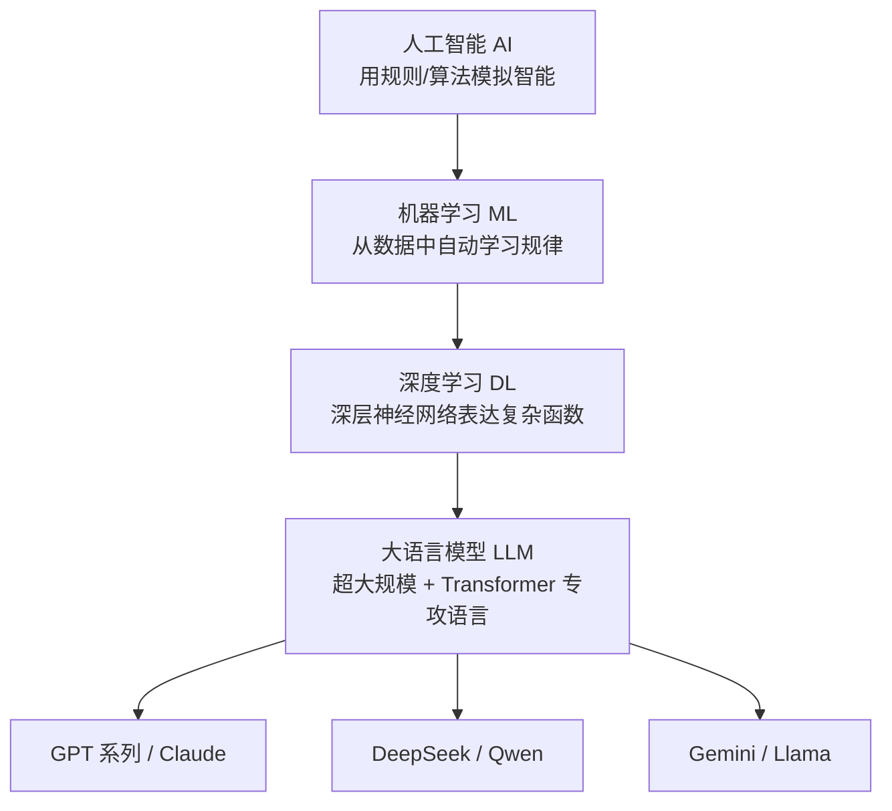

### 0.2 Transformer 架构核心原理

**一句话定义**：Transformer 是一种"完全基于注意力机制、抛弃了循环结构"的神经网络架构，是现代所有大模型的骨架。

#### 0.2.1 为什么需要它（历史痛点）

在 Transformer 之前（2017 年以前），处理语言主流用 RNN / LSTM：句子一个词一个词地"串行"读进去。它的致命缺点是：
1. **无法并行**：第 n 个词必须等第 n-1 个词算完；
2. **长距离遗忘**：句子开头的信息传到结尾时早已衰减殆尽（比如"那个穿红衣服的、刚才在门口聊了半小时天的男孩……他走了"——"他"指代谁，RNN 早就忘了）。

Transformer 一次性"看全整句话"，并用"注意力"直接计算任意两个词之间的关系，彻底解决了这两个问题。

#### 0.2.2 自注意力机制（Self-Attention）在算什么

**通俗解释**：自注意力就是让每个词在理解自己时，去"回头看"句子里所有其他词，并动态地给每个词分配一个"关注度权重"。比如句子"猫坐在垫子上，它很舒服"，模型算到"它"这个词时，注意力会高度集中在"猫"上，于是知道"它=猫"。

**数学表达**：每个词先被映射成三个向量：

- **Q（Query，查询）**："我在找什么信息"；
- **K（Key，键）**："我能提供什么信息"；
- **V（Value，值）**："我实际携带的内容"。

注意力分数 = 用 Q 去匹配所有词的 K，分数高说明"相关性强"，再用这个分数对 V 做加权求和。核心公式（缩放点积注意力）：

$$\text{Attention}(Q,K,V) = \text{softmax}\left(\frac{QK^T}{\sqrt{d_k}}\right)V$$

- $QK^T$：Query 和每个 Key 做点积，得到相关性分数（越大越相关）；
- $\sqrt{d_k}$：除以 Key 维度开根号，是为了防止维度太大时点积数值爆炸、softmax 梯度消失；
- $\text{softmax}$：把分数变成加起来等于 1 的概率分布（即注意力权重）；
- 最后乘以 $V$ 做加权求和，得到融合了全局上下文的新表示。

#### 0.2.3 多头注意力（Multi-Head Attention）

单个注意力只能关注一种"关系视角"（比如语法依赖）。多头注意力就是把 Q/K/V 投影成多组（比如 8 个头），每组各自算一遍注意力，捕捉不同角度的关系（一个头看语法、一个头看指代、一个头看语义……），最后拼接起来。这就像你同时用 8 个不同角度的"透镜"看同一句话。

#### 0.2.4 位置编码（Positional Encoding）

注意：自注意力天然是"无序"的——它同时看所有词，并不知道"猫坐在垫子上"和"垫子上坐在猫"的顺序区别。所以 Transformer 必须**额外注入位置信息**，这就是位置编码：给每个词叠加一个与其位置相关的向量，告诉模型"你在第几个位置"。现代大模型多用可学习的位置编码（如 RoPE 旋转位置编码），让模型能处理比训练时更长的文本。

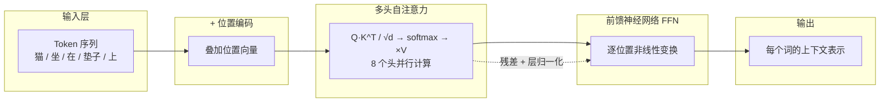

### 0.3 Tokenization（分词）原理

**一句话定义**：分词是把你输入的"字符串"切成模型能认识的最小单元（token）的过程，token 既不等于字，也不等于词。

**原理说明**：模型并不认识"字"或"词"，它只认识一个固定大小的"词表"（比如 10 万～20 万个 token 编号）。所以任何文本进来，第一步都得切成词表里的单元。主流大模型用 **BPE（Byte Pair Encoding，字节对编码）** 算法，思路是"从字符开始，反复合并出现频率最高的相邻片段"。

**BPE 一步步演示（以"机器学习"为例，纯演示逻辑）**：

假设初始词表把每个字拆成字符：
```
初始: ['机','器','学','习']
```
1. 统计语料里相邻字符对的频率，发现"机器"出现最多 → 合并成 `机器`；
2. 再统计，"学习"出现很多 → 合并成 `学习`；
3. 反复迭代后词表里有了 `机器`、`学习`、`机器学习` 等子词。

最终"机器学习"可能被切成：`['机器', '学习']` 两个 token（也可能是一个 `机器学习`，取决于训练时合并到哪一步、以及它在词表里是否独立存在）。关键是：**token 是"子词"粒度，不是整词也不是单字**。

**中文 vs 英文的 token 差异（重要，直接影响成本）**：

- 英文一个 token ≈ 0.75 个单词（常见词如 "hello" 是一个 token）；
- 中文因为词表对汉字多按单字或双字存储，**一个汉字常常占 1 个 token**，一个中文词（如"机器学习"）通常 2～4 个 token。

后果：同样含义的一句话，中文往往比英文消耗 **1.5～2 倍** 的 token 数，而 API 按 token 计费，所以中文应用成本天然偏高。你在估算费用、设计上下文长度时务必把这点算进去。

**代码示例（用 tiktoken 看真实切分）**：
```python
import tiktoken

enc = tiktoken.get_encoding("cl100k_base")  # GPT-4 系列词表
text = "机器学习很有趣"
tokens = enc.encode(text)
print(tokens)                       # 例如 [53920, 58136, 78990, 352, ...]
print([enc.decode([t]) for t in tokens])  # 看每个 token 对应什么片段
print("token 数:", len(tokens))     # 中文通常每字 1 token
```

### 0.4 Embedding（嵌入）原理

**一句话定义**：Embedding 是把"离散的文字"映射成"连续的高维向量"，让语义相近的文字在向量空间里距离也相近。

**原理说明**：模型内部只认数字。文字必须先变成向量（比如一个 4096 维的浮点数数组）。通过训练，语义相似的词会被放到向量空间里靠近的位置——"猫"和"猫咪"的向量夹角很小，"猫"和"汽车"夹角很大。衡量"靠不靠近"最常用的指标是**余弦相似度**。

**余弦相似度公式**：
$$\cos(\theta) = \frac{A \cdot B}{|A|\,|B|} = \frac{\sum_{i=1}^{n} A_i B_i}{\sqrt{\sum A_i^2}\,\sqrt{\sum B_i^2}}$$

它只看**方向**不看长度，取值 [-1, 1]，越接近 1 越相似。

**具体数值例子**（为演示用 3 维简化向量）：

```
"猫"     的向量 A = [0.9, 0.4, 0.1]
"猫咪"   的向量 B = [0.85, 0.45, 0.15]   # 语义接近，方向几乎一致
"汽车"   的向量 C = [0.1, -0.2, 0.9]     # 语义无关，方向不同
```

- A·B = 0.9×0.85 + 0.4×0.45 + 0.1×0.15 = 0.765 + 0.18 + 0.015 = 0.96
- |A| ≈ √(0.81+0.16+0.01)=√0.98≈0.99，|B|≈√(0.7225+0.2025+0.0225)=√0.9475≈0.97
- cos(A,B) ≈ 0.96 / (0.99×0.97) ≈ **0.999**（非常相似）

- A·C = 0.9×0.1 + 0.4×(-0.2) + 0.1×0.9 = 0.09 - 0.08 + 0.09 = 0.10
- |C| ≈ √(0.01+0.04+0.81)=√0.86≈0.93
- cos(A,C) ≈ 0.10 / (0.99×0.93) ≈ **0.108**（几乎不相关）

**应用意义**：RAG（检索增强生成）的核心就是——把用户问题 embed 成向量，去向量库里找余弦相似度最高的文档片段，再把这些片段喂给大模型。所以"Embedding + 余弦相似度"是你做 RAG 必须掌握的数学基础。

### 0.5 采样参数：Temperature / Top-P / Top-K

**一句话定义**：大模型每次并不是"确定地选出下一个词"，而是输出一个"所有候选词的概率分布"，采样参数决定我们怎么从这个分布里挑词。

**原理说明**：模型算出下一个 token 时，给出的是每个候选 token 的概率（如"猫"40%、“狗”30%、“鸟”20%……）。默认情况下它**按概率随机抽**，所以同样的输入也可能得到不同输出——这就是为什么聊天会有"创意感"，但也带来"不稳定"。

**Temperature（温度）**：调整分布的"平滑/陡峭"程度。
- T 低（如 0.2）：把概率差距拉大，高概率词更可能被选中 → 输出**稳定、保守、确定性高**（适合代码、事实问答）；
- T 高（如 1.0+）：分布变平缓，低概率词也常被翻牌 → 输出**发散、有创意、随机性强**（适合写诗、头脑风暴）。
- 数学上：softmax 前先除以 T，即 $\text{softmax}(z_i/T)$。

**Top-K**：只在概率最高的 K 个词里抽（如 K=50），过滤掉长尾噪声词。

**Top-P（核采样，Nucleus Sampling）**：动态取"累计概率达到 P 的最小词集合"来抽（如 P=0.9 表示只从累计覆盖 90% 概率的那些词里选）。它比 Top-K 更灵活——分布尖时只留几个词，分布平时留很多词。**实践中推荐用 Top-P 代替 Top-K**。

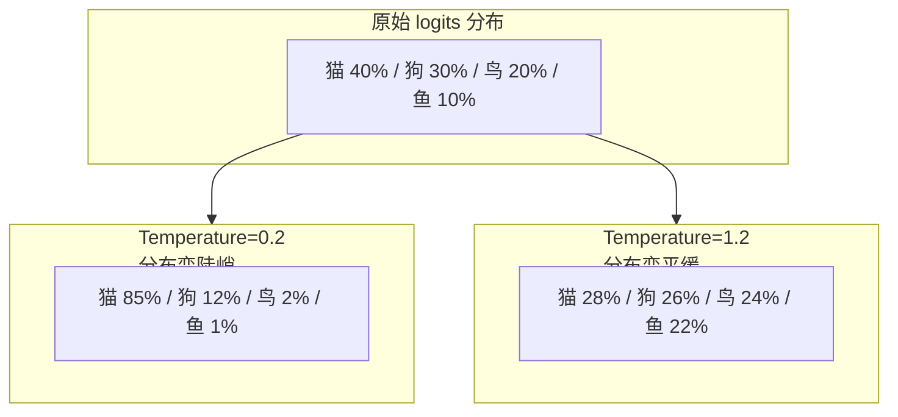

**实践建议**：代码/SQL/结构化输出用 T=0；普通问答 T=0.2~0.5；创意写作 T=0.8~1.0；Top-P 设 0.9 通常够用。

### 0.6 上下文窗口与 KV Cache

**一句话定义**：上下文窗口是模型"一次能同时看到"的最大 token 数（含输入+输出）；KV Cache 是推理时为加速而缓存的历史键值对。

**原理说明**：
- **上下文窗口（Context Window）**：比如 128K tokens ≈ 一本 10 万字小说。超出窗口的内容模型"看不到"。注意它是**输入+输出共用**的额度，输出越长，留给输入的就越少。长文档处理、多轮对话累积历史，都会吃窗口。
- **KV Cache（键值缓存）**：前面讲的自注意力要算 QK^T。如果每生成一个新词都把整段历史重算一遍，开销爆炸。于是把历史 token 算过的 K、V 缓存起来（KV Cache），新词只算自己的 Q 去和缓存的 K/V 匹配。代价是：上下文越长，缓存占显存越多——这就是为什么长对话会变慢、变贵。

**对你开发的影响**：做多轮对话时别无脑把全历史塞回去；做长文档 RAG 时先切片检索，而不是整本塞进窗口。

### 0.7 主流大模型对比（选型参考）

> 价格以官方公布区间为准，会随时间变动，落地前请查最新官网。以下为示意量级。

| 模型 | 厂商 | 上下文长度 | 中文能力 | 多模态 | 价格(输入/输出 $/百万token) | 兼容 OpenAI 格式 | 适合场景 |
|------|------|-----------|---------|--------|---------------------------|----------------|---------|
| DeepSeek-V3 | 深度求索 | 128K | 强 | 否(纯文本) | ~0.27 / ~1.10 | 是 | 高性价比中文、代码、Agent |
| GPT-4o | OpenAI | 128K | 强 | 是(文/图/音) | ~2.5 / ~10 | 原生 | 多模态、海外合规场景 |
| Claude 3.5 Sonnet | Anthropic | 200K | 较强 | 否 | ~3 / ~15 | 否(需适配) | 长文本、代码、严谨写作 |
| Qwen2.5 | 阿里 | 128K | 很强 | 部分 | ~0.4 / ~1.2 | 是 | 中文、国产私有化部署 |
| Gemini 1.5 Pro | Google | 1M~2M | 强 | 是 | ~1.25 / ~5 | 否(需适配) | 超长文档、多模态 |

**API 提供方/平台选型对比**：

| 维度 | 官方直连 | 云厂商市场(阿里云/腾讯云等) | 聚合网关(One-API等) |
|------|---------|--------------------------|-------------------|
| 优点 | 价格最低、最新鲜 | 国内访问稳、可开票 | 一套代码切多模型 |
| 缺点 | 国内网络可能不稳 | 价格略高 | 多一跳延迟、需自建 |
| 适用 | 海外/有网络方案 | 国内生产环境 | 多模型实验平台 |

### 0.8 第 0 章自测题

1. 用一句话说明 AI、机器学习、深度学习、大语言模型四者的包含关系，并指出大模型相比传统 ML 最关键的"规模"体现在哪两点。
2. 自注意力公式 $\text{softmax}(QK^T/\sqrt{d_k})V$ 中，Q、K、V 分别代表什么？为什么要除以 $\sqrt{d_k}$？
3. 为什么"机器学习"四个字在中文里可能消耗比英文 "machine learning" 更多的 token？这对你的应用成本意味着什么？
4. 给定向量 A=[1,0,0]、B=[0.87,0.5,0]、C=[0,-1,0]，用余弦相似度判断 A 与谁更相似，并说明 RAG 如何利用这一原理。
5. Temperature 从 0.2 调到 1.2，输出的概率分布和随机性会怎么变化？写代码时你会给"SQL 生成"和"诗歌创作"分别配什么 T 值？

---

## 第 1 章：环境准备

> 本章目标：把你的 Java 开发环境武装到"能安全、稳定地调用大模型 API"。你已有的 Java + 前端基础完全够用，重点是补齐：JDK 版本选择、构建工具、API Key 安全管理、以及用最小成本验证连通性。

### 1.1 开发工具链对比

#### 1.1.1 JDK：17 vs 21

| 维度 | JDK 17 | JDK 21 |
|------|--------|--------|
| 身份 | 上一个 LTS | 当前最新 LTS |
| 虚拟线程 | 不支持 | 支持（Project Loom，高并发 I/O 利器） |
| 新特性 | 密封类、switch 表达式 | 虚拟线程、分代 ZGC、字符串模板预览 |
| 生态成熟度 | 几乎所有库都兼容 | 主流库已适配，更新较快 |
| 建议 | 求稳选它 | **新项目推荐**：调 LLM 多为高并发网络 I/O，虚拟线程收益大 |

**建议**：新项目直接用 JDK 21；若公司基线仍是 17 也无妨，调用 LLM 的 SDK 都兼容。

#### 1.1.2 构建工具：Maven vs Gradle

| 维度 | Maven | Gradle |
|------|-------|--------|
| 配置 | XML（pom.xml），约定优于配置 | Groovy/Kotlin DSL，灵活 |
| 学习曲线 | 平缓，Java 开发者熟悉 | 略陡 |
| 构建速度 | 较慢 | 增量构建快（有缓存） |
| 建议 | 团队规范统一、求稳 | 追求构建效率、Kotlin 项目 |

**建议**：手册示例统一用 Maven（最常见、资料最多）。

#### 1.1.3 IntelliJ：社区版 vs 旗舰版

| 维度 | 社区版(免费) | 旗舰版(付费) |
|------|-------------|-------------|
| Spring Boot 支持 | 需装插件/有限 | 原生完整 |
| 数据库工具 | 无 | 有 |
| HTTP 客户端 | 无 | 有（内置 .http 文件） |
| 建议 | 学习够用 | 生产开发体验更好 |

### 1.2 API Key 安全管理（四种方案）

**核心原则**：API Key 绝对不能写进代码、不能提交到 Git。下面四种方案由浅入深。

**方案一：.env 本地环境变量文件（推荐起步）**

项目根目录放 `.env`（需加入 .gitignore），用 `dotenv` 读取。

```bash
# .env （切勿提交）
DEEPSEEK_API_KEY=sk-xxxxxxxxxxxxxxxx
OPENAI_API_KEY=sk-yyyyyyyyyyyyyyyy
LLM_BASE_URL=https://api.deepseek.com
```

```java
// 用 dotenv-java 读取
import io.github.cdimascio.dotenv.Dotenv;
Dotenv dotenv = Dotenv.load();
String key = dotenv.get("DEEPSEEK_API_KEY");
```

**方案二：系统/容器环境变量（推荐生产）**

不落地文件，直接在运行环境注入：

```bash
# Linux/Mac 终端或 CI 中
export DEEPSEEK_API_KEY=sk-xxxxxxxx
java -jar app.jar
```

```java
// 直接读系统环境变量
String key = System.getenv("DEEPSEEK_API_KEY");
```

```yaml
# Spring Boot application.yml 中不写明文，引用环境变量
llm:
  api-key: ${DEEPSEEK_API_KEY}        # 来自环境变量，yml 里无明文
  base-url: ${LLM_BASE_URL:https://api.deepseek.com}
```

**方案三：配置中心（Nacos / Apollo，推荐团队生产）**

Key 存于配置中心，应用启动时拉取，支持动态轮换、权限管控，避免 Key 散落各处。

**方案四：KMS / 密钥管理服务（云上最高安全级）**

Key 加密存于云 KMS（阿里云 KMS、AWS KMS、腾讯云 SSM），应用运行时用角色凭证解密。适合金融、合规场景，配合最小权限 IAM。

| 方案 | 安全级 | 复杂度 | 适用 |
|------|--------|--------|------|
| .env | 低 | 极低 | 本地学习 |
| 环境变量 | 中 | 低 | 单机/容器部署 |
| 配置中心 | 高 | 中 | 团队/微服务 |
| KMS | 最高 | 高 | 合规/生产核心 |

**必须配套的 .gitignore 片段**：
```gitignore
# 密钥与本地配置
.env
*.env.local
application-secret.yml
```

### 1.3 用 curl 和 Postman 测试连通性

在写 Java 代码前，先用最小工具验证 Key 和端点可用。

**curl 方式**：
```bash
curl https://api.deepseek.com/chat/completions \
  -H "Content-Type: application/json" \
  -H "Authorization: Bearer $DEEPSEEK_API_KEY" \
  -d '{
    "model": "deepseek-chat",
    "messages": [{"role":"user","content":"你好，用一句话介绍自己"}],
    "temperature": 0.5
  }'
```

**Postman 方式**：
- Method：`POST`
- URL：`https://api.deepseek.com/chat/completions`
- Headers：`Authorization: Bearer <你的Key>`、`Content-Type: application/json`
- Body（raw / JSON）：
```json
{
  "model": "deepseek-chat",
  "messages": [{ "role": "user", "content": "你好" }],
  "temperature": 0.5
}
```
- 点 Send，看到 `choices[0].message.content` 返回即连通成功。

### 1.4 DeepSeek 与 OpenAI 请求体差异对照

**好消息**：DeepSeek 刻意兼容 OpenAI 的 API 格式，所以你能用 OpenAI 的 Java SDK（如 `openai-java`）直接连 DeepSeek，只需改 **base_url** 和 **model 名**。

| 维度 | OpenAI | DeepSeek（兼容模式） |
|------|--------|---------------------|
| 端点 | `https://api.openai.com/v1/chat/completions` | `https://api.deepseek.com/chat/completions` |
| 鉴权 Header | `Authorization: Bearer sk-...` | 同左（完全一样） |
| model 字段 | `gpt-4o` 等 | `deepseek-chat` / `deepseek-reasoner` |
| messages 结构 | `[{role, content}]` | 完全一致 |
| 其余参数 | temperature/top_p/stream 等 | 完全一致 |

**关键映射点**：
1. 唯一差异在 `base_url` 和 `model` 名，请求体字段 100% 复用；
2. DeepSeek 额外提供 `deepseek-reasoner`（推理模型），对应 OpenAI 的 `o1` 系列思路；
3. 流式输出 `stream: true` 两边字段一致，都是 SSE 分片返回 `choices[0].delta.content`。

**Java 调用示例（用 openai-java，仅改 baseUrl）**：
```java
import com.openai.client.OpenAIClient;
import com.openai.client.okhttp.OpenAIOkHttpClient;
import com.openai.models.chat.ChatCompletion;
import com.openai.models.chat.ChatCompletionCreateParams;

OpenAIClient client = OpenAIOkHttpClient.builder()
    .apiKey(System.getenv("DEEPSEEK_API_KEY"))
    .baseUrl("https://api.deepseek.com/v1")   // 唯一改动点
    .build();

ChatCompletionCreateParams params = ChatCompletionCreateParams.builder()
    .model("deepseek-chat")                    // 模型名
    .addUserMessage("用 Java 写一个快速排序")
    .temperature(0.3)
    .build();

ChatCompletion completion = client.chat().completions().create(params);
System.out.println(completion.choices().get(0).message().content().get());
```

### 1.5 第 1 章自测题

1. 新项目你倾向选 JDK 17 还是 21？给出至少一条"虚拟线程对调 LLM 接口有益"的理由。
2. 为什么 API Key 绝不能写进代码或提交 Git？请列出四种安全管理方案并说明各自的适用场景。
3. 写一段 `application.yml` 片段，要求 API Key 不出现明文，而是从环境变量读取。
4. DeepSeek 与 OpenAI 的 chat 接口有哪些差异？用 openai-java 连 DeepSeek 时，你实际只需要改哪两个值？
5. 用 curl 测试 DeepSeek 连通性时，鉴权 Header 应该怎么写？如果返回 401，最可能的原因是什么？
## 第 2 章：第一个 AI 应用 —— 跑通你的第一个聊天机器人

本章目标：即使你完全没有 AI/ML 背景，也能在已有 Java + 前端知识的基础上，搭出一个能和用户实时对话的聊天机器人。我们会从架构讲起，逐个击破"怎么调 API、怎么维护多轮对话、怎么处理报错、怎么让前端流式显示"。

### 2.1 整体架构：从浏览器到大模型

一个最小可用的 AI 聊天应用，本质是"套了一层壳的 HTTP 调用"。浏览器不能直接、也不该直接持有大模型 API Key（会泄露密钥），所以必须有一层后端。典型分层如下：

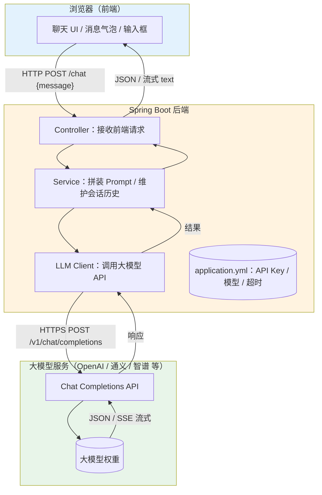

**各层职责一句话说明：**

| 层 | 职责 | 关键关注点 |
|---|---|---|
| 浏览器（前端） | 展示消息、采集用户输入、流式渲染 | 用户体验、不要暴露 Key |
| Spring Boot 后端 | 鉴权、拼 Prompt、维护会话、调模型 | 安全、稳定性、成本控制 |
| 大模型服务 | 根据请求生成文本 | 模型选择、计费、速率限制 |

> **核心认知**：大模型 API 就是一个"接收一段结构化文本、返回一段文本"的远端服务。你的工作是把业务问题翻译成它能理解的格式。

### 2.2 一次对话的完整流程（时序图）

非流式（一次性返回）与流式（像打字机一样逐字返回）差异巨大。下面用 Mermaid 时序图展示两者：

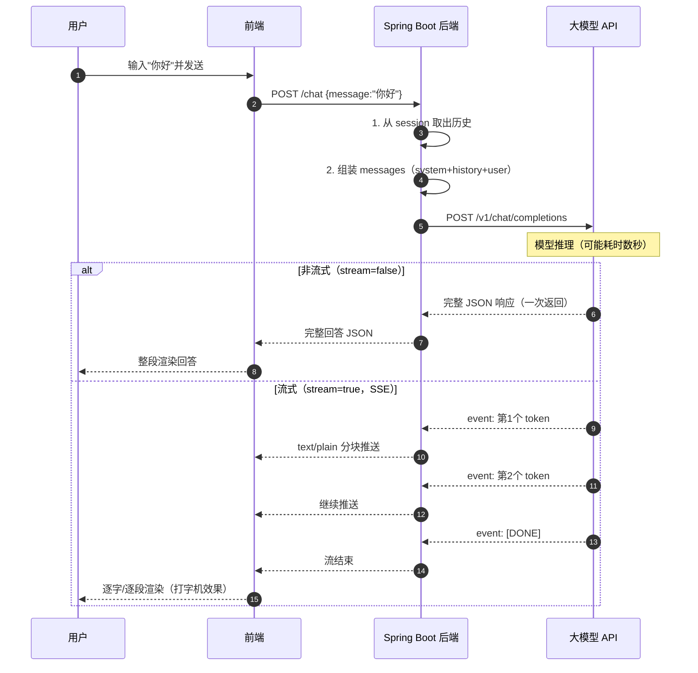

**非流式 vs 流式对比：**

| 维度 | 非流式 | 流式 |
|---|---|---|
| 首字延迟 | 高（等全部生成完） | 低（第一个 token 就显示） |
| 用户体验 | 卡顿感 | 自然流畅 |
| 实现复杂度 | 低 | 略高（需解析 SSE） |
| 适用场景 | 后台批处理、测试 | 聊天、写作、代码生成 |

### 2.3 四种调用大模型的方式

我们以"调用 OpenAI 兼容接口"为例（国内模型如通义千问、智谱、DeepSeek 大多兼容这套协议，换 baseUrl 即可）。

#### 方式一：用 Spring `RestTemplate` 裸调（最直白，理解原理）

```java
@RestController
@RequestMapping("/api/chat")
public class ChatController {

    private final RestTemplate rest = new RestTemplate();
    private static final String URL = "https://api.openai.com/v1/chat/completions";
    @Value("${openai.api-key}") private String apiKey;

    @PostMapping
    public String chat(@RequestBody Map<String, String> body) {
        // 1. 组装请求体
        Map<String, Object> req = new HashMap<>();
        req.put("model", "gpt-4o-mini");
        req.put("temperature", 0.7);
        req.put("messages", List.of(
            Map.of("role", "system", "content", "你是乐于助人的助手。"),
            Map.of("role", "user", "content", body.get("message"))
        ));

        // 2. 设置请求头（鉴权）
        HttpHeaders headers = new HttpHeaders();
        headers.setContentType(MediaType.APPLICATION_JSON);
        headers.setBearerAuth(apiKey);
        HttpEntity<Map<String, Object>> entity = new HttpEntity<>(req, headers);

        // 3. 发起调用并解析
        ResponseEntity<Map> resp = rest.postForEntity(URL, entity, Map.class);
        Map<?, ?> firstChoice = ((List<Map<?, ?>>) resp.getBody().get("choices")).get(0);
        Map<?, ?> message = (Map<?, ?>) firstChoice.get("message");
        return (String) message.get("content");
    }
}
```

#### 方式二：用 LangChain4j（声明式，最省心，推荐入门）

```java
// 1. 声明一个 AI 服务接口（像写 Spring 接口一样）
public interface ChatAssistant {
    @SystemMessage("你是乐于助人的中文助手。")
    String chat(String userMessage);
}

// 2. 配置并注入
@Configuration
public class LlmConfig {
    @Bean
    public ChatAssistant assistant(@Value("${openai.api-key}") String key) {
        OpenAiChatModel model = OpenAiChatModel.builder()
                .apiKey(key)
                .modelName("gpt-4o-mini")
                .temperature(0.7)
                .build();
        return AiServices.create(ChatAssistant.class, model);
    }
}

// 3. 在 Controller 中直接调用
@RestController
@RequestMapping("/api/chat")
public class ChatController {
    private final ChatAssistant assistant;
    public ChatController(ChatAssistant assistant) { this.assistant = assistant; }

    @PostMapping
    public String chat(@RequestBody Map<String, String> body) {
        return assistant.chat(body.get("message")); // 一行搞定
    }
}
```

#### 方式三：用 Spring AI（与 Spring 生态最融合）

```java
@RestController
@RequestMapping("/api/chat")
public class ChatController {

    private final ChatClient chatClient;

    public ChatController(ChatClient.Builder builder,
                         @Value("${openai.api-key}") String key) {
        this.chatClient = builder
                .defaultSystem("你是乐于助人的中文助手。")
                .build();
        // 实际还需通过配置/环境变量设置 spring.ai.openai.api-key
    }

    @PostMapping
    public String chat(@RequestBody Map<String, String> body) {
        return chatClient.prompt()
                .user(body.get("message"))
                .call()
                .content();
    }

    // 流式调用：返回 Flux，前端可逐段接收
    @GetMapping(value = "/stream", produces = MediaType.TEXT_EVENT_STREAM_VALUE)
    public Flux<String> stream(@RequestParam String message) {
        return chatClient.prompt().user(message).stream().content();
    }
}
```

> 方式四：`WebClient`（非阻塞响应式）与 RestTemplate 思路一致，只是用链式 API；方式一已展示核心，故略。

**四方式优缺点对比表：**

| 方式 | 上手难度 | 可维护性 | 流式支持 | 适合人群 |
|---|---|---|---|---|
| RestTemplate 裸调 | 低（直观） | 差（要手写解析） | 需自己解析 SSE | 想理解原理者 |
| OpenAI Java SDK | 低 | 中 | 原生支持 | 偏好官方 SDK |
| LangChain4j | 中 | 高（声明式） | 原生支持 | 想快速做 RAG/Agent |
| Spring AI | 中 | 高（Spring 风格） | 原生支持 | Spring 项目首选 |

### 2.4 Chat Completions API 请求体字段完整解析

| 字段 | 含义 | 常见取值 | 说明 |
|---|---|---|---|
| `model` | 模型名 | `gpt-4o-mini` / `deepseek-chat` | 不同模型能力/价格不同 |
| `messages` | 对话消息数组 | 见下 | 每次请求都需带上完整上下文 |
| `temperature` | 随机性 | 0.0–2.0，默认 1.0 | 越低越确定、越高越发散 |
| `top_p` | 核采样 | 0.0–1.0 | 与 temperature 二选一控制多样性 |
| `max_tokens` | 最大输出长度 | 如 1024 | 防超长、控成本 |
| `stream` | 是否流式 | `true`/`false` | true 则 SSE 逐块返回 |
| `response_format` | 输出格式 | `{"type":"json_object"}` | 强制 JSON（需 prompt 提示） |
| `tools` | 工具定义 | 函数描述数组 | 实现 Function Calling |

**完整请求示例（带注释）：**

```json
{
  "model": "gpt-4o-mini",          // 指定模型
  "temperature": 0.7,              // 适度发散，又不至于胡说
  "max_tokens": 1024,              // 最多生成 1024 个 token
  "stream": false,                 // 非流式，一次性返回
  "response_format": { "type": "text" }, // 纯文本（也可 json_object）
  "messages": [
    { "role": "system",
      "content": "你是专业的中文客服助手，语气友好、简洁。" },
    { "role": "user",
      "content": "我的订单还没发货，怎么办？" }
  ]
}
```

**完整响应示例（逐字段注释）：**

```json
{
  "id": "chatcmpl-abc123",         // 本次请求唯一 ID
  "object": "chat.completion",     // 对象类型
  "created": 1718000000,           // 时间戳（秒）
  "model": "gpt-4o-mini",          // 实际使用的模型
  "choices": [                     // 候选结果（n>1 时多个）
    {
      "index": 0,                  // 第几个候选
      "message": {                 // 模型返回的消息
        "role": "assistant",       // 角色固定为 assistant
        "content": "您好！请提供订单号，我帮您查询发货状态。" // 正文
      },
      "finish_reason": "stop"      // 结束原因：stop/length/tool_calls
    }
  ],
  "usage": {                       // 用量统计（计费依据）
    "prompt_tokens": 28,           // 输入 token 数
    "completion_tokens": 15,       // 输出 token 数
    "total_tokens": 43             // 合计
  }
}
```

### 2.5 角色消息机制与多轮对话

三种角色各司其职：

- **system**：设定 AI 的人设、语气、规则。通常每条请求都放最前面，且内容不变。
- **user**：用户说的话（每轮用户输入）。
- **assistant**：AI 之前的回答。把历史回答回传，模型才"记得"上文。

**维护多轮会话历史的 Java 代码（基于内存 Map，生产应换 Redis/DB）：**

```java
@Service
public class ConversationService {

    // sessionId -> 消息历史
    private final Map<String, List<Map<String, String>>> store = new ConcurrentHashMap<>();

    public String chat(String sessionId, String userInput, ChatAssistant assistant) {
        List<Map<String, String>> history =
                store.computeIfAbsent(sessionId, k -> new ArrayList<>());

        // 追加用户消息
        history.add(Map.of("role", "user", "content", userInput));

        // 用历史构造 prompt（system 单独加在最前）
        StringBuilder sb = new StringBuilder("你是乐于助人的中文助手。\n\n历史对话：\n");
        for (Map<String, String> m : history) {
            sb.append(m.get("role")).append(": ").append(m.get("content")).append("\n");
        }

        String reply = assistant.chat(sb.toString());

        // 把 AI 回复也记入历史，供下一轮使用
        history.add(Map.of("role", "assistant", "content", reply));

        // 控制历史长度，避免 token 爆炸（只保留最近 10 轮）
        if (history.size() > 20) history.subList(0, history.size() - 20).clear();

        return reply;
    }
}
```

> **踩坑提示**：`messages` 必须严格交替且以 user/assistant 为主；不要只发 system 或连续两条 user，部分模型会报错。

### 2.6 错误处理：超时、限流(429)、鉴权失败(401)

```java
@Configuration
public class RestConfig {
    @Bean
    public RestTemplate restTemplate() {
        SimpleClientHttpRequestFactory f = new SimpleClientHttpRequestFactory();
        f.setConnectTimeout(5000);   // 连接超时 5s
        f.setReadTimeout(60000);     // 读取超时 60s（模型可能慢）
        return new RestTemplate(f);
    }
}

@Service
public class SafeChatService {
    private final RestTemplate rest;
    private static final String URL = "https://api.openai.com/v1/chat/completions";

    public SafeChatService(RestTemplate rest) { this.rest = rest; }

    public String chat(Map<String, Object> req, String apiKey) {
        HttpHeaders h = new HttpHeaders();
        h.setContentType(MediaType.APPLICATION_JSON);
        h.setBearerAuth(apiKey);
        HttpEntity<Map<String, Object>> entity = new HttpEntity<>(req, h);

        try {
            ResponseEntity<Map> resp = rest.postForEntity(URL, entity, Map.class);
            // 2xx 正常解析
            Map<?, ?> msg = (Map<?, ?>) ((List<Map<?, ?>>) resp.getBody().get("choices")).get(0).get("message");
            return (String) msg.get("content");
        } catch (HttpStatusCodeException e) {
            int code = e.getStatusCode().value();
            if (code == 401) {
                throw new RuntimeException("API Key 无效或已过期，请检查配置。", e);
            } else if (code == 429) {
                // 限流：可在此加指数退避重试
                throw new RuntimeException("请求过于频繁，被限流（429），请稍后重试。", e);
            } else if (code >= 500) {
                throw new RuntimeException("大模型服务端错误，请重试。", e);
            } else {
                throw new RuntimeException("调用失败：" + e.getResponseBodyAsString(), e);
            }
        } catch (RestClientException e) {
            throw new RuntimeException("网络超时或连接失败，请检查网络。", e);
        }
    }
}
```

**退避重试建议**：遇到 429，先等 `1s → 2s → 4s` 指数退避，最多 3 次；不要立即死循环重试。

### 2.7 前端聊天页面（流式接收）

```html
<!doctype html>
<html lang="zh-CN">
<head>
  <meta charset="utf-8" />
  <title>AI 聊天</title>
  <style>
    .bubble { padding:8px 12px; margin:6px 0; border-radius:10px; max-width:75%; }
    .user { background:#d1e7ff; align-self:flex-end; }
    .ai { background:#f1f1f1; }
    #box { display:flex; flex-direction:column; height:70vh; overflow:auto; }
    #loading { color:#999; font-style:italic; }
  </style>
</head>
<body>
  <div id="box"></div>
  <input id="inp" placeholder="说点什么…" style="width:80%" />
  <button onclick="send()">发送</button>

<script>
async function send() {
  const inp = document.getElementById('inp');
  const text = inp.value.trim();
  if (!text) return;
  inp.value = '';

  const box = document.getElementById('box');
  box.appendChild(bubble(text, 'user'));
  const aiBubble = bubble('', 'ai');
  box.appendChild(aiBubble);
  const loading = document.createElement('div');
  loading.id = 'loading'; loading.textContent = '正在思考…';
  box.appendChild(loading);

  // 流式请求：fetch + ReadableStream
  const resp = await fetch('/api/chat/stream?message=' + encodeURIComponent(text));
  const reader = resp.body.getReader();
  const decoder = new TextDecoder();
  loading.remove();

  while (true) {
    const { done, value } = await reader.read();
    if (done) break;
    const chunk = decoder.decode(value, { stream: true });
    // Spring AI SSE 形如 "data:xxx\n\n"，按需解析
    aiBubble.textContent += chunk.replace(/^data:\s?/gm, '');
    box.scrollTop = box.scrollHeight;
  }
}

function bubble(text, who) {
  const d = document.createElement('div');
  d.className = 'bubble ' + who;
  d.textContent = text;
  return d;
}
</script>
</body>
</html>
```

### 2.8 第 2 章自测题

1. 为什么浏览器不能直接持有大模型 API Key？后端存在的三个核心职责是什么？
2. `temperature=0` 与 `temperature=1.2` 分别会让回答呈现什么特点？什么场景该用低值？
3. 多轮对话中，assistant 角色的消息为什么要回传给模型？如果不传会怎样？
4. 遇到 HTTP 429，正确的处理策略是什么？为什么不能立刻无限重试？
5. 流式与非流式响应在前后端代码上的主要差异是什么？

---

## 第 3 章：Prompt 工程入门

如果说第 2 章解决"怎么把请求发出去"，第 3 章解决"怎么让回答符合预期"。**Prompt（提示词）是你与大模型之间唯一的沟通语言**，写得好，弱模型也能干好活；写得差，强模型也答非所问。

### 3.1 为什么需要 Prompt 工程

大模型是"概率生成"的：它根据上下文预测下一个最可能出现的词。你的 Prompt 就是"上下文"。同样的模型，Prompt 不同，输出质量天差地别。Prompt 工程就是**用结构化、有约束的方式表达意图**，把随机性引导到你要的方向。

### 3.2 Prompt 四要素

一个高质量 Prompt 通常包含四要素，缺一不可：

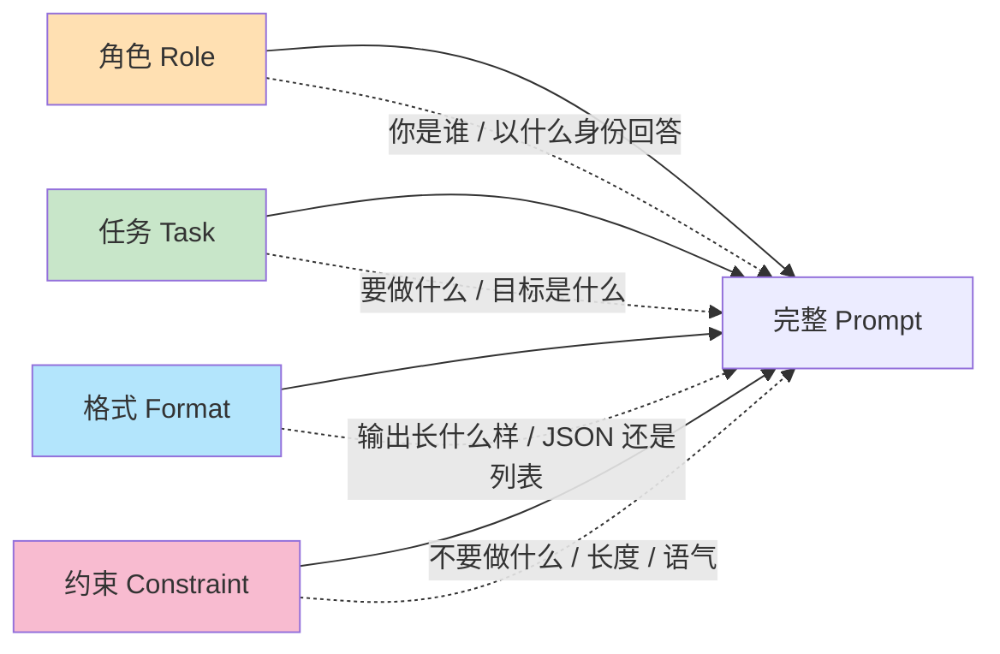

#### 要素一：角色（Role）—— 告诉模型"你是谁"

**Before（模糊）：** "翻译这段话。"

**After（清晰）：** "你是一名资深中英翻译专家，译文要符合 IEEE 论文的书面语风格。" → 指定身份后，模型会自动套用该角色的知识与语气。

#### 要素二：任务（Task）—— 明确"要做什么"

**Before：** "处理一下这些数据。"

**After：** "请把下面用户评论按情感分为『正面/负面/中性』三类，并各给出一句理由。"

#### 要素三：格式（Format）—— 规定"输出长什么样"

**Before：** "列出北京的三个景点。"

**After：** "用 JSON 数组返回，每项含字段 name（名称）与 reason（推荐理由）。例：`[{\"name\":\"故宫\",\"reason\":\"明清皇宫\"}]`"

#### 要素四：约束（Constraint）—— 划清"边界与禁忌"

**Before：** "写个产品介绍。"

**After：** "写 80 字以内的产品介绍，面向程序员，不使用营销夸张用语，不出现『最』『第一』等绝对化表述。"

> **组合拳示例**：`你是电商客服主管（角色）｜给用户的差评写一句真诚致歉（任务）｜只返回致歉语，不超过 30 字（格式+约束）`。

### 3.3 核心技术对比表

| 技术 | 思路 | 适用场景 | 效果 | 成本（token/复杂度） |
|---|---|---|---|---|
| Zero-Shot | 不给例子，直接下令 | 简单、通用任务 | 中 | 低 |
| One-Shot | 给 1 个示例 | 格式敏感任务 | 中高 | 低 |
| Few-Shot | 给 3–5 个示例 | 分类、抽取、风格模仿 | 高 | 中 |
| Chain-of-Thought (CoT) | 要求"一步步思考" | 推理、数学、逻辑 | 很高 | 中高 |
| Tree-of-Thought (ToT) | 多分支探索再择优 | 复杂规划、搜索问题 | 极高 | 高 |

**经验法则**：简单任务用 Zero-Shot，格式/风格难搞加 Few-Shot，涉及推理必加 CoT，复杂决策再上 ToT。

### 3.4 Chain-of-Thought（思维链）详解

**零样本 CoT**：只加一句"让我们一步步思考"（Let's think step by step），模型会先输出推理过程再给答案。

**数学推理示例（不加 CoT）：**
> 问：操场有 23 个男生、17 个女生，每 5 人一组，能分几组剩几人？
> 答：8 组。（✗ 模型跳步直接给错数）

**加零样本 CoT：**
> 问：……请一步步思考。
> 答：总人数 = 23 + 17 = 40。40 ÷ 5 = 8 组，余数 0。答：8 组，剩 0 人。（✓）

**少样本 CoT（给带推理过程的例子）：**
```
示例：
问：小明有 12 颗糖，给弟弟一半，又买 5 颗，剩几颗？
答：12 的一半是 6，给弟弟后剩 6；再买 5 颗得 11。答案：11。
---
问：图书馆借出 30 本，还剩 45 本，原来有几本？请一步步思考。
答：借出 30 且剩 45，原来 = 30 + 45 = 75。答案：75。
```

### 3.5 结构化输出：JSON Mode 与 Function Calling

很多时候我们要把模型输出喂给程序（如抽取字段、调用工具）。两种方式：

#### 方式 A：JSON Mode（强制 JSON 文本）

```java
// 用 RestTemplate 调，response_format=json_object
Map<String, Object> req = new HashMap<>();
req.put("model", "gpt-4o-mini");
req.put("response_format", Map.of("type", "json_object"));
req.put("messages", List.of(Map.of(
    "role", "user",
    "content", "从这句话抽取姓名、城市、年龄，返回 JSON：" +
               "{\"name\":\"张三\",\"city\":\"北京\",\"age\":28}。文本：李四是上海人，32 岁。")));
// ...发起请求后解析：
String json = (String) ((Map<?,?>) ((List<Map<?,?>>) resp.getBody().get("choices"))
        .get(0).get("message")).get("content");
Map<?, ?> data = new ObjectMapper().readValue(json, Map.class);
System.out.println(data.get("name")); // 李四
```

#### 方式 B：用 LangChain4j 的 AiServices 声明式（更优雅）

```java
// 1. 定义结构化返回类型
public record UserInfo(String name, String city, int age) {}

// 2. 声明接口，让框架自动做 JSON 解析与映射
public interface Extractor {
    @UserMessage("从文本中抽取用户信息：{{text}}")
    @OutputType(UserInfo.class)   // 触发结构化输出
    UserInfo extract(@V("text") String text);
}

// 3. 调用
Extractor ex = AiServices.create(Extractor.class, model);
UserInfo u = ex.extract("李四是上海人，32 岁。");
System.out.println(u.name()); // 李四
```

> **对比**：JSON Mode 手动解析灵活但易出错；AiServices 声明式把"生成+解析"封装掉，代码更干净，推荐在生产中使用。

### 3.6 Prompt 模板管理

| 方式 | 做法 | 优点 | 缺点 |
|---|---|---|---|
| 硬编码 | 字符串写死在代码里 | 简单 | 改文案要重新编译 |
| 配置化 | 放 `application.yml` / 数据库 | 不改代码可热更 | 无变量替换能力 |
| 模板引擎 | 用 `String.format` / Velocity / 专用 Prompt 模板 | 支持变量、复用 | 稍复杂 |

**Spring 配置化模板示例：**

```yaml
# application.yml
prompt:
  translator: "你是一名{{tone}}风格的翻译专家，请把下面内容译为{{target}}：\n{{text}}"
```

```java
@Component
@ConfigurationProperties(prefix = "prompt")
public class PromptProperties {
    private Map<String, String> templates = new HashMap<>();
    public Map<String, String> getTemplates() { return templates; }
}

@Service
public class TranslateService {
    private final PromptProperties props;
    public TranslateService(PromptProperties props) { this.props = props; }

    public String build(String tone, String target, String text) {
        String tpl = props.getTemplates().get("translator");
        return tpl.replace("{{tone}}", tone)
                 .replace("{{target}}", target)
                 .replace("{{text}}", text);
    }
}
```

### 3.7 常见反模式与调试技巧

**反模式 1：模糊指令**
- ✗ "写点东西关于 Java。"
- ✓ "写一段 100 字、面向初学者的 Java 多线程简介，含一个 Runnable 示例。"

**反模式 2：缺乏约束**
- ✗ "总结这篇文章。"（可能返回 2000 字）
- ✓ "用 3 条要点总结，每条不超过 30 字。"

**反模式 3：上下文泄漏**
- 把上一个用户的隐私数据带进下一个会话；或 system 提示里写死不该暴露的内部规则。
- 修正：会话隔离 + 历史裁剪（见 2.5）+ 敏感字段脱敏。

**调试技巧：**
1. **分而治之**：把复杂 Prompt 拆成"角色/任务/格式"逐段验证。
2. **打印完整请求**：把发出去的 messages 全部 log 出来，核对是否如你所想。
3. **小样本探测**：用 5 条典型输入跑一遍，看失败模式，再补 Few-Shot 示例。
4. **温度调低**：调试阶段设 `temperature=0`，排除随机性干扰，确认是 Prompt 问题还是模型问题。
5. **断言输出**：对结构化输出写单元测试，断言字段存在且类型正确。

### 3.8 第 3 章自测题

1. Prompt 四要素分别解决什么类型的歧义？缺了"格式"要素通常会出什么问题？
2. 什么场景下该用 Few-Shot 而不是 Zero-Shot？请举一个自己的例子。
3. 零样本 CoT 的关键触发句是什么？它为什么能提升数学推理准确率？
4. JSON Mode 与 Function Calling（AiServices）在"获取结构化数据"上各有什么取舍？
5. 为什么调试 Prompt 时建议先把 temperature 设为 0？上下文泄漏有哪些典型危害？

---

> **下一步（第 4 章预告）**：当单个 Prompt 不够用时，我们需要 RAG（检索增强）让模型"查资料再答"，以及 Agent（智能体）让模型"自己调工具"。届时将用到本章所有 Prompt 技巧与第 2 章的调用能力。
## 第 4 章：RAG 知识库问答 —— 让 AI 读懂你的文档

> 适用读者：有 Java + 前端基础、但完全没有 AI/ML 背景的开发者。学完本章，你将能够把"公司内部的 PDF/Word/网页"变成 AI 能回答的"知识库"，并理解每个环节为什么这么做、出了错怎么调。

---

### 4.1 为什么需要 RAG：从"瞎猜"到"有据可依"

**RAG（Retrieval-Augmented Generation，检索增强生成）** 的核心思想只有一句话：**先去资料库里查，再把查到的内容喂给大模型，让它基于证据回答。**

#### 4.1.1 大模型的三大硬伤

| 硬伤 | 说明 | 例子 |
| --- | --- | --- |
| 知识截止 | 训练数据有截止日期，之后的事一概不知 | 问"昨天发布的 XXX 政策"，模型答不出 |
| 幻觉 | 不知道时会"一本正经地编" | 编造不存在的法条、接口、人名 |
| 私有数据盲区 | 没见过你的公司内部文档 | 问"我们报销流程是什么"，模型胡说 |

#### 4.1.2 对比：无 RAG vs 有 RAG

假设你的知识库里有一句话："公司年假规则：入职满 1 年享 5 天，满 3 年享 10 天。"

- **无 RAG（直接问大模型）**
  > 问：我们公司年假怎么算？
  > 答：一般企业年假为入职满 1 年 5 天、满 10 年 10 天、满 20 年 15 天（按国家劳动法）。
  > ❌ 把"国家通用规则"当成了"你们公司规则"，且完全没用到内部制度。

- **有 RAG（先检索再生成）**
  > 问：我们公司年假怎么算？
  > 检索到片段：「入职满 1 年享 5 天，满 3 年享 10 天」
  > 答：根据公司制度，入职满 1 年可享 5 天年假，满 3 年可享 10 天年假。
  > ✅ 答案来自你的文档，可追溯、可验证。

一句话总结：**大模型负责"说人话"，RAG 负责"说真话"。**

---

### 4.2 RAG 全流程架构深解

RAG 分两个阶段：**离线入库（把文档变成可检索的向量）** 和 **在线查询（拿到问题去检索再生成）**。

#### 4.2.1 离线入库流程图

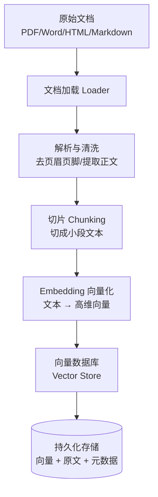

#### 4.2.2 在线查询流程图

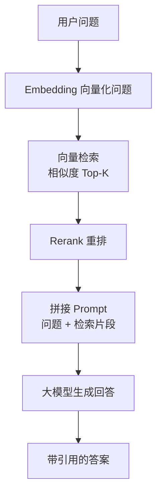

#### 4.2.3 各环节底层原理

- **文档加载（Loader）**：用解析库把不同格式读成纯文本。PDF 用 `pdfplumber`/`PyMuPDF`，Word 用 `python-docx`，网页用 `BeautifulSoup` 去标签。
- **解析与清洗**：去掉页眉、页码、表格线等噪声，否则噪声也会被向量化并污染检索。
- **切片（Chunking）**：把长文档切成若干小段（chunk），因为大模型上下文有限，且检索要"定位到具体段落"才有用。
- **Embedding**：用神经网络把文本编码成一组数字（向量）。语义相近的文本，向量在数学空间里也"离得近"。
- **向量库**：专门存向量、并支持"按距离快速找最近邻"的数据库。
- **检索**：把问题向量化，在库里找最相似的 K 个片段。
- **重排（Rerank）**：初检可能不准，再用更强的模型二次排序，把最相关的顶上去。
- **生成**：把检索片段 + 问题拼成 Prompt，让大模型基于片段作答，并尽量标注来源。

---

### 4.3 文档切片（Chunking）策略对比

切片质量直接决定"能不能检索到对的片段"。切太大 → 噪声多、命中率低；切太小 → 上下文断裂、答不全。

| 策略 | 原理 | 优点 | 缺点 | 适用场景 |
| --- | --- | --- | --- | --- |
| 固定大小切分 | 每 N 个字符/Token 一刀切断 | 简单、可控、速度快 | 可能切断句子/语义 | 通用文本、快速原型 |
| 递归字符切分 | 优先按 `\n\n`→`\n`→` `→`字符` 递归拆 | 尽量在天然边界切，结构友好 | 仍可能跨语义 | **最常用默认值**（LangChain 默认） |
| 按语义切分 | 用嵌入/小模型判断语义边界再切 | 片段语义完整 | 慢、依赖模型、成本高 | 长文、法律/论文 |
| 按结构切分 | 按 Markdown 标题、HTML 标签、段落 | 保留层级、可带标题上下文 | 依赖文档结构规范 | 技术文档、API 手册、带目录的 PDF |

#### 4.3.1 chunk_size 与 chunk_overlap 怎么调

- **chunk_size（片段大小）**：单个片段的字符/Tokens 数。
  - 太小（如 128）：上下文不足，回答缺前因后果。
  - 太大（如 2048）：噪声多、单次检索命中不精准、占 token。
  - **推荐起点**：中文 300–500 字 / 英文 500–1000 tokens。
- **chunk_overlap（重叠）**：相邻片段重复的部分，防止一句话被切断后丢失语义。
  - 推荐为 chunk_size 的 **10%–20%**。
  - 重叠太大 → 重复内容多、检索冗余；太小 → 边界信息易丢。

**调优建议**：先用"递归字符切分 + 512 字 + 64 字重叠"跑通，再用评估集（见 4.9）逐步增大/减小观察召回变化。

---

### 4.4 Embedding 模型原理与对比

#### 4.4.1 一句话原理

Embedding 模型本质是一个**训练好的神经网络编码器**：把一句话输入网络，输出一个固定长度的数字数组（向量），语义越接近的句子，向量在空间中的"夹角"越小。

#### 4.4.2 主流 Embedding 模型对比

| 模型 | 维度 | 中文能力 | 是否开源 | 价格/获取 | 备注 |
| --- | --- | --- | --- | --- | --- |
| OpenAI text-embedding-3-small | 1536 | 中 | 否 | 约 $0.02/百万 tokens | 易用、稳定，英文强 |
| OpenAI text-embedding-3-large | 3072 | 中 | 否 | 约 $0.13/百万 tokens | 精度更高、更贵 |
| BGE-large-zh（智源） | 1024 | 强 | 是 | 开源免费 | 中文 RAG 经典选择 |
| M3E（moka-ai） | 768 | 强 | 是 | 开源免费 | 中文友好、轻量 |
| GTE（阿里） | 1024/768 | 强 | 是 | 开源免费 | 中英双语表现好 |

> 选型口诀：**纯中文私有部署 → BGE/GTE/M3E；想省事上云 → OpenAI 3-small。**

#### 4.4.3 向量维度与向量库的关系

- 维度越高，能表达的语义越细，但**存储与检索成本随维度线性上升**。
- 同一应用内所有文本必须用**同一个模型、同一维度**向量化，否则无法比较距离。
- 向量库通常用"索引"（见 4.5）来加速高维检索；维度越高，索引构建越慢、内存越大。

---

### 4.5 向量数据库对比

向量库不是在"精确匹配字符串"，而是在"高维空间里找最近邻"。核心靠**近似最近邻（ANN）索引算法**。

> 索引算法一句话：**HNSW** = 建多层图，像跳表一样快速跳到邻居；**IVF** = 先聚类分桶，只在最近的几个桶里找，牺牲一点精度换速度。

| 数据库 | 底层/索引 | 部署难度 | 性能 | 扩展性 | 适合场景 |
| --- | --- | --- | --- | --- | --- |
| Chroma | HNSW（内置） | ★ 极低（pip 即装） | 中（单机） | 弱（偏单机/嵌入式） | 本地开发、原型、中小数据 |
| Milvus | HNSW/IVF/DiskANN | ★★★ 高（需分布式） | 高 | 强（分布式） | 海量数据、生产级 |
| pgvector | 集成进 PostgreSQL | ★★ 中（装扩展） | 中 | 中（借 PG 生态） | 已有 PG、要事务/SQL 混合 |
| Qdrant | HNSW（Rust 写） | ★★ 中（Docker） | 高 | 中强 | 生产推荐、性能好 |
| Redis | HNSW（Redis Stack） | ★★ 中 | 高（内存） | 中 | 已用 Redis、要超低延迟 |

#### 4.5.1 向量检索流程图

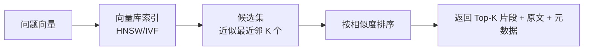

---

### 4.6 检索与相似度算法对比

向量之间"多近"由相似度/距离度量决定：

| 度量 | 公式直觉 | 取值范围 | 特点 | 适用 |
| --- | --- | --- | --- | --- |
| 余弦相似度 | 看两向量**方向**夹角 | [-1, 1]，越大越像 | 不受向量长度影响 | **RAG 最常用** |
| 点积 | 向量逐元素相乘再求和 | 任意 | 受向量模长影响 | 归一化后等价余弦、推理快 |
| 欧氏距离 | 空间中直线距离 | [0, +∞)，越小越像 | 受绝对值尺度影响 | 特征已归一化的聚类 |

**为什么 RAG 常用余弦相似度？** 因为句子有长有短，向量"长度"不代表语义强度。余弦只看"方向"，更关注语义是否一致，对文本最稳健。多数 Embedding 模型（如 OpenAI）输出已归一化，此时余弦相似度 = 点积，计算更快。

---

### 4.7 重排（Rerank）

初检（向量检索）是"快但粗"的近似最近邻，可能把字面不相关但语义相关的漏掉，或把表面像实则无关的顶上来。**Rerank 用更强的交叉编码器对"问题+每个候选片段"逐对打分，重排出真正最相关的 Top-N。**

> 交叉编码器（Cross-Encoder）一句话：把"问题"和"片段"**拼在一起**输入同一个模型，直接输出一个相关性分数，比"各自编码再比距离"更准，但速度慢，所以只用在初检后的少量候选上。

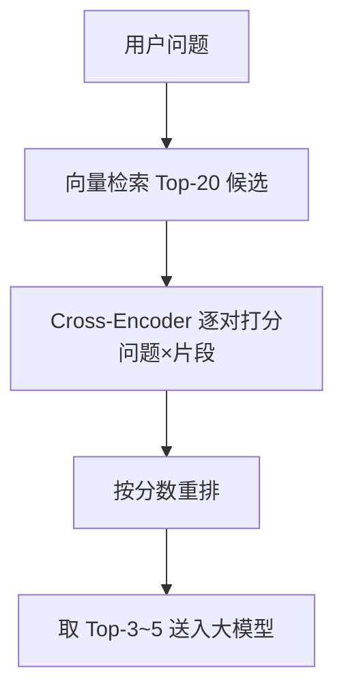

常用重排模型：`bge-reranker-large`（中文强、开源）、Cohere Rerank（API）。

---

### 4.8 混合检索（Hybrid Search）

向量检索擅长"语义"，但不擅长"精确关键词"（如产品型号、错误码、人名）。**BM25** 是经典关键词匹配算法，恰好互补。

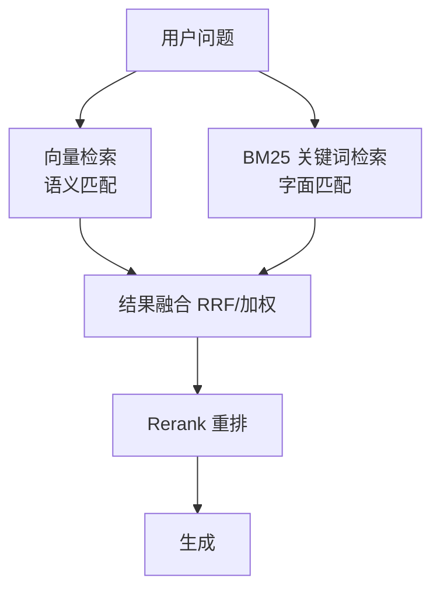

- **向量检索**：找"意思相近"的，比如问"怎么重置密码"能命中"如何找回登录口令"。
- **BM25**：找"词面相同"的，比如问"ERR_502 怎么办"必须精确命中含 `ERR_502` 的文档。
- **融合**：常用 RRF（Reciprocal Rank Fusion）按排名倒数加权合并，再交重排。

---

### 4.9 完整代码：两种技术栈

#### 4.9.1 Python 版（chromadb + openai）

```python
# pip install openai chromadb sentence-transformers
import openai
from chromadb import Client
from chromadb.config import Settings
from sentence_transformers import CrossEncoder  # 重排模型

# ---------- 配置 ----------
OPENAI_API_KEY = "sk-xxx"
EMBED_MODEL = "text-embedding-3-small"   # 也可换 bge/m3e
LLM_MODEL = "gpt-4o-mini"
CHUNK_SIZE = 500        # 切片大小（字符）
CHUNK_OVERLAP = 64      # 重叠
TOP_K = 5               # 初检召回数
RERANK_TOP = 3          # 重排后送入大模型数
TEMPERATURE = 0.1       # 越低越严谨，减少胡编

client = openai.OpenAI(api_key=OPENAI_API_KEY)

# ---------- 1. 切片 ----------
def chunk_text(text, size=CHUNK_SIZE, overlap=CHUNK_OVERLAP):
    """递归式简单切片：按 size 切，相邻片段重叠 overlap。"""
    chunks = []
    start = 0
    while start < len(text):
        end = start + size
        chunks.append(text[start:end])
        start += size - overlap   # 滑动窗口，制造重叠
    return [c for c in chunks if c.strip()]

# ---------- 2. 入库（离线） ----------
def build_index(documents, collection_name="kb"):
    chroma = Client(Settings(anonymized_telemetry=False))
    col = chroma.create_collection(collection_name)

    all_chunks, ids, metas = [], [], []
    for doc_id, text in enumerate(documents):
        for i, c in enumerate(chunk_text(text)):
            all_chunks.append(c)
            ids.append(f"{doc_id}_{i}")
            metas.append({"doc": doc_id, "idx": i})

    # Embedding：文本 -> 向量
    embeddings = [
        client.embeddings.create(input=c, model=EMBED_MODEL).data[0].embedding
        for c in all_chunks
    ]
    col.add(ids=ids, documents=all_chunks, embeddings=embeddings, metadatas=metas)
    return chroma, col

# ---------- 3. 检索 + 重排（在线） ----------
reranker = CrossEncoder("BAAI/bge-reranker-large")  # 中文重排

def retrieve(col, question, top_k=TOP_K):
    q_emb = client.embeddings.create(input=question, model=EMBED_MODEL).data[0].embedding
    res = col.query(query_embeddings=[q_emb], n_results=top_k)
    docs = res["documents"][0]
    # 重排：对每个(问题, 片段)打分
    pairs = [(question, d) for d in docs]
    scores = reranker.predict(pairs)
    ranked = sorted(zip(docs, scores), key=lambda x: x[1], reverse=True)
    return [d for d, _ in ranked[:RERANK_TOP]]

# ---------- 4. 生成 ----------
def ask(col, question):
    contexts = retrieve(col, question)
    prompt = f"""你是企业知识库助手，仅根据下面的【资料】回答，
若资料中没有答案，请回答"资料中未提及"。不要编造。

【资料】
{chr(10).join(f'{i+1}. {c}' for i, c in enumerate(contexts))}

【问题】{question}
【回答】"""
    resp = client.chat.completions.create(
        model=LLM_MODEL,
        temperature=TEMPERATURE,
        messages=[{"role": "user", "content": prompt}],
    )
    return resp.choices[0].message.content, contexts

# ---------- 5. 运行示例 ----------
if __name__ == "__main__":
    docs = ["公司年假规则：入职满1年享5天，满3年享10天。报销需主管审批。"]
    _, col = build_index(docs)
    answer, ctx = ask(col, "我们公司年假怎么算？")
    print("答案：", answer)
    print("引用：", ctx)
```

#### 4.9.2 Java 版（LangChain4j + pgvector）

**依赖（Maven，`pom.xml` 片段）：**

```xml
<dependencies>
  <dependency>
    <groupId>dev.langchain4j</groupId>
    <artifactId>langchain4j</artifactId>
    <version>0.35.0</version>
  </dependency>
  <dependency>
    <groupId>dev.langchain4j</groupId>
    <artifactId>langchain4j-open-ai</artifactId>
    <version>0.35.0</version>
  </dependency>
  <dependency>
    <groupId>dev.langchain4j</groupId>
    <artifactId>langchain4j-pgvector</artifactId>
    <version>0.35.0</version>
  </dependency>
</dependencies>
```

**配置（`application.yml`）：**

```yaml
langchain4j:
  open-ai:
    chat-model:
      api-key: ${OPENAI_API_KEY}
      model-name: gpt-4o-mini
      temperature: 0.1
    embedding-model:
      api-key: ${OPENAI_API_KEY}
      model-name: text-embedding-3-small
spring:
  datasource:
    url: jdbc:postgresql://localhost:5432/ragdb
    username: postgres
    password: postgres
```

**RAG Service 代码：**

```java
@Service
public class RagService {

    // 切片参数
    private static final int CHUNK_SIZE = 500;
    private static final int CHUNK_OVERLAP = 64;
    private static final int TOP_K = 5;

    private final ChatLanguageModel chatModel;
    private final EmbeddingModel embedModel;
    private final ContentRetriever retriever;

    public RagService(ChatLanguageModel chatModel,
                      OpenAiEmbeddingModel embedModel,
                      DataSource dataSource) {
        this.chatModel = chatModel;
        this.embedModel = embedModel;

        // 1. 向量库（pgvector，需先建扩展：CREATE EXTENSION vector;）
        EmbeddingStore store = PgVectorEmbeddingStore.builder()
                .datasource(dataSource)
                .table("knowledge")
                .dimension(1536)   // 与 text-embedding-3-small 维度一致
                .build();

        // 2. 文档解析 + 切片
        DocumentParser parser = new TextDocumentParser();
        Document document = parser.parse(new File("docs/company.txt"));
        DocumentSplitter splitter = DocumentSplitters.recursive(CHUNK_SIZE, CHUNK_OVERLAP);
        List<TextSegment> segments = splitter.split(document);

        // 3. 向量化并入库
        EmbeddingStoreIngestor ingestor = EmbeddingStoreIngestor.builder()
                .embeddingModel(embedModel)
                .embeddingStore(store)
                .build();
        ingestor.ingest(document);

        // 4. 检索器（带重排可用 EmbeddingStoreContentRetriever + 后续 Rerank）
        this.retriever = EmbeddingStoreContentRetriever.builder()
                .embeddingStore(store)
                .embeddingModel(embedModel)
                .maxResults(TOP_K)
                .minScore(0.5)     // 相似度阈值，过滤无关片段
                .build();
    }

    // 5. 问答
    public String ask(String question) {
        RetrievalAugmentor augmentor = DefaultRetrievalAugmentor.builder()
                .contentRetriever(retriever)
                .build();
        ChatMemory memory = MessageWindowChatMemory.withMaxMessages(10);
        ConversationalRetrievalChain chain = ConversationalRetrievalChain.builder()
                .chatLanguageModel(chatModel)
                .retrievalAugmentor(augmentor)
                .chatMemory(memory)
                .build();
        return chain.execute(question);
    }
}
```

#### 4.9.3 参数调优对照表

| 参数 | 推荐值 | 调大影响 | 调小影响 |
| --- | --- | --- | --- |
| chunk_size | 300–500 字 | 上下文多但噪声多、检索不精准 | 上下文缺失、答不全 |
| chunk_overlap | size 的 10–20% | 重复多、冗余 | 边界信息易丢失 |
| top_k | 3–8 | 召回全但 token 贵、易引入噪声 | 可能漏掉正确答案 |
| temperature | 0.0–0.3 | 更发散、易幻觉 | 更严谨、刻板 |

---

### 4.10 RAG 评估与常见问题

#### 4.10.1 回答不准的排查顺序

1. **是不是没检索到？** 直接打印检索出的片段，看是否包含答案。→ 调大 `top_k`、减小 `chunk_size`、换更强 Embedding。
2. **检索到了但答不对？** 片段里有答案却没用。→ 降低 `temperature`、优化 Prompt（强调"仅依据资料"）。
3. **片段本身噪声多？** → 加强解析清洗、调 `chunk_overlap`、加重排。
4. **语义相关但关键词没命中？** → 上混合检索（BM25）。
5. **整体都差？** → 换 Embedding/重排模型，或补文档覆盖度。

#### 4.10.2 幻觉缓解

- Prompt 强约束："资料中没有就回答未提及，禁止编造"。
- 要求模型**标注引用来源**，便于人工核对。
- 设 `min_score` 阈值，低置信度直接拒答。
- 关键场景加**重排 + 答案一致性校验**（如用第二个模型复核）。

#### 4.10.3 成本优化

- Embedding 一次入库、反复查询，优先选便宜的 `text-embedding-3-small` 或本地开源模型。
- 重排只用在初检后的少量候选（Top-20→Top-3），不要全量。
- 缓存高频问题的检索结果；对长文档做去重切片，减少向量条数。
- 生产用 `gpt-4o-mini` 级别模型足以应对多数知识库问答。

---

### 4.11 本章小结

RAG = **检索（找证据）+ 生成（说人话）**。关键链路：文档加载 → 切片 → Embedding → 向量库 → 检索 → 重排 → 拼 Prompt → 生成。工程上 80% 的效果来自**切片策略 + Embedding 选型 + 重排**，而不是换更大的大模型。先跑通最小可用闭环，再用 4.9.3 的对照表逐步调参。

---

### 4.12 自测题

1. **概念**：请用自己的话解释"为什么有了强大的大模型还需要 RAG？"列举至少两个原因。
2. **切片**：chunk_size 设得过大和过小分别会带来什么问题？chunk_overlap 的作用是什么？
3. **相似度**：RAG 为何常用余弦相似度而不是欧氏距离？两者核心区别在哪？
4. **重排**：向量检索已经能返回 Top-K 了，为什么还要再做一次 Rerank？交叉编码器相比"各自编码再比距离"强在哪里？
5. **综合**：用户问"错误码 ERR_502 怎么解决"，但你的知识库里有相关文档却没被检索到。请按本章的排查顺序，给出可能的 3 个原因及对应解决办法。
## 第 5 章：Function Calling 与 Agent —— 让 AI 动手干活

> 在前面的章节里，我们学会了如何调用大模型"聊天"：你输入一段文字，模型返回一段文字。但如果你问它"北京今天天气怎么样"，它只会凭记忆"猜"一个答案——它根本没有联网，也不知道实时数据。
>
> 这一章我们解决一个核心问题：**如何让大模型突破"只能聊天"的限制，去调用真实的外部能力（查天气、查数据库、发邮件、跑代码），并自主完成多步任务？** 答案就是两件事：Function Calling（函数调用）和 Agent（智能体）。

---

### 5.1 Function Calling 原理深解

#### 5.1.1 大模型为什么能"调用函数"

首先要破除一个误解：**大模型并不会真的"运行"你的 Java 函数。** 它既不能访问你的文件系统，也不能直接触发你的代码。所谓"调用函数"，本质上是：

1. 你预先告诉模型："我这里有几个工具可以用，它们长这样（名字、用途、参数）"。
2. 模型根据用户的自然语言问题，**判断是否需要用某个工具**，如果需要，就**生成一段结构化的 JSON**，里面写明"要调用哪个函数 + 参数是什么"。
3. **你的程序**拿到这段 JSON，真正去执行对应的函数，把结果再喂回模型。
4. 模型结合工具返回的真实数据，生成最终的自然语言回答。

换句话说，**模型负责"决定"和"理解"，程序负责"执行"和"兜底"。** 模型是一个"指挥官"，它输出的是指令（JSON），而不是动作本身。

下面这张图说明了这个本质区别：

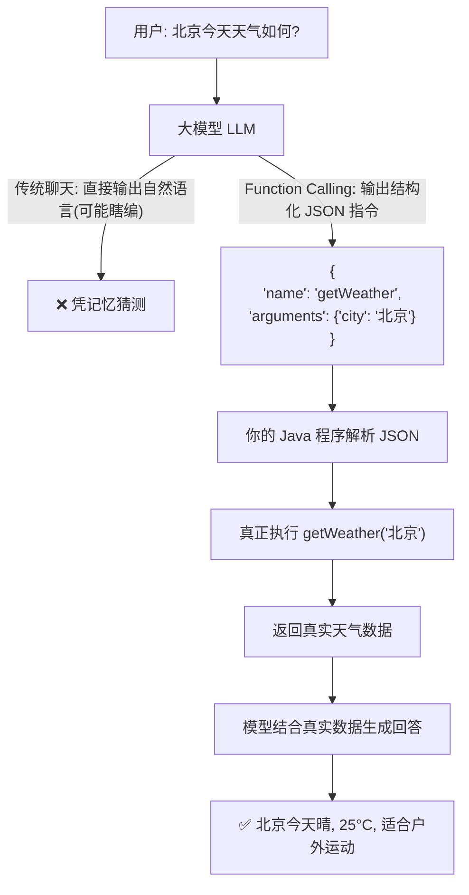

关键点：**"function name + arguments"是 JSON，不是自然语言**，所以解析是确定、可靠的；模型只生成"意图"，执行权始终在你手里（可以控制权限、超时、错误处理）。

#### 5.1.2 完整时序图

下面是一轮完整的 Function Calling 时序。注意每一轮 `messages` 数组是如何变化的——这是最容易出 bug 的地方。

```mermaid
sequenceDiagram
    autonumber
    participant U as 用户
    participant App as 你的程序
    participant LLM as 大模型 API

    U->>App: "北京今天天气如何？"
    App->>LLM: messages=[{role:user, content:"北京今天天气如何？"}]<br/>tools=[getWeather 定义]

    Note over LLM: 模型判断需要工具
    LLM-->>App: 返回 tool_calls:<br/>[{name:"getWeather", args:{city:"北京"}}]<br/>(不再直接回答)

    Note over App: 解析 tool_calls，执行本地函数
    App->>App: 调用 getWeather("北京") 拿到 "晴, 25°C"
    App->>LLM: messages=[
        {role:user, content:"北京今天天气如何？"},
        {role:assistant, tool_calls:[...]},  ← 原样回传模型的指令
        {role:tool, name:"getWeather", content:"晴, 25°C"}  ← 工具结果
    ]

    Note over LLM: 模型结合真实数据生成回答
    LLM-->>App: 返回最终文本: "北京今天晴, 25°C, 适合户外运动"
    App->>U: 展示最终回答
```

`messages` 结构变化的三个要点：
- **第一轮**：只有 `user` 消息 + `tools` 定义。
- **第二轮**：必须**原样保留**第一轮模型发出的 `assistant`(带 `tool_calls`) 消息，再追加一条 `role: tool` 的消息承载工具返回结果。少任何一条都会报错或让模型"失忆"。
- `role: tool` 消息需要带 `name` 字段（对应被调用的函数名），便于模型对齐。

---

### 5.2 工具定义（JSON Schema）详解

工具定义就是告诉模型"有什么工具、怎么用"。它本质是一段 **JSON Schema**。下面以 OpenAI / 兼容 API 的 `tools` 字段为例拆解每个字段。

#### 5.2.1 字段说明

```json
{
  "type": "function",
  "function": {
    "name": "getWeather",
    "description": "查询指定城市当前的天气情况，包括温度、天气状况和风力。",
    "parameters": {
      "type": "object",
      "properties": {
        "city": {
          "type": "string",
          "description": "城市名称，例如：北京、上海、Tokyo"
        },
        "unit": {
          "type": "string",
          "enum": ["celsius", "fahrenheit"],
          "description": "温度单位，不填默认摄氏度"
        }
      },
      "required": ["city"]
    }
  }
}
```

| 字段 | 含义 | 怎么写才对 |
|------|------|-----------|
| `name` | 工具/函数名 | 用英文、动词开头、驼峰，如 `getWeather`、`sendEmail`。不要用空格或中文 |
| `description` | 工具用途 | **极其重要**。模型靠它决定"是否该用这个工具"。要写清楚"能做什么、什么时候用"，不要写实现细节 |
| `parameters.type` | 固定为 `object` | 参数容器 |
| `properties` | 每个参数的定义 | 每个参数都要有 `type` 和 `description`；能用 `enum` 就别用自由文本 |
| `type` | 参数类型 | `string/number/integer/boolean/array/object`，越精确模型越不容易传错 |
| `required` | 必填参数列表 | 只放真正必须的；放太多会让模型卡住，放太少会拿到空值 |

#### 5.2.2 写好 vs 写不好的对比

**❌ 写不好（模型容易误用或传错参）：**

```json
{
  "name": "weather",
  "description": "获取天气",
  "parameters": {
    "type": "object",
    "properties": {
      "location": { "type": "string" },
      "detail": { "type": "string" }
    },
    "required": []
  }
}
```

问题：`description` 太短（没说何时用）、`location` 没说明格式、`detail` 没约束（自由文本 → 模型随便填）、`required` 为空（模型可能漏传城市）。

**✅ 写得好（模型几乎不会用错）：**

```json
{
  "name": "getWeather",
  "description": "当用户询问某城市当前或未来几天的天气、温度、是否适合出行/运动时使用。需要实时数据时必须调用，不要凭记忆回答。",
  "parameters": {
    "type": "object",
    "properties": {
      "city": {
        "type": "string",
        "description": "城市中文名或英文名，例如：北京、上海"
      },
      "days": {
        "type": "integer",
        "enum": [0, 1, 2, 3],
        "description": "预测天数，0 表示今天，最多 3 天。不填默认 0"
      }
    },
    "required": ["city"]
  }
}
```

好在哪：`description` 既说明了用途也说明了触发条件；参数用 `enum` 约束；`required` 只保留必要的 `city`。

---

### 5.3 完整 Java 实现（LangChain4j AiServices 完整版）

下面用 **LangChain4j 的 AiServices** 给出一段接近可运行的完整代码。AiServices 帮我们自动把接口方法转成 `tools` 定义、自动解析 `tool_calls`、自动回填消息，省去大量样板代码。

#### 5.3.1 引入依赖（Maven）

```xml
<dependency>
    <groupId>dev.langchain4j</groupId>
    <artifactId>langchain4j</artifactId>
    <version>0.34.0</version>
</dependency>
<dependency>
    <groupId>dev.langchain4j</groupId>
    <artifactId>langchain4j-open-ai</artifactId>
    <version>0.34.0</version>
</dependency>
```

#### 5.3.2 定义工具（Tool）

工具就是一个普通 Java 类/接口方法，用 `@Tool` 注解描述：

```java
import dev.langchain4j.agent.tool.Tool;
import dev.langchain4j.agent.tool.P;

public class WeatherTools {

    @Tool("查询指定城市今天的天气，返回温度与天气状况，用于判断是否适合户外运动")
    public String getWeather(
            @P("城市名称，如 北京") String city,
            @P("预测天数，0=今天，最多3") int days) {
        // 真实场景里这里会调用天气 API（如和风天气、OpenWeather）
        // 此处用模拟数据演示
        return city + " 今天：晴，25°C，微风3级，空气质量良。";
    }

    @Tool("根据天气和运动类型，判断当前是否适合户外运动")
    public String adviseSport(
            @P("天气描述") String weather,
            @P("运动类型，如 跑步/骑行") String sport) {
        return "天气条件良好，" + sport + " 适合进行，注意补水。";
    }
}
```

#### 5.3.3 定义 AiServices 接口并发起调用

```java
import dev.langchain4j.service.AiServices;
import dev.langchain4j.service.SystemMessage;
import dev.langchain4j.model.openai.OpenAiChatModel;
import dev.langchain4j.model.chat.ChatLanguageModel;

public class AgentDemo {

    interface Assistant {
        @SystemMessage("你是一个贴心的生活助手，需要时务必调用工具获取真实数据，不要凭记忆编造。")
        String chat(String userMessage);
    }

    public static void main(String[] args) {
        ChatLanguageModel model = OpenAiChatModel.builder()
                .apiKey(System.getenv("OPENAI_API_KEY"))
                .modelName("gpt-4o-mini")
                .build();

        Assistant assistant = AiServices.builder(Assistant.class)
                .chatLanguageModel(model)
                .tools(new WeatherTools())   // 注册工具，框架自动生成 tools 定义
                .build();

        // 一次调用，框架内部自动完成：请求→解析tool_calls→执行→回填→二次请求
        String answer = assistant.chat("北京今天天气如何？适合去户外跑步吗？");
        System.out.println(answer);
    }
}
```

`assistant.chat(...)` 背后发生的事情，正是 5.1.2 时序图里的内容，只是被 LangChain4j 封装了。**AiServices 的优势**：不用手写 JSON Schema、不用手动解析 `tool_calls`、不用手动回填 `tool` 消息。

#### 5.3.4 另一种方案：RestTemplate 裸调关键片段

如果你想完全掌控（或对接非标准 API），可以用 Spring 的 `RestTemplate` 裸调。关键片段如下（完整调用需自己拼装 messages 循环）：

```java
// 1) 发起带 tools 的请求
Map<String, Object> body = Map.of(
    "model", "gpt-4o-mini",
    "messages", List.of(Map.of("role", "user",
                  "content", "北京今天天气如何？")),
    "tools", List.of(weatherToolDefinition), // 见 5.2 的 JSON
    "tool_choice", "auto"
);
// RestTemplate 发送 POST 到 /v1/chat/completions

// 2) 解析返回的 tool_calls
// JSON 形如: choices[0].message.tool_calls = [{id, type:"function",
//          function:{name:"getWeather", arguments:"{\"city\":\"北京\"}"}}]
// arguments 是 JSON 字符串，需要再反序列化

// 3) 执行函数后回填
List<Object> messages = new ArrayList<>(firstMessages);
messages.add(Map.of("role", "assistant", "tool_calls", toolCalls)); // 原样回传
messages.add(Map.of("role", "tool",
                     "tool_call_id", id,
                     "name", "getWeather",
                     "content", realResult));     // 工具真实结果
// 4) 再次 POST 同一接口，这次不传 tools 也能出最终回答（推荐仍传）
```

> 裸调的核心工作量在于"拼 messages + 解析 tool_calls + 回填"，且要处理多轮、并行调用、错误。这正是框架的价值所在。

---

### 5.4 多工具选择、并行调用与出错处理

#### 5.4.1 多工具选择

模型会根据每个工具的 `description` 自动选择最匹配的一个。**最佳实践**：给每个工具写清"何时用"；如果工具多（>10 个），可考虑先让模型"选工具类别"再展开（路由模式），避免一次性塞太多工具导致选择变差。

#### 5.4.2 并行调用

模型可以在**一次回复里返回多个 `tool_calls`**（例如同时查北京和上海天气）。处理时要并发执行、各自回填：

```java
// 伪代码：并发执行多个 tool_call
List<CompletableFuture<ToolResult>> futures = toolCalls.stream()
    .map(tc -> CompletableFuture.supplyAsync(() -> execute(tc)))
    .toList();
// 每个结果都生成一条 role:tool 消息，全部追加后再二次请求
```

注意：并行调用时，每条 `tool` 消息必须带对应的 `tool_call_id`，否则模型无法把结果和指令配对。

#### 5.4.3 工具出错处理

工具执行可能抛异常（网络超时、参数非法）。一定要兜底，并把"错误信息"当作 observation 回传，让模型自我纠正：

```java
try {
    return tool.execute(args);
} catch (Exception e) {
    // 把错误作为观察结果返回，让模型决定重试/换参数/放弃
    return "工具执行失败：" + e.getMessage() + "，请尝试调整参数或改用其他工具。";
}
```

同时建议加**超时**与**最大重试次数**，防止单个工具把整个请求拖死。

---

### 5.5 Agent 深入

#### 5.5.1 什么是 Agent

Function Calling 解决的是"调一次工具"。但真实任务往往是多步的：比如"帮我规划一次北京两日游，预算 2000 以内，并把行程发到我邮箱"。这需要查天气、查景点、算预算、调用发邮件——还要在过程中做判断。

**Agent（智能体）= 大模型（大脑）+ 工具（手脚）+ 记忆（上下文）+ 规划/推理循环（思考方式）。** 它不是一个新模型，而是一种"让模型在循环里反复思考→行动→观察"的运行范式。

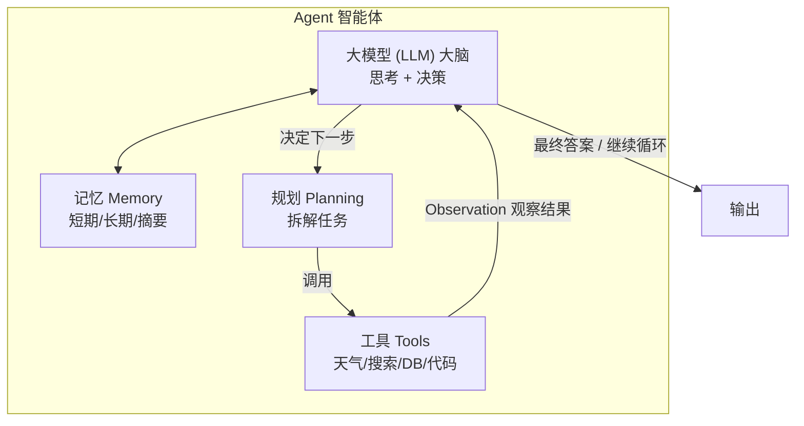

Agent 和 Function Calling 的关系：**Function Calling 是 Agent 的"手脚接口"，Agent 是 Function Calling 在多步循环上的组织方式。**

#### 5.5.2 ReAct 模式原理

ReAct = **Reason（推理）+ Act（行动）**。核心思想是把模型的输出显式拆成：
- **Thought（思考）**：我目前知道什么、还缺什么、下一步该干什么。
- **Action（行动）**：调用哪个工具、传什么参数。
- **Observation（观察）**：工具返回的结果。

循环往复，直到模型认为可以给出 **Final Answer**。

下面用真实例子走一遍。用户问：**"北京今天天气如何，适合户外运动吗？"**

```
Step 1
Thought: 用户想知道北京今天的天气，并判断是否适合户外运动。我需要先获取实时天气。
Action: getWeather(city="北京", days=0)
Observation: 北京 今天：晴，25°C，微风3级，空气质量良。

Step 2
Thought: 已知北京今天晴、25°C、微风、空气良。这些条件对户外运动很友好，无需再查其他数据，可以下结论。
Action: 无需调用工具，直接回答。
Final Answer: 北京今天晴，25°C，微风，空气质量良，非常适合户外运动（如跑步、骑行），记得补水防晒。
```

如果问题更复杂（比如"北京和上海哪个更适合周末出游"），循环会拉长：查北京 → 查上海 → 比较 → 给出结论，体现多步推理。

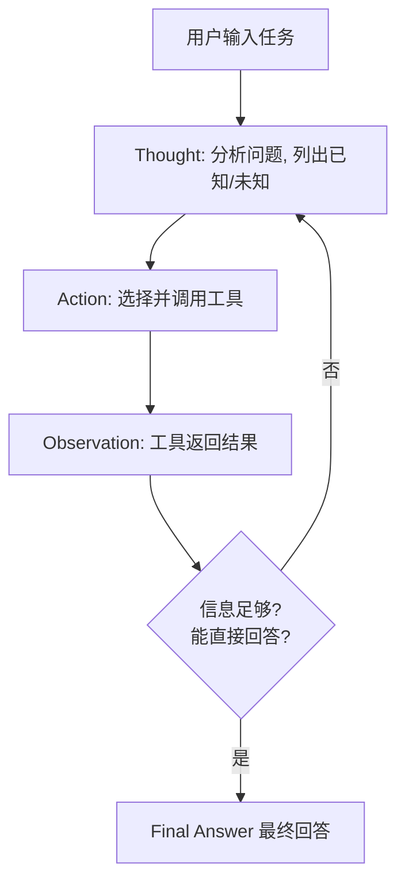

#### 5.5.3 Planning 与 Reflection

ReAct 是"走一步看一步"。更强大的 Agent 还会做两件事：

- **Planning（规划）**：动手前先列计划。例如先让模型输出"任务拆解清单"（1.查天气 2.查景点 3.算预算 4.发邮件），再逐步执行。好处是方向感强、不易走偏。
- **Reflection（反思）**：每完成一步或整体完成后，让模型自评"结果对不对、有没有遗漏、要不要重做"。例如："预算超了 200，需要替换一个景点。" 这能显著提升最终质量。

实践中常见组合：**Plan → ReAct 执行 → Reflect 修正 → 再执行**。

#### 5.5.4 Memory（记忆）类型对比

| 记忆类型 | 原理 | 存什么 | 适用场景 | 优点 | 缺点 |
|---------|------|--------|---------|------|------|
| 短期对话历史 | 把最近 N 轮 messages 原样回传 | 完整对话原文 | 单轮/多轮闲聊、上下文连续任务 | 实现简单、保真度高 | 受 token 上限限制，长对话成本高 |
| 长期向量记忆 | 把历史/知识切片 → 向量化 → 存向量库，按相似度检索 | 语义片段的 embedding | 个人知识库、客服历史、RAG | 可检索海量历史、跨会话 | 需搭建向量库，检索可能有噪声 |
| 摘要记忆 | 定期用模型把历史对话压缩成摘要 | 浓缩后的要点 | 超长任务、角色扮演、长期助手 | 省 token、保留主线 | 细节可能丢失，依赖摘要质量 |

**经验法则**：先用短期记忆跑通；需要"记住用户偏好/跨会话"再加长期向量记忆；对话特别长时用摘要记忆兜底。

#### 5.5.5 Tool vs Agent：什么时候用哪个

| 维度 | 单个 Function Calling | 完整 Agent |
|------|----------------------|-----------|
| 任务步数 | 1~2 步、路径确定 | 多步、路径不确定 |
| 是否需要规划 | 不需要 | 需要拆解与决策 |
| 是否需循环 | 调用一次即可 | 反复思考-行动-观察 |
| 例子 | "查北京天气""算两数之和" | "规划旅行并邮件发送""分析日志定位 Bug" |
| 复杂度/成本 | 低 | 高（多轮调用、更慢更贵） |

**结论**：能用单次工具调用解决的，绝不上 Agent；只有当任务需要"根据中间结果决定下一步"时才用 Agent。

#### 5.5.6 多 Agent 协作

复杂系统常把不同职责拆给多个 Agent，像团队一样配合：

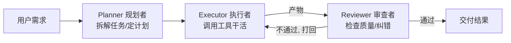

- **Planner**：理解目标，拆成子任务，决定顺序。
- **Executor**：真正调用工具执行子任务。
- **Reviewer**：检查结果是否正确、完整，不通过则打回重做。

其他常见角色还有 Retriever（检索）、Coder（写代码）、Summarizer（总结）。多 Agent 适合"质量敏感、步骤繁杂"的任务，但成本和延迟也更高。

---

### 5.6 完整 Agent 循环代码（ReAct 风格，Java）

下面用**原生思路**（不依赖高级封装）实现一个带最大步数、终止条件的 ReAct Agent。为聚焦逻辑，工具执行用本地方法模拟；真实项目可替换为网络调用。

```java
import java.util.*;

public class ReActAgent {

    // 极简的"工具表"：名字 -> 可执行函数
    static class ToolBox {
        String getWeather(String city) {
            return city + " 今天：晴，25°C，微风，空气良。";
        }
        String adviseSport(String w) {
            return "天气良好，适合户外运动，注意补水。";
        }
    }

    // 这里我们"假装"模型返回结构化指令；真实场景改为调用 LLM API 并解析 JSON。
    // 返回 null 表示模型认为可以结束。
    static class ModelStep {
        String thought;
        String action;     // 工具名，null 表示结束
        String arg;        // 参数
        String finalAnswer;
    }

    // 模拟一次模型决策（真实实现：组装 prompt + 调 LLM + 解析）
    static ModelStep callModel(String userTask, List<String> history) {
        // 演示：第一步查天气，第二步给结论
        if (!history.contains("OBS:weather")) {
            ModelStep s = new ModelStep();
            s.thought = "需要先获取北京实时天气";
            s.action = "getWeather";
            s.arg = "北京";
            return s;
        }
        ModelStep s = new ModelStep();
        s.finalAnswer = "北京今天晴，25°C，微风，非常适合户外运动。";
        return s;
    }

    public static String run(String userTask, int maxSteps) {
        ToolBox tools = new ToolBox();
        List<String> history = new ArrayList<>();
        history.add("USER: " + userTask);

        for (int step = 1; step <= maxSteps; step++) {
            ModelStep s = callModel(userTask, history);

            if (s.action == null) {                // 终止条件：模型不再调用工具
                history.add("ANS: " + s.finalAnswer);
                return s.finalAnswer;
            }

            // Thought / Action 记录
            System.out.println("Step " + step + " Thought: " + s.thought);
            System.out.println("Step " + step + " Action: " + s.action + "(" + s.arg + ")");

            // 执行工具（真实场景含 try/catch 与超时）
            String observation;
            if ("getWeather".equals(s.action)) {
                observation = tools.getWeather(s.arg);
            } else if ("adviseSport".equals(s.action)) {
                observation = tools.adviseSport(s.arg);
            } else {
                observation = "ERROR: 未知工具 " + s.action;
            }
            System.out.println("Step " + step + " Observation: " + observation);

            history.add("THOUGHT: " + s.thought);
            history.add("ACT: " + s.action + "(" + s.arg + ")");
            history.add("OBS:" + s.action + " " + observation);  // 供下次决策参考
        }
        return "⚠️ 达到最大步数 " + maxSteps + " 仍未完成，请检查任务或放宽限制。";
    }

    public static void main(String[] args) {
        String ans = run("北京今天天气如何，适合户外运动吗？", 10);
        System.out.println("最终回答: " + ans);
    }
}
```

要点解读：
- **循环结构**：`for` 循环即 ReAct 循环；每轮 `callModel` 决定"继续行动 or 结束"。
- **最大步数 `maxSteps`**：防止模型陷入死循环无限烧钱，是 Agent 的必备安全闸。
- **终止条件**：模型输出 `action == null`（Final Answer）即停止；否则继续。
- **history**：把 Thought/Action/Observation 累积回传，模拟"记忆"，让下一步决策有依据。
- **真实落地**：把 `callModel` 换成"拼 prompt + 调 LLM + 解析 tool_calls"，把 `ToolBox` 换成真实工具集即可。

---

### 5.7 框架对比与选型建议

| 方案 | 定位 | 语言 | 适合人群 | 优点 | 缺点 |
|------|------|------|---------|------|------|
| 原生 API（HTTP 直调） | 最底层、最灵活 | 任意 | 想彻底理解原理、对接非标接口 | 零框架依赖、完全可控 | 样板代码多、易出 messages 拼接 bug |
| LangChain4j | Java 生态最成熟 LLM 框架 | Java | 纯 Java 团队、快速集成 | AiServices 极简、工具/记忆/RAG 齐全 | 抽象层多、版本迭代快 |
| Spring AI | Spring 官方 AI 抽象 | Java | 已有 Spring Boot 项目 | 与 Spring 生态无缝、可换模型 | 相对年轻、部分高级特性仍在完善 |
| Python CrewAI | 多 Agent 协作框架 | Python | 做多角色 Agent 编排 | 多 Agent 角色/流程开箱即用 | 非 JVM、需另起 Python 服务 |

**给 Java 开发者的选型建议：**
1. **已有 Spring Boot 项目** → 优先 **Spring AI**，贴合现有技术栈，迁移成本低。
2. **想最快跑通工具/Agent、重视生态完整** → 选 **LangChain4j**（本文示例即用它）。
3. **要深度定制协议或对接私有模型** → 用**原生 API** 打底，必要时自封装。
4. **重点做多 Agent 团队编排** → 可考虑 **CrewAI**，但需接受 Java/Python 混合架构（或等 JVM 生态补齐）。

实际工业项目常见组合：**Spring Boot + Spring AI/LangChain4j 做主服务，原生 API 做特殊适配。**

---

### 5.8 实战项目建议

下面给两个"综合 Agent"练手项目，难度适中、能覆盖本章全部知识点。

#### 项目一：个人助理 Agent
- **能力**：查天气、查日历、记待办、发提醒邮件。
- **架构**：
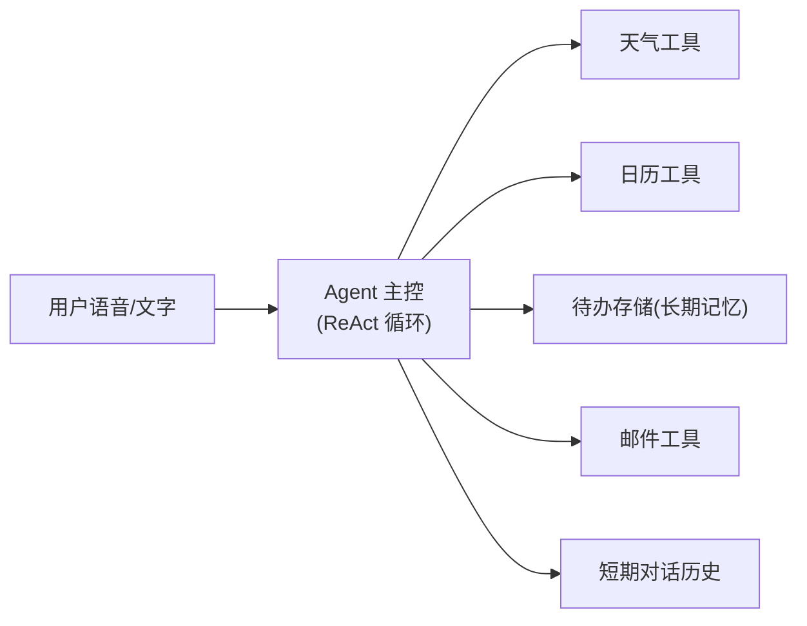
- **知识点覆盖**：多工具选择、记忆（待办=长期）、规划（"提醒我明天跑步"需查日历+写待办+发邮件）。

#### 项目二：代码审查机器人 Agent
- **能力**：拉取 PR  diff → 调用 LLM 分析 → 结合项目规范文档（向量检索）→ 输出审查意见 → 提交评论。
- **角色分工（多 Agent）**：Retriever（检索规范）、Reviewer（审代码）、Summarizer（汇总评论）。
- **知识点覆盖**：多 Agent 协作、向量记忆（RAG）、工具出错处理（API 限流重试）。

> 做项目时牢记安全：**给工具加权限边界与超时**，不要让 Agent 拥有不受控的"删库/发件"能力；先用沙箱环境验证。

---

### 5.9 本章小结

- **Function Calling**：模型输出结构化 JSON 指令（`name` + `arguments`），由你的程序真正执行——模型是"指挥官"，程序是"执行者"。
- **工具定义**用 JSON Schema 描述，`description` 写得好坏直接决定模型会不会用对工具。
- **Agent** = 大模型 + 工具 + 记忆 + 规划/推理循环；**ReAct** 用 Thought/Action/Observation 实现多步自主任务。
- 记忆分短期/长期向量/摘要三类，各有适用场景；能单次工具解决就别上 Agent。
- 多 Agent 通过角色分工（Planner/Executor/Reviewer）协作，适合复杂质量敏感任务。
- Java 落地优先 **Spring AI / LangChain4j**，务必给 Agent 加最大步数与超时等安全闸。

---

### 5.10 自测题

1. **判断并说明**：大模型在 Function Calling 时，是真的在"运行"你的 Java 函数吗？请描述真实的执行链路。
2. **改错题**：下面是一个天气工具的 `description`："获取天气"。请从"模型能否正确选择工具"的角度，说明它的问题，并写出一个改进版。
3. **时序题**：在 Function Calling 的第二次 API 请求中，`messages` 数组应当包含哪几条消息？如果漏掉 `role: assistant`（带 tool_calls）那一条，会发生什么？
4. **设计题**：你要做一个"根据用户问题自动查数据库并生成图表"的功能。请判断应该用"单次 Function Calling"还是"完整 Agent"，并说明理由。
5. **代码题（简述）**：在 ReAct Agent 中，"最大步数（maxSteps）"的作用是什么？如果去掉它，可能出现什么风险？请结合"工具出错陷入死循环"的场景说明。
## 第 6 章：流式输出与生产化 —— 从 Demo 到上线

> 在前 5 章中，你已经学会用 Spring AI / 前端调用大模型完成一次问答。但那只是"Demo 形态"：用户点击按钮，浏览器转圈几秒甚至几十秒，然后一次性吐出整段答案。当真实用户使用你的产品时，这种体验会让人以为"程序卡死了"。本章要解决的，正是**如何把一次 LLM 调用从"同步阻塞"改造成"流式输出"**，以及围绕它的一整套生产化能力：缓存、限流、成本、可观测性、重试与部署。

---

### 6.1 流式输出（Streaming）原理深解

#### 6.1.1 为什么需要流式

大模型（LLM）在底层是**逐 token（词元）生成**的：它先预测第 1 个 token，再基于前面所有 token 预测第 2 个，依此类推，直到生成"结束符"。一个百字回答，背后可能是上百次"前向推理"。

在**同步（普通）模式**下，服务端会等到所有 token 生成完毕，把完整文本拼成 JSON 一次性返回。假设一次回答需要 8 秒，那么前端要"白屏 8 秒"才能看到任何内容。

在**流式模式**下，服务端每生成 1 个（或一小批）token，就立刻通过 HTTP 连接推给前端，前端边收边渲染。用户在第 0.3 秒就能看到第一个字，体验从"卡死"变成"打字机"。

| 维度 | 同步响应 | 流式响应 |
| --- | --- | --- |
| 首字可见延迟 | 等于整体耗时（如 8s） | ≈ 首 token 耗时（如 0.3s） |
| 连接占用 | 长连接但"静默等待" | 长连接但持续有数据 |
| 用户感知 | "卡住了？" | "正在打字" |
| 取消能力 | 难（已占满后端算力） | 易（发个取消即可中断） |
| 实现复杂度 | 低 | 中（需 SSE/WS + 逐块解析） |

> 结论：**凡是面向真实用户的对话类产品，流式输出几乎是必选项。**

#### 6.1.2 SSE（Server-Sent Events）协议原理

SSE 是浏览器原生支持的单向（服务端→客户端）流式协议，基于普通 HTTP，比 WebSocket 轻量得多。它的核心 MIME 类型是 `text/event-stream`，数据用纯文本发送，每条消息形如：

```
data: {"content":"你好"}

data: {"content":"，世界"}

event: done
data: [DONE]
```

要点：
- 每条消息以 `data:` 开头，多个 `data:` 行会被拼接；消息以**空行（两个换行）**分隔。
- 可选 `event:` 指定事件名，`id:` 用于断线重连，`retry:` 指定重连毫秒。
- **心跳**：长时间无数据时，服务端可周期性发送注释行 `:\n\n`（以冒号开头的注释行会被客户端忽略），防止中间代理（Nginx）因空闲断开连接。

下面用 Mermaid 展示一次 SSE 数据流：

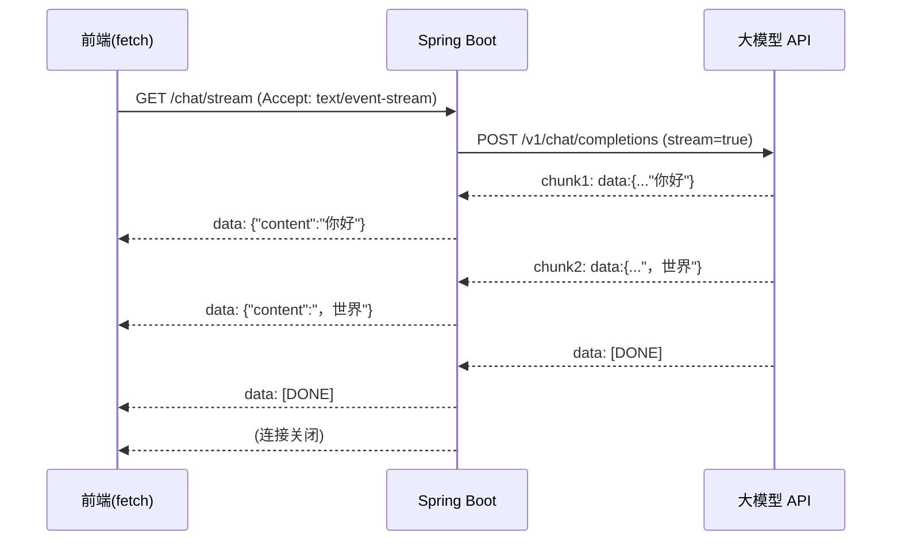

#### 6.1.3 WebSocket vs SSE 对比

| 维度 | SSE | WebSocket |
| --- | --- | --- |
| 方向 | 单向（服务端→客户端） | 双向（全双工） |
| 协议基础 | 普通 HTTP（易走 CDN/网关） | 独立 `ws://` 协议，需升级握手 |
| 浏览器 API | 原生 `EventSource`（自动重连） | 需手写 `WebSocket` |
| 断线重连 | 原生支持 | 需自己实现 |
| 适合场景 | LLM 逐字输出、通知推送 | 多人聊天、游戏、协同编辑 |
| 复杂度 | 低 | 中高 |

> AI 对话场景绝大多数是"单向流"，**优先选 SSE**。只有需要"前端随时打断/双向控制信道"时才上 WebSocket。

#### 6.1.4 后端：Spring Boot WebFlux 流式返回

Spring Boot 3 + WebFlux 对 SSE 有原生支持：控制器方法返回 `Flux<String>`，并标注 `produces = MediaType.TEXT_EVENT_STREAM_VALUE`。下面代码演示：把 DeepSeek/OpenAI 的流式响应（`data: {...}` 行）逐 chunk 解析，提取 `choices[0].delta.content`，转发为 SSE 给前端，遇到 `[DONE]` 终止。

```java
// ChatController.java  (Spring Boot 3 / WebFlux)
@RestController
@RequestMapping("/api/chat")
public class ChatController {

    private final WebClient llmClient =
        WebClient.builder().baseUrl("https://api.deepseek.com").build();

    @GetMapping(value = "/stream", produces = MediaType.TEXT_EVENT_STREAM_VALUE)
    public Flux<String> stream(@RequestParam String question) {
        // 1) 构造请求体，开启 stream=true
        Map<String, Object> body = Map.of(
            "model", "deepseek-chat",
            "stream", true,
            "messages", List.of(
                Map.of("role", "user", "content", question))
        );

        return llmClient.post()
            .uri("/v1/chat/completions")
            .header(HttpHeaders.AUTHORIZATION, "Bearer " + apiKey)
            .contentType(MediaType.APPLICATION_JSON)
            .bodyValue(body)
            .retrieve()
            .bodyToFlux(String.class)            // 原始 SSE 文本行
            .map(this::parseChunk)               // 解析出 content / 检测 [DONE]
            .takeUntil("__DONE__"::equals)       // 遇到终止标记即结束流
            .filter(s -> !"__DONE__".equals(s))
            .map(content -> "data: " + content + "\n\n"); // 封装为 SSE 格式
    }

    // 解析单行： "data: {...}" 或 "data: [DONE]"
    private String parseChunk(String raw) {
        if (raw == null) return "";
        String line = raw.startsWith("data:") ? raw.substring(5).trim() : raw.trim();
        if ("[DONE]".equals(line)) return "__DONE__";
        try {
            JsonNode node = new ObjectMapper().readTree(line);
            JsonNode delta = node.path("choices").path(0).path("delta").path("content");
            return delta.isMissingNode() ? "" : delta.asText();
        } catch (Exception e) {
            return "";   // 忽略心跳/注释行等
        }
    }
}
```

> 说明：真实项目建议用 Spring AI 的 `ChatClient.stream()`，它会帮你处理 `[DONE]` 和 JSON 解析，返回 `Flux<ChatResponse>`，代码更简洁。上面手写版是为了展示**协议层原理**。

#### 6.1.5 前端：fetch + ReadableStream 逐字追加

`EventSource` 只支持 GET，若你的接口是 POST（带 body），要用 `fetch` + `ReadableStream` 手动读流：

```html
<!-- chat.html -->
<div id="bubble" class="bubble"></div>
<script>
async function send(question) {
  const bubble = document.getElementById('bubble');
  bubble.textContent = '';
  const resp = await fetch('/api/chat/stream?question=' + encodeURIComponent(question));
  const reader = resp.body.getReader();
  const decoder = new TextDecoder('utf-8');
  let buffer = '';

  while (true) {
    const { value, done } = await reader.read();
    if (done) break;
    buffer += decoder.decode(value, { stream: true });
    // 按 SSE 空行分块
    let idx;
    while ((idx = buffer.indexOf('\n\n')) !== -1) {
      const frame = buffer.slice(0, idx).trim();
      buffer = buffer.slice(idx + 2);
      if (frame.startsWith('data:')) {
        const text = frame.slice(5).trim();
        if (text === '[DONE]') return;
        bubble.textContent += text;   // 逐字追加进聊天气泡
      }
    }
  }
}
</script>
```

#### 6.1.6 流式输出的三大工程问题

1. **如何取消**：前端用 `AbortController`，`reader.cancel()` 会断开连接；后端 SSE 流要监听 `Flux` 的 `doOnCancel()`，主动中断对上游 LLM 的请求（WebClient 本身可在取消时释放连接，避免"用户走了但算力还在跑"）。
2. **如何处理错误**：流中途 LLM 报错时，不要静默断流，应发送一个 `event: error` 帧或在 JSON 里带 `error` 字段，前端据此展示"生成失败，请重试"并停止追加。
3. **如何做限流**：流是长连接，常规"QPS 限流"不够，需按**并发连接数**或**用户级 Token 桶**限流（见 6.3），否则少数用户可占满全部出站带宽与模型配额。

---

### 6.2 语义缓存（Semantic Cache）原理与实现

#### 6.2.1 原理

普通缓存靠"完全相等"的 key 命中（如 Redis 的 `GET question`）。但用户问"北京天气"和"北京今天天气怎么样"语义相同、字符串不同，精确缓存打不中，却会重复花钱调用 LLM。

**语义缓存**的做法：
1. 把问题用 Embedding 模型转成向量（如 1536 维）。
2. 缓存里存 `(向量, 问题, 答案)`。
3. 新问题来了，算它与缓存问题向量的**余弦相似度**；若 `相似度 > 阈值（如 0.95）`，直接返回缓存答案，省一次 API 调用。

```
余弦相似度 = (A · B) / (|A| × |B|)   ∈ [-1, 1]，越接近 1 越相似
```

| 缓存类型 | Key 方式 | 命中条件 | 适合场景 |
| --- | --- | --- | --- |
| 精确缓存 | 原文字符串 | 完全相同 | 幂等接口、固定模板 |
| Redis 缓存 | 任意 key（含哈希） | key 相等 | 通用 KV |
| 语义缓存 | 向量 | 语义相似 > 阈值 | LLM 问答、FAQ |

#### 6.2.2 Java 实现（Embedding + 余弦 + 存储）

下面用 `ConcurrentHashMap` 做内存版（生产可替换为 Redis + 向量检索）：

```java
// SemanticCache.java
public class SemanticCache {
    private final EmbeddingClient embed; // Spring AI EmbeddingClient
    private final Map<String, CacheEntry> store = new ConcurrentHashMap<>();
    private final double threshold = 0.95;

    public String get(String question) {
        float[] q = embed.embed(question);
        for (CacheEntry e : store.values()) {
            if (cosine(q, e.vector) >= threshold) return e.answer; // 命中
        }
        return null; // 未命中
    }

    public void put(String question, String answer) {
        store.put(question, new CacheEntry(embed.embed(question), question, answer));
    }

    private double cosine(float[] a, float[] b) {
        double dot = 0, na = 0, nb = 0;
        for (int i = 0; i < a.length; i++) {
            dot += a[i] * b[i]; na += a[i] * a[i]; nb += b[i] * b[i];
        }
        return dot / (Math.sqrt(na) * Math.sqrt(nb));
    }

    record CacheEntry(float[] vector, String question, String answer) {}
}
```

调用处：先查语义缓存，未命中再调 LLM 并回填。

```java
String ans = cache.get(question);
if (ans == null) {
    ans = chatClient.prompt(question).call().content();
    cache.put(question, ans);
}
```

#### 6.2.3 缓存失效与更新

- **TTL 过期**：知识会过时，给每条缓存加过期时间（如 24h）。
- **主动失效**：知识库更新时，按业务 tag 批量清除相关条目。
- **质量过滤**：只缓存"被用户点赞/未被举报"的答案，避免把错误答案长期复用。
- **阈值调优**：阈值过低会"答非所问"，过高则命中率低；建议从 0.92 起步，结合线上日志调。

---

### 6.3 限流（Rate Limiting）算法对比

#### 6.3.1 四种算法原理

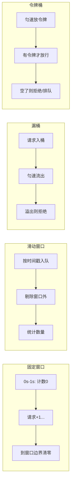

| 算法 | 原理 | 优点 | 缺点 | 适合 |
| --- | --- | --- | --- | --- |
| 固定窗口 | 时间窗口内计数，到边界清零 | 实现最简单 | 窗口临界点**双倍突发**（如 59s+1s 各满） | 粗粒度保护 |
| 滑动窗口 | 按时间戳统计最近 N 秒请求 | 平滑、无临界突刺 | 需存时间戳，内存稍高 | 精确限流 |
| 漏桶 | 请求入桶，匀速流出，溢出拒绝 | 输出速率恒定，平滑流量 | 突发友好性差 | 保护下游、整形 |
| 令牌桶 | 匀速放令牌，取到才放行 | 允许一定**突发**，最常用 | 需维护令牌数 | 通用 API 限流 |

#### 6.3.2 Java 令牌桶实现（手写）

```java
// TokenBucket.java
public class TokenBucket {
    private final long capacity;        // 桶容量
    private final double refillRate;    // 每秒补充令牌数
    private double tokens;
    private long lastRefill;

    public TokenBucket(long capacity, double refillRate) {
        this.capacity = capacity; this.refillRate = refillRate;
        this.tokens = capacity; this.lastRefill = System.nanoTime();
    }

    public synchronized boolean tryAcquire() {
        refill();
        if (tokens >= 1) { tokens -= 1; return true; }
        return false;
    }

    private void refill() {
        long now = System.nanoTime();
        double secs = (now - lastRefill) / 1e9;
        tokens = Math.min(capacity, tokens + secs * refillRate);
        lastRefill = now;
    }
}
```

> 生产环境推荐 **Resilience4j** 的 `RateLimiter`（`@RateLimiter(name="llmApi")`），它已实现令牌桶并支持 `waitForPermission`。也可直接用 Spring Cloud Gateway 的 `RequestRateLimiter` 过滤器（基于 Redis）。

#### 6.3.3 用户级 + 全局级限流

- **用户级**：每个 `userId` 一个令牌桶（如 20 次/分钟），防单用户刷爆。
- **全局级**：整个服务一个桶（如 1000 次/分钟），防总量超模型配额。
- 两层**同时**判断，任一拒绝即 429。可用 `Map<userId, TokenBucket>` 实现用户级，配合一个全局 `TokenBucket`。

---

### 6.4 Token 计费与成本优化

#### 6.4.1 Token 如何计费

模型按 **token 数** 计费，且**输入（prompt）和输出（completion）分开计价**。一个中文汉字约 0.6~1.5 个 token，英文单词约 1 个。示例（示意价）：输入 ¥0.014/千 token，输出 ¥0.028/千 token。

#### 6.4.2 成本优化清单

1. **短模型优先**：能用 7B/小模型解决的（分类、抽取），别用旗舰大模型。
2. **限制 `max_tokens`**：防止模型"话痨"拉长输出。
3. **语义缓存**：重复问题零成本（见 6.2）。
4. **Prompt 压缩**：精简系统提示、去掉冗余示例；长文档用 RAG 只取相关片段。
5. **批量 API（Batch）**：非实时任务走批量接口，价格常打 5 折。
6. **复用上下文**：多轮对话避免重复发送完整历史，可只发增量。

#### 6.4.3 成本估算小例子

假设：1 万用户，每人每天 10 次对话，每次平均输入 500 token + 输出 300 token。

- 日调用次数：`10,000 × 10 = 100,000` 次
- 日输入 token：`100,000 × 500 = 5,000 万`
- 日输出 token：`100,000 × 300 = 3,000 万`
- 日费用：`(50,000 × 0.014) + (30,000 × 0.028)` = `700 + 840` = **¥1,540 / 天**
- 月费用 ≈ **¥4.6 万**（未计缓存命中节省；若语义缓存命中率 30%，可省约 ¥1.4 万/月）。

---

### 6.5 可观测性（Observability）与评估

#### 6.5.1 为什么要监控

LLM 应用"看不见内部状态"：Token 偷偷涨、延迟突然高、偶发幻觉。必须量化。核心监控对象：**Token 消耗、首 token 延迟、错误率、幻觉率、成本**。

#### 6.5.2 LLM 调用追踪

- **Spring AI Observation**：集成 Micrometer，自动为每个 `ChatClient` 调用生成 `gen_ai` 语义约定指标（模型名、token 数、耗时），对接 Prometheus + Grafana。
- **LangSmith 思路**：把每次调用的 prompt、响应、token、耗时、父子链路全记录下来，支持回放与对比；自建可用 OpenTelemetry traces 实现类似能力。

#### 6.5.3 关键指标

| 指标 | 含义 | 关注点 |
| --- | --- | --- |
| TTFT（首 token 延迟） | 请求到首个字符的时间 | 用户体验核心 |
| 吞吐 (tokens/s) | 每秒生成 token | 模型/网络性能 |
| 成本/请求 | 单次调用平均花费 | 预算控制 |
| 错误率 / 429 率 | 失败占比 | 限流与健康 |

下面用一张图串联"采集 → 存储 → 告警"的监控链路：

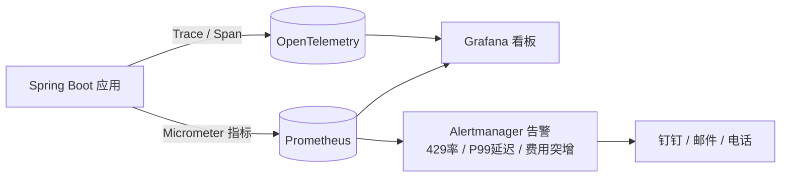

#### 6.5.4 评估方法：LLM-as-Judge

用**另一个更强的 LLM 当评委**，对回答从"相关性、正确性、无害性"打分（0~5）。先把标准写成 rubric，再批量跑裁判，得到可量化的质量趋势。注意：评委本身也会出错，关键场景仍需人工抽检。

---

### 6.6 错误重试与退避

LLM API 常见问题：**429（限流）**、**5xx（服务端抖动）**、**超时**。盲目立即重试会雪上加霜，**指数退避（Exponential Backoff）** 让重试间隔随次数指数增长，并加随机抖动（jitter）避免"重试风暴"。

公式：`等待 = base × 2^尝试次数 + 随机抖动`，并设置最大重试次数与上限。

```java
// RetryUtils.java —— 手写指数退避
public class RetryUtils {
    public static <T> T withRetry(Supplier<T> task, int maxAttempts) {
        long base = 500; // ms
        for (int i = 0; i < maxAttempts; i++) {
            try {
                return task.get();
            } catch (Exception e) {
                boolean retryable = isRetryable(e); // 429 / 5xx / 超时
                if (!retryable || i == maxAttempts - 1) throw e;
                long wait = base * (1L << i) + (long)(Math.random() * base);
                try { Thread.sleep(wait); } catch (InterruptedException ie) { Thread.currentThread().interrupt(); throw e; }
            }
        }
        throw new IllegalStateException("unreachable");
    }

    private static boolean isRetryable(Exception e) {
        // 可结合 HttpStatus：429 / 500 / 502 / 503 / 504 与 SocketTimeoutException
        return e instanceof SocketTimeoutException
            || (e instanceof ResponseStatusException r && (r.getStatusCode().is5xxServerError() || r.getStatusCode().value() == 429));
    }
}
```

> 生产推荐 **Resilience4j Retry**（`@Retry(name="llm", maxAttempts=3)`）配合 `RetryConfig` 配置退避与可重试异常，比手写更稳健。

---

### 6.7 部署架构

#### 6.7.1 部署架构图

```mermaid
flowchart TB
    U[用户 / 前端] --> GW[API 网关 / 限流 / 鉴权]
    GW --> APP[Spring Boot 应用<br/>流式 + 缓存 + 限流 + 重试]
    APP --> LLM[大模型 API<br/>DeepSeek / OpenAI]
    APP --> VEC[(向量库<br/>pgvector / Chroma)]
    APP --> CACHE[(Redis<br/>语义缓存 + 限流计数)]
    APP --> OBS[可观测性<br/>Prometheus + Grafana + Trace]
    APP -. 指标/日志 .-> OBS
```

#### 6.7.2 Docker Compose 示例

```yaml
# docker-compose.yml
version: "3.9"
services:
  app:
    build: .
    ports: ["8080:8080"]
    environment:
      - SPRING_REDIS_HOST=redis
      - SPRING_DATASOURCE_URL=jdbc:postgresql://pg:5432/ai
      - LLM_API_KEY=${LLM_API_KEY}
    depends_on: [redis, pg]

  redis:
    image: redis:7-alpine
    ports: ["6379:6379"]

  pg:
    image: pgvector/pgvector:pg16
    environment:
      - POSTGRES_DB=ai
      - POSTGRES_PASSWORD=secret
    ports: ["5432:5432"]

  chroma:
    image: chromadb/chroma:latest
    ports: ["8000:8000"]
```

#### 6.7.3 K8s 与 HPA 自动扩缩容

把 `app` 打成镜像部署为 Deployment，配合 **HPA（HorizontalPodAutoscaler）** 按 CPU/内存或自定义指标（如并发连接数）自动增减副本：

```yaml
# hpa.yaml
apiVersion: autoscaling/v2
kind: HorizontalPodAutoscaler
metadata: { name: llm-app }
spec:
  scaleTargetRef: { kind: Deployment, apiVersion: apps/v1, name: llm-app }
  minReplicas: 2
  maxReplicas: 20
  metrics:
    - type: Resource
      resource: { name: cpu, target: { type: Utilization, averageUtilization: 70 } }
```

> 注意：HPA 扩的是"应用副本"，**模型配额本身无法水平扩展**，因此限流（6.3）仍是保护上游的最后一道闸。

---

### 6.8 生产就绪检查清单

**安全**
- [ ] API Key 存放于密钥管理（Vault/环境变量），不入库、不进前端
- [ ] 用户输入做注入防护与内容审核，防 Prompt 注入
- [ ] 接口鉴权 + 用户级限流，防滥用

**成本**
- [ ] 已启用语义缓存；已设 `max_tokens`
- [ ] 有 Token/费用看板，设预算告警
- [ ] 非实时任务走 Batch 接口

**性能**
- [ ] 流式输出已落地（TTFT 受控）
- [ ] 连接池、超时（connect/read）已配置
- [ ] 网关/应用层限流已生效

**可观测性**
- [ ] Token、延迟、错误率、成本指标接入监控
- [ ] 调用链追踪（Trace）可回放
- [ ] 有关键告警（429 率、P99 延迟、费用突增）

**容错**
- [ ] 指数退避重试（429/5xx/超时）
- [ ] 模型降级策略（主模型失败时降级小模型）
- [ ] 上游不可用时返回友好错误而非崩溃

---

### 6.9 本章自测题

1. **概念**：SSE 与 WebSocket 最主要的区别是什么？为什么 AI 对话场景通常优先选 SSE？
2. **协议**：SSE 消息以什么字符作为单条消息的分隔？如何用注释行实现心跳？
3. **缓存**：语义缓存与传统 Redis 精确缓存在"命中条件"上有何本质不同？阈值设得过低会带来什么问题？
4. **限流**：固定窗口限流在"窗口临界时刻"会出现什么缺陷？令牌桶相比它有何优势？
5. **成本/容错**：某接口每秒最多 5 次调用，某用户在第 0.9 秒连发 5 次、第 1.1 秒又连发 5 次，固定窗口限流会如何处理？这种设计风险在哪？指数退避如何缓解上游限流（429）带来的雪崩？

---

> **本章小结**：从"能跑"到"能上线"，关键不只是流式输出本身，而是一整条链路——SSE 让体验顺滑，语义缓存与限流守住成本与稳定性，可观测性让你"看得见"，重试与降级让你"扛得住"，容器化与 HPA 让你"扩得开"。下一章我们将进入 RAG（检索增强生成），把"模型不知道的知识"接进来。
## 第 7 章：GitHub 实战项目推荐 —— 向优秀开源项目学习

> ⏱ 预计时间：持续关注 | 🎯 目标：找到适合自己水平的开源项目，边看边学

学完前面 6 章后，你已经能独立搭建 AI 应用了。但自己闷头写代码进步有限——**阅读优秀的开源项目，是提升最快的途径之一**。

本章精选了 GitHub 上最适合 Java + 前端背景学习者的 AI 开源项目，按难度和用途分类。

---

### 7.1 项目总览

```
难度  ★☆☆          ★★☆              ★★★
      │              │                 │
  快速体验型      教程/学习型       生产级平台型
  (点点就能用)   (跟着代码学)      (阅读源码提升)
```

| 难度 | 适合人群 | 学习方式 |
|------|---------|----------|
| ★☆☆ | 刚入门，想先体验 AI 应用长什么样 | 部署运行，理解功能 |
| ★★☆ | 有一定基础，想跟着代码学习 | Clone + 运行 + 调试 + 修改 |
| ★★★ | 想深入理解架构设计 | 阅读源码，学习设计模式 |

---

### 7.2 Java 后端项目（与你的技术栈完美匹配）

#### 🌟 首推：llm-apps-java-spring-ai

| 项目信息 | 详情 |
|----------|------|
| **GitHub** | [ThomasVitale/llm-apps-java-spring-ai](https://github.com/ThomasVitale/llm-apps-java-spring-ai) |
| **难度** | ★★☆ |
| **技术栈** | Spring Boot 3 + Spring AI + Ollama + PGVector + OpenAI |
| **推荐理由** | **Java AI 学习最佳项目，没有之一！** 56 个可运行示例，覆盖手册第 0-6 章全部内容 |

**项目包含的示例（直接对应本手册各章）**：

| 分类 | 示例数量 | 对应手册章节 | 亮点示例 |
|------|---------|-------------|---------|
| 用例 (Use Cases) | 5 个 | 第 2、4 章 | Chatbot、RAG 问答、语义搜索、文本分类 |
| 模型集成 (Models) | 10 个 | 第 1、2 章 | OpenAI / Ollama / Mistral AI 三套方案 |
| Prompt 设计模式 | ~25 个 | 第 3 章 | 模板、结构化输出、多模态、消息角色 |
| Tool Calling | 3 个 | 第 5 章 | OpenAI / Ollama / Mistral 三种实现 |
| 记忆 (Memory) | 4 个 | 第 5 章 | 基础记忆、JDBC、向量存储、Spring Security |
| RAG 流程 | 4 个 | 第 4 章 | 朴素 RAG、高级 RAG、分支 RAG、条件 RAG |
| 数据摄取 | 7 个 | 第 4 章 | JSON/Markdown/PDF/Tika 文档读取与分块 |
| 护栏 (Guardrails) | 2 个 | 第 6 章 | 输入护栏、输出护栏 |
| 可观测性 | 4 个 | 第 6 章 | 模型调用监控、向量存储监控 |

> **学习建议**：每学完手册一章，就去这个项目找对应示例运行一遍。从 `use-cases/chatbot` 开始，逐步深入。

---

#### 🌟 推荐二：LangChat/ai-tutorials

| 项目信息 | 详情 |
|----------|------|
| **GitHub** | [LangChat/ai-tutorials](https://github.com/LangChat/ai-tutorials) |
| **在线文档** | [ai-tutorials.langchat.cn](https://ai-tutorials.langchat.cn/) |
| **难度** | ★★☆ |
| **技术栈** | Java 17 + Maven + LangChain4j 1.10 + JUnit 5 |
| **推荐理由** | **中文友好，0 基础上手，40 篇文档 + 完整测试代码** |

**教程目录（部分）**：

```
01 - LangChain4j 简介
02 - 第一个聊天应用
03 - ChatModel 深入（含流式聊天）
07 - Embedding 模型
08 - 向量存储
10 - RAG 检索增强生成
11 - AI Services 声明式服务
... (共 40 篇)
```

**项目特点**：
- 每个主题都有**独立的测试类**，可以直接运行
- 使用 `.env` 文件统一管理配置，安全规范
- 支持 DeepSeek、OpenAI、通义千问等多种模型
- 代码风格好，有 Lombok、JUnit DisplayName 等最佳实践

> **学习建议**：先看在线文档理解概念，再 clone 代码运行测试，最后自己改参数实验。非常适合配合本手册第 2-5 章同步学习。

---

#### 🌟 推荐三：yu-ai-agent（AI 超级智能体）

| 项目信息 | 详情 |
|----------|------|
| **GitHub** | [liyupi/yu-ai-agent](https://github.com/liyupi/yu-ai-agent) |
| **难度** | ★★★ |
| **技术栈** | Java 21 + Spring Boot 3 + Spring AI + LangChain4j + PgVector + MCP |
| **推荐理由** | **完整全栈 AI 项目，从 0 到 1 构建 Agent** |

**项目内容**：
- **AI 恋爱大师应用**：多轮对话 + RAG 知识库 + 工具调用 + MCP 服务
- **YuManus 自主智能体**：基于 ReAct 模式，能自主搜索、下载、生成 PDF
- 配套完整视频教程 + 文字教程

**学习大纲**（9 期）：
1. 项目总览与架构设计
2. AI 大模型接入（4 种方式）+ 本地部署
3. AI 应用开发：Prompt 工程 + 多轮对话 + 结构化输出
4. RAG 知识库基础：Spring AI + 本地/云知识库
5. RAG 知识库进阶：ETL + 向量数据库 + 检索策略调优
6. 工具调用：6 种工具开发（搜索、文件、抓取、终端、下载、PDF）
7. MCP 协议：3 种使用方式 + MCP Server 开发
8. AI 智能体构建：ReAct + OpenManus 原理 + 自主实现
9. AI 服务化：SSE 接口 + 前端 + Docker + Serverless 部署

> **学习建议**：完成本手册前 6 章后再来看这个项目。它相当于把你学的所有知识串成一个完整的全栈产品，是**简历项目的绝佳素材**。

---

#### 🌟 推荐四：langchain4j-examples（官方示例）

| 项目信息 | 详情 |
|----------|------|
| **GitHub** | [langchain4j/langchain4j-examples](https://github.com/langchain4j/langchain4j-examples) |
| **难度** | ★★☆ |
| **技术栈** | Java + LangChain4j + 多种模型 |
| **推荐理由** | LangChain4j 官方出品，示例最权威 |

包含：Chat Models、Embedding、RAG、Tools、Agents、Image Models、Audio Models 等全方位示例。

---

#### 🌟 推荐五：spring-ai-community/awesome-spring-ai

| 项目信息 | 详情 |
|----------|------|
| **GitHub** | [spring-ai-community/awesome-spring-ai](https://github.com/spring-ai-community/awesome-spring-ai) |
| **难度** | ★☆☆ |
| **推荐理由** | 不是项目，是**资源索引**——收集了 Spring AI 生态的所有教程、工具、项目 |

当你不知道用什么库、看什么教程时，来这里搜就对了。

---

### 7.3 前端项目（发挥你的前端优势）

#### 🌟 Lobe Chat —— 开源 ChatGPT 替代品

| 项目信息 | 详情 |
|----------|------|
| **GitHub** | [lobehub/lobe-chat](https://github.com/lobehub/lobe-chat) |
| **难度** | ★★☆ |
| **Star** | 63K+ |
| **技术栈** | React + TypeScript + Next.js + shadcn/ui |
| **推荐理由** | **最好的 AI 聊天前端开源项目，UI 精美，功能完整** |

**你可以学到**：
- AI 聊天界面的完整前端架构
- 多模型切换（OpenAI / Claude / Gemini / Ollama）
- 流式输出（SSE）的前端实现
- 插件系统和知识库的前端交互
- PWA 离线支持、国际化、主题切换

> **学习建议**：作为前端开发者，这个项目的 UI/UX 设计值得深入研究。你可以参考它的对话组件设计，用在自己的项目中。

---

#### 🌟 NextChat (ChatGPT-Next-Web)

| 项目信息 | 详情 |
|----------|------|
| **GitHub** | [ChatGPTNextWeb/NextChat](https://github.com/ChatGPTNextWeb/NextChat) |
| **难度** | ★★☆ |
| **Star** | 80K+ |
| **技术栈** | React + Next.js |
| **推荐理由** | 部署最简单，5 分钟就能用上自己的 ChatGPT 套壳**

特别适合快速搭建私有的 AI 聊天前端，支持一键 Vercel 部署。

---

#### 🌟 Shadcn Chatbot Kit

| 项目信息 | 详情 |
|----------|------|
| **GitHub** | [blazity/shadcn-chatbot-kit](https://github.com/blazity/shadcn-chatbot-kit) |
| **难度** | ★☆☆ |
| **技术栈** | React + Next.js + shadcn/ui + Vercel AI SDK |
| **推荐理由** | **拿来即用的聊天组件库**，基于 shadcn/ui 构建**

如果你已经在用 shadcn/ui 做前端，这个库能让你几分钟搭出一个 AI 聊天界面。

---

### 7.4 平台型项目（理解 AI 产品全貌）

这些项目比较大，不建议一上来就啃源码。可以先**部署使用**，理解功能和架构后再深入。

| 项目 | GitHub | Star | 一句话介绍 | 适合你吗？ |
|------|--------|------|-----------|-----------|
| **Dify** | [langgenius/dify](https://github.com/langgenius/dify) | 60K+ | 可视化的 LLM 应用开发平台，拖拽式构建 AI 工作流 | ⭐ 强烈推荐！用它快速验证想法，再用 Java 自己实现 |
| **FastGPT** | [labring/FastGPT](https://github.com/labring/FastGPT) | 20K+ | 专注知识库问答，开箱即用的 RAG 平台 | 如果你想快速搭建知识库，用这个比从零写快 10 倍 |
| **MaxKB** | [1Panel-dev/MaxKB](https://github.com/1Panel-dev/MaxKB) | 12K+ | 国产开源知识库问答系统，支持 DeepSeek | 中文场景首选，可直接对接企业微信/钉钉 |
| **Open WebUI** | [open-webui/open-webui](https://github.com/open-webui/open-webui) | 50K+ | 自托管 AI 聊天界面，功能全面 | 想部署私有的 ChatGPT 替代品就用它 |
| **LangChat** | [LangChat/LangChat](https://github.com/LangChat/LangChat) | - | Java 生态的 AI 开发平台，LangChain4j 最佳实践 | Java 开发者必看，完整的 Java AI 全栈方案 |

---

### 7.5 Python 生态精品项目（拓宽视野）

虽然你是 Java 开发者，但这些 Python 项目的**架构思想**值得学习。AI 领域很多创新先出现在 Python 生态。

| 项目 | GitHub | 难度 | 值得学什么 |
|------|--------|------|-----------|
| **awesome-llm-apps** | [Shubhamsaboo/awesome-llm-apps](https://github.com/Shubhamsaboo/awesome-llm-apps) | ★★☆ | 18K+ Star，RAG 和 Agent 应用合集，每个都是独立小项目 |
| **llama_index** | [run-llama/llama_index](https://github.com/run-llama/llama_index) | ★★★ | RAG 框架的架构设计，数据连接器的设计模式 |
| **LangChain** | [langchain-ai/langchain](https://github.com/langchain-ai/langchain) | ★★★ | 理解 LangChain4j 之前，先了解 Python 版的设计哲学 |
| **CrewAI** | [crewai/crewai](https://github.com/crewai/crewai) | ★★☆ | 多 Agent 协作的设计模式 |

---

### 7.6 学习路线图：这些项目怎么配合本手册学？

```
┌──────────────────────────────────────────────────────────┐
│ 阶段          本手册         配套 GitHub 项目               │
├──────────────────────────────────────────────────────────┤
│                                                           │
│ 概念入门      第 0-1 章      直接看手册即可                  │
│     ↓                                                      │
│ 第一个应用    第 2 章        llm-apps-java-spring-ai       │
│                              → use-cases/chatbot           │
│                              LangChat/ai-tutorials         │
│                              → 02-第一个聊天应用             │
│     ↓                                                      │
│ Prompt 工程   第 3 章        llm-apps-java-spring-ai       │
│                              → patterns/prompts-*          │
│                              → patterns/structured-output-*│
│     ↓                                                      │
│ RAG 知识库    第 4 章        llm-apps-java-spring-ai       │
│                              → rag-* (4 种 RAG 模式)       │
│                              LangChat/ai-tutorials         │
│                              → 07-Embedding + 08-向量存储   │
│                              → 10-RAG                      │
│     ↓                                                      │
│ Agent         第 5 章        yu-ai-agent (完整 Agent 项目)  │
│                              llm-apps-java-spring-ai       │
│                              → patterns/tool-calling-*     │
│     ↓                                                      │
│ 生产化        第 6 章        yu-ai-agent → Docker/SSE      │
│                              Dify/FastGPT → 部署体验        │
│     ↓                                                      │
│ 综合实战      第 7 章        yu-ai-agent (全栈完整项目)      │
│                              Lobe Chat (前端参考)           │
│                                                           │
└──────────────────────────────────────────────────────────┘
```

---

### 7.7 如何高效学习开源项目？

**三步法**：

1. **先跑起来**（30 分钟）
   ```bash
   git clone <项目地址>
   # 按照 README 配置环境
   # 跑起来，点点看有什么功能
   ```

2. **带着问题读代码**（2-4 小时）
   - "这个功能是怎么实现的？" → 从 Controller 一路追到 Service
   - "为什么这样设计？" → 看注释、看 Commit 记录、看 Issue 讨论
   - "如果是我会怎么写？" → 对比自己的实现

3. **动手改**（4+ 小时）
   - 换个模型试试（DeepSeek 换成 GPT-4o）
   - 加个新功能（比如加个导出对话的功能）
   - 修个小 Bug 并提 PR（这是简历上非常亮眼的经历）

**不要做的**：
- ❌ 把整个项目代码从头读到尾（效率极低）
- ❌ 只看不跑（不运行永远理解不了）
- ❌ 追求一次看懂 100%（先理解 60%，剩下在实践中补）

---

## 第 8 章：大模型发展简史与底层原理全景

> 本章目标：让你在动手写代码之外，也能"看懂新闻、听懂术语、分清边界"。读完这一章，你会明白——为什么现在的大模型这么强、它到底在干什么、以及一个 Java/前端开发者到底该从哪儿切入。
>
> 全程不堆术语，用类比说话。放心看。

---

### 8.1 为什么要懂一点"历史与原理"

你可能会想：我是来学**怎么用大模型写应用**的，为什么要看历史和原理？

原因很简单，三个"能帮你避坑"的理由：

- **看懂技术新闻**：以后看到"GPT-5、MoE、推理模型、RLHF"这些词，你不会一脸懵，也不会被营销号带节奏。
- **理解 AI 的"脾气"**：为什么它有时候胡说八道？为什么你指令写得越清楚它答得越好？底层原理能解释这些日常现象。
- **分清"我能做什么"**：最重要的一点。很多小白误以为"学 AI"就要去训练模型，把自己吓退了。本章会明确告诉你：**训练模型是巨头的事，做应用是你的事**。

一句话：**懂原理不是为了造轮子，是为了用轮子时心里有数。**

---

### 8.2 大模型发展简史（一条时间线读懂 70 年）

我们先把时间轴拉到 1956 年。那时候"人工智能"这个词刚被发明，计算机还像冰箱那么大。下面这条主线，串起了从"AI 概念诞生"到"2025 年全民 AI"的关键里程碑。

```mermaid
timeline
    title 大模型发展主线：从 AI 诞生到 2025
    1956 : 达特茅斯会议 : 人工智能(AI)概念正式诞生
    1957 : 感知机 Perceptron : 最早的"神经网络"雏形
    1980s : 专家系统 : 把人类专家规则写进程序
    1986 : 反向传播算法 : 让神经网络真正可被训练
    1997 : LSTM : 神经网络能"记住"更长的内容
    2012 : AlexNet : 深度学习引爆，图像识别超越人类
    2017 : Transformer : 注意力机制诞生，大模型基石
    2018 : BERT / GPT-1 : "预训练+微调"范式确立
    2019 : GPT-2 : 生成文本已相当流畅
    2020 : GPT-3 : 少样本/上下文学习惊艳全场
    2022.11 : ChatGPT : 引爆全民 AI 浪潮
    2023 : GPT-4 / LLaMA / 国内爆发 : 多模态与开源齐飞
    2024 : GPT-4o / Claude 3.5 : 多模态与强推理并进
    2025 : DeepSeek-V3 / R1 : 推理模型+极致性价比
```

下面逐个节点，用"一句话大白话 + 为什么是里程碑"来解释。

#### 1956 达特茅斯会议 —— AI 概念诞生
- **大白话**：一帮科学家开了个会，正式给"让机器像人一样思考"这个梦想起了个名字叫"人工智能"。
- **为什么是里程碑**：这是一个领域的"出生证明"。从此，AI 作为一门独立学科存在。

#### 1957 感知机（Perceptron）—— 最早的神经网络
- **大白话**：科学家造了一个极简的"电子神经元"，能根据输入做简单的"是/否"判断。
- **为什么是里程碑**：它证明了"机器可以从数据中学习"，这是今天所有神经网络的老祖宗。

#### 1980s 专家系统 —— 把规则写进程序
- **大白话**：把医生、律师等专家的判断规则一条条写进程序，让电脑像专家一样给建议。
- **为什么是里程碑**：第一次让 AI 在实际工业里赚钱（比如帮企业做故障诊断），但缺点是"知识靠人硬写"，不好扩展。

#### 1986 反向传播算法（Backpropagation）—— 训练的关键
- **大白话**：找到了一种"从错误里反推、自动调整每个神经元参数"的数学方法。
- **为什么是里程碑**：没有它，深层神经网络根本训练不动。它是现代深度学习的"发动机原理"。

#### 1997 LSTM —— 能记住长依赖
- **大白话**：一种特殊的神经网络结构，擅长"记得前面说过的话"，适合处理句子、语音这种有先后顺序的数据。
- **为什么是里程碑**：解决了"模型读到文章后半段就忘了开头"的问题，是早期 NLP（自然语言处理）的主力。

#### 2012 AlexNet —— 深度学习引爆
- **大白话**：一个叫 AlexNet 的模型在图像识别比赛里把人类选手都秒了。
- **为什么是里程碑**：它证明了"用 GPU 堆大力出奇迹"这条路走得通，直接点燃了深度学习革命。

#### 2017 Transformer —— 大模型的基石
- **大白话**：一篇叫《Attention Is All You Need》的论文，提出一种叫"注意力机制"的新结构，让模型能同时看整句话、抓住重点。
- **为什么是里程碑**：**今天所有主流大模型（GPT、BERT、文心、通义……）都是 Transformer 的子孙。** 没有它就没有"大模型时代"。

#### 2018 BERT / GPT-1 —— 预训练范式确立
- **大白话**：谷歌的 BERT 和 OpenAI 的 GPT-1 提出：先"博览群书"学通用语言，再"岗前培训"做具体任务。
- **为什么是里程碑**：确立了"预训练 + 微调"这套今天仍在用的标准玩法。

#### 2019 GPT-2 —— 生成变得流畅
- **大白话**：GPT-2 生成的文章已经相当通顺，真假难辨，OpenAI 当时甚至因为怕被滥用而一度不敢开源。
- **为什么是里程碑**：展示了"大模型自己就能写出连贯长文"的能力。

#### 2020 GPT-3 —— 少样本/上下文学习
- **大白话**：GPT-3 参数量暴涨到 1750 亿，你不用专门训练它，只要在对话里给几个例子，它就"秒懂"你要什么。
- **为什么是里程碑**：开启了"不用微调、靠 Prompt 就能指挥模型"的时代——这正是本手册第 3 章讲的内容。

#### 2022.11 ChatGPT —— 引爆全民 AI
- **大白话**：OpenAI 把 GPT-3.5 包装成会聊天、听得懂人话的产品，两个月破亿用户。
- **为什么是里程碑**：AI 第一次走出实验室，变成普通人每天用的工具。你我现在学的东西，起点就在这里。

#### 2023 GPT-4 / LLaMA / 国内大模型爆发
- **大白话**：GPT-4 支持图文多模态；Meta 开源 LLaMA，让小团队也能玩大模型；国内文心、通义、智谱、DeepSeek 等纷纷登场。
- **为什么是里程碑**：大模型从"一家独大"变成"百花齐放"，开源 + 国产化让普通人做应用的成本骤降。

#### 2024 GPT-4o / Claude 3.5 —— 多模态与强推理
- **大白话**：模型能同时看懂文字、图片、声音，并且推理能力更强、响应更快更便宜。
- **为什么是里程碑**：AI 从"会聊天"进化到"会看会听会想"，应用边界大幅拓宽。

#### 2025 DeepSeek-V3 / R1 —— 推理模型 + 极致性价比
- **大白话**：DeepSeek 用远低于美国巨头的成本训出顶级模型，R1 还能像人一样"先思考再回答"（推理模型）。
- **为什么是里程碑**：证明"便宜也能很强"，把大模型门槛打到地板价，极大利好应用开发者。

> **小白记忆法**：1956 起名 → 1986 找到训练方法 → 2012 大力出奇迹 → 2017 Transformer 立基 → 2022 ChatGPT 普及 → 2025 便宜又聪明。抓住这条线，新闻就通了。

---

### 8.3 底层原理全景（小白版，最少公式）

这一部分，我们尽量不写数学公式，只用"它在干什么"的视角来看。

#### 8.3.1 大模型本质在做什么：预测下一个词

你以为大模型在"思考""理解"吗？**不是。** 它的本质只有一件事：

> **根据你前面写的内容，预测"下一个最可能的词"是什么。**

用一个类比——**"读心术接龙游戏"**：

想象你和朋友玩文字接龙。朋友说"今天天气真"，你大脑立刻补出"好"。你并没有"理解宇宙"，你只是根据无数次经验，知道"今天天气真"后面大概率接"好"。

大模型就是这样一个**被喂了几乎整个互联网文本的"接龙高手"**。你输入的每一句，它都基于概率算出"下一个词最可能是哪个"，一个词一个词地往外蹦，连起来就成了回答。

**为什么这个认知很重要？**
- 它解释了**为什么 AI 会"一本正经地胡说"**：它只是在"接着往下编概率最高的词"，并不总是"知道真相"。
- 它解释了**为什么你问得越清楚、它答得越好**：你给的"前文"越明确，它预测的"下一个词"就越准。
- 它解释了**为什么会有"幻觉"**：接龙接顺了，它就自信地编下去，哪怕编的是假的。

记住这句话：**大模型是"概率接龙机"，不是"全知全能的神"。** 这能帮你建立对 AI 的正确预期。

#### 8.3.2 训练三阶段：模型是怎么"长成"的

我们平时调用的模型（比如 GPT、文心、通义），背后都经历了三个阶段。用"培养一个员工"来比喻最直观：

```mermaid
flowchart TD
    A[原始模型：一堆随机参数] --> B[第一阶段：预训练 Pre-training]
    B -->|博览群书：海量互联网文本| C[学到语言规律 + 世界知识]
    C --> D[第二阶段：有监督微调 SFT]
    D -->|岗前培训：人工写的高质量问答对| E[学会按指令、像人一样回答]
    E --> F[第三阶段：RLHF]
    F -->|用户评价驱动：人类给回答打分| G[学会更安全、更有用、更讨喜]
    G --> H[可用的对话大模型，对外提供 API]

    style B fill:#e1f5ff
    style D fill:#fff3cd
    style F fill:#e8f5e9
```

下面逐个解释。

**第一阶段：预训练（Pre-training）—— 博览群书**
- **大白话**：把整个互联网的文本（网页、书籍、代码……）一股脑喂给模型，让它通过"预测下一个词"的游戏，自己摸索出语言规律和世界常识。
- **类比**：像一个刚出生的孩子疯狂读书，还没人教怎么说话，但他已经"知书达理"了。
- **为什么重要**：这是模型"知识"的主要来源。你问它"水的沸点""Python 怎么写循环"，这些基础认知都来自预训练。

**第二阶段：有监督微调（SFT, Supervised Fine-Tuning）—— 岗前培训**
- **大白话**：人工编写大量"高质量问答对"（问题 + 标准回答），专门教模型"用户这么问，你就该这么答"。
- **类比**：新员工入职培训，HR 给他看标准话术："客户问退款，你就按这个模板回。"
- **为什么重要**：预训练后的模型只是"知识渊博但不懂规矩"。SFT 让它学会**按人类指令办事、用对话的方式输出**。

**第三阶段：RLHF（基于人类反馈的强化学习）—— 用户评价驱动优化**
- **大白话**：让人类评审给模型的多个回答打分（"这个更好、这个有毒"），模型根据这些偏好，调整自己以后更偏向"安全、有用、得体"的回答。
- **类比**：员工上岗后，公司收集用户好评差评，他慢慢学会"哪种回答用户更买账"。
- **为什么重要**：这是模型变得"好用、不犯浑"的关键一步。没有它，模型可能满嘴冒犯性内容或拒绝正常请求。

**这三阶段解释了你日常遇到的现象：**
| 你遇到的现象 | 背后的原因 |
|---|---|
| 有时候答非所问、胡编 | 本质是"概率接龙"，预训练知识有盲区或接龙跑偏 |
| 你指令（Prompt）写得越细，它答得越好 | SFT 教会它"听指令"，指令越清晰，它越知道你要啥 |
| 它通常拒绝违法/有害请求 | RLHF 阶段人类给它打了"不安全 = 差评"的标签 |
| 它语气自然、像人在聊 | SFT + RLHF 共同训练出的"对话人格" |

> 一句话总结原理：**大模型 = 海量文本喂出来的"概率接龙机"，经过"博览群书 → 岗前培训 → 用户评价优化"三步，变成一个能听懂人话的助手。**

---

### 8.4 普通人如何开发大模型（关键纠偏）

这是本章**最重要**的一节，请务必看清这条分界线。

#### 8.4.1 两件事，千万别混为一谈

很多小白被"学 AI"吓退，是因为把下面两件事当成了一件事：

| 你以为的"做 AI" | 实际上的"做 AI 应用" |
|---|---|
| 训练 / 微调一个大模型 | 调用别人已经训练好的大模型 API |
| 需要万张 GPU、TB 级数据、ML 博士团队 | 需要会写代码、会调接口、会写 Prompt |
| 只有巨头和实验室能做 | **你，一个 Java/前端开发者，就能做** |

- **训练 / 微调模型**：是从零（或基于开源底座）用海量数据把模型"教出来"。这确实是普通人的能力边界之外——烧钱、烧卡、烧人才。
- **用模型做应用**：是站在巨人肩膀上，把现成模型当"发动机"，你负责造"汽车"（产品）。**本手册前 7 章讲的，全流程都是这件事。**

#### 8.4.2 普通人的开发路径（就是本手册的脉络）

你不是从"训练模型"开始，而是从"调用模型"开始，一步步往上搭：

```mermaid
flowchart LR
    A[第2章 学 API 调用] --> B[第3章 Prompt 工程]
    B --> C[第4章 RAG 知识库]
    C --> D[第5章 Agent 智能体]
    D --> E[第6章 生产化部署]
    E --> F[第7章 读优秀源码]

    style A fill:#e1f5ff
    style F fill:#e8f5e9
```

- **第 2 章 API 调用**：学会用 HTTP 请求让模型"说话"（就像调一个远程服务）。
- **第 3 章 Prompt 工程**：学会把指令写清楚，让模型听话、答得好。
- **第 4 章 RAG 知识库**：给模型"外接大脑"，让它回答你私有的、最新的资料。
- **第 5 章 Agent 智能体**：让模型学会"自己规划步骤、调用工具"去完成任务。
- **第 6 章 生产化**：把玩具变成能扛流量的线上服务（限流、缓存、监控）。
- **第 7 章 读源码**：看高手怎么写，抄作业、长内功。

#### 8.4.3 一句定心丸

> **你不需要懂模型是怎么训练的，也能做出很有价值的 AI 产品。**

就像你用 MySQL 不需要懂 B+ 树的内部分裂算法，你用大模型也不需要懂 Transformer 的每一行公式。调用 API + 写好 Prompt + 组合业务，就足以做出帮人省时间、赚到钱的应用。

---

### 8.5 需要掌握的知识地图（分层表格）

下面这张表，帮你**精确划定学习范围**。核心结论先说：**做"应用开发"，你只需"必学 + 进阶"，"可选"部分等真遇到需要时再学，完全不慌。**

| 分类 | 知识点 | 是否必须 | 为什么（小白视角） |
|---|---|---|---|
| **必学** | HTTP / REST 基础 | 必须 | 调大模型本质就是发一个 HTTP 请求，不懂就调不通 |
| **必学** | JSON 数据格式 | 必须 | 你和模型之间"对话"的请求/响应全是 JSON |
| **必学** | 一门编程语言（Java / Python） | 必须 | 写应用总得有代码，你已有的 Java/前端基础直接够用 |
| **必学** | 大模型 API 调用 | 必须 | 这是"用 AI"的入口，第 2 章核心 |
| **必学** | 基本的 Prompt 写法 | 必须 | 指令写得好不好，直接决定回答质量，第 3 章核心 |
| **进阶** | Embedding 与向量库 | 进阶 | 做 RAG 知识库必须懂"把文字变向量、按相似度搜"，第 4 章核心 |
| **进阶** | RAG 原理 | 进阶 | 让模型回答私有/最新资料的关键套路 |
| **进阶** | Function Calling（函数调用） | 进阶 | 让模型"调用你的接口/工具"的桥梁，Agent 基础 |
| **进阶** | Agent 模式 | 进阶 | 让模型自主规划、串联多步任务，第 5 章核心 |
| **可选** | 机器学习数学基础（线代/概率/微积分） | 可选 | 做应用几乎用不到，除非你想深入算法岗 |
| **可选** | Transformer 细节（注意力公式等） | 可选 | 理解原理有帮助，但不妨碍你写应用 |
| **可选** | 模型微调（Fine-tuning） | 可选 | 通常需要自有算力与数据，应用层很少自己微调 |
| **可选** | CUDA / 分布式训练 | 可选 | 纯训练基础设施，应用开发者基本不碰 |

**给小白的一句话总结**：

> 把"必学"打牢（你大概率已经会大半了），把"进阶"学透（本手册第 4–5 章），"可选"先放一边——等哪天你想做更底层的优化，再回头补，完全来得及。别被"可选"吓住，那不是你的战场。

---

### 8.6 本章小结

- 大模型 70 年主线：从 1956 概念诞生，到 2017 Transformer 立基，再到 2022 ChatGPT 普及、2025 便宜又聪明。
- 大模型本质是**预测下一个词的"概率接龙机"**，不是全知全能。
- 模型经历**预训练（博览群书）→ SFT（岗前培训）→ RLHF（用户评价优化）**三步才变好用。
- **关键纠偏**：训练模型是巨头的事；你做的是"调 API 做应用"，前 7 章就是路径。
- 知识地图：必学 + 进阶足够做出有价值的产品，可选部分按需再学。

---

### 8.7 自测题

1. **（概念）** 请用你自己的话解释：大模型在生成回答时，本质上在做什么？为什么它会"一本正经地胡说"？
2. **（历史）** 2017 年发表的《Attention Is All You Need》提出了什么结构？为什么说它是"大模型的基石"？今天哪些主流模型是它的"子孙"？
3. **（原理）** 训练大模型的三个阶段分别是什么？请用一个比喻（如培养员工）分别说明每个阶段在"教模型什么"。
4. **（纠偏）** 判断并说明理由：小明认为"学 AI 应用开发必须先学会训练自己的大模型"，这个说法对吗？普通开发者正确的切入点是什么？
5. **（地图）** 在"必学 / 进阶 / 可选"三类中，各举出一个你**现在不必急着学**的例子，并说明为什么做应用开发可以暂时不碰它。

---

> 下一章预告：当你已经看清全景，我们会回到实战，深入某个具体方向的"最佳实践与避坑指南"。保持节奏，你已经比 90% 的围观群众更懂 AI 了。

## 第 9 章：实战项目 —— 完整天气查询 Agent

> 前面第 5 章你已经理解了 **Function Calling（函数调用）** 的原理：大模型本身不会查天气，但它能"看懂"你提供的工具描述，并在需要时输出一段结构化指令让你去执行。第 6、7、8 章我们又补齐了流式输出、RAG、多轮记忆等能力。
>
> 本章是一个**从 0 到 1 的实战整合项目**：你要亲手写出一个会"先调天气工具拿真实数据、再判断今天适不适合出门运动、最后用自然语言回答"的 AI Agent。它把第 5 章的工具调用、第 8 章的对话记忆概念串成一条完整可运行的链路。全程手把手，跟着做就能跑起来。

---

### 9.1 项目介绍与最终效果

我们要做一个**天气出行运动助手 Agent**，用户用自然语言提问，例如：

- "北京今天适合跑步吗？"
- "上海现在天气怎么样，能不能带孩子去公园？"
- "深圳下午会下雨吗，适合打羽毛球吗？"

Agent 会：

1. **自动判断**需要先去查天气（而不是凭空编答案）；
2. **调用天气工具**拿到真实温度、天气状况、风速、湿度；
3. **结合数据推理**，判断适宜度并给出穿衣/运动建议；
4. 用**自然语言**把结论说清楚。

最终你会得到一个 Spring Boot 后端（端口 8080）和一个极简 HTML 页面：在网页输入框打字，网页把问题发给后端，后端让大模型决定要不要调工具，工具查到真实天气后返回，模型组织成回答，前端展示出来。

---

### 9.2 整体架构

下图展示整个系统的组件与数据流向。关键点是：**大模型不直接联网查天气**，它只负责"决策"和"组织语言"，真正的数据由我们写的 **Weather Tool（天气工具）** 提供。这正是第 5 章讲的工具调用范式。

```mermaid
flowchart LR
    U["前端 / 浏览器\n(HTML + fetch)"] -->|"HTTP 提问"| B["Spring Boot 后端\n(端口 8080)"]
    B -->|"带工具定义的请求"| M["大模型 API\n(DeepSeek / OpenAI)"]
    M -->|"1) 决策：需要调工具\n返回 tool_call"| B
    B -->|"2) 执行工具"| T["天气工具\nWeather Tool"]
    T -->|"3) 调外部天气 API"| W["天气服务\nOpenWeatherMap / 和风天气"]
    W -->|"JSON 天气数据"| T
    T -->|"工具结果"| B
    B -->|"4) 把结果回传给模型"| M
    M -->|"5) 自然语言回答"| B
    B -->|"HTTP 回答"| U
```

> 注意那 5 步：模型先说"我要查天气"（tool_call），后端真的去查，再把结果喂回模型，模型才吐出最终答案。这就是一个**最小可用的 Agent 闭环**。

---

### 9.3 环境准备

#### 9.3.1 JDK 与构建工具

- **JDK**：推荐 **17 或 21**（LangChain4j 1.x 与 Spring Boot 3.x 要求是 17+）。本章用 17。
  - 验证：`java -version` 应显示 `17.x` 或 `21.x`。
- **Maven**：3.8+，用于编译和启动。`mvn -version` 验证。

如果你用 IDE（IntelliJ IDEA 社区版免费够用），直接导入 Maven 项目即可。

#### 9.3.2 Maven 依赖：LangChain4j

我们选用 **LangChain4j**（Java 生态里最成熟的 LLM 应用框架之一），它把"定义工具、创建 Agent、调用模型"封装得很干净。核心依赖两个：

- `langchain4j`：核心包（`@Tool`、`AiServices` 等）
- `langchain4j-open-ai`：兼容 OpenAI 协议的模型接入（**DeepSeek 也兼容该协议**，复用它即可）

#### 9.3.3 申请天气 API Key

本项目用 **OpenWeatherMap** 免费 tier（每月 10 万次调用，足够学习和小项目）。

注册步骤：

1. 打开 https://openweathermap.org/api ，点 **Sign Up** 注册免费账号。
2. 注册后进入 **API keys** 页面（https://home.openweathermap.org/api_keys ）。
3. 复制默认生成的 Key（形如 `a1b2c3...` 一长串）。**新 Key 生成后约 10 分钟~2 小时才生效**，别急着立刻测，先去睡个觉或继续写代码。
4. （备选）如果你更想用国内服务，可改用 **和风天气**（https://dev.qweather.com ），注册后在「控制台 → 项目管理」创建项目拿 Key，免费版每天 1000 次，足够练习。

> 小贴士：如果你暂时不想注册，本章 **9.6 节** 提供了"模拟天气数据"版本，把 Key 留空也能先把整条链路跑通，之后再换成真实 API。

#### 9.3.4 申请大模型 Key

- **DeepSeek（推荐，便宜好用）**：打开 https://platform.deepseek.com ，注册后在「API Keys」页面创建 Key。DeepSeek 兼容 OpenAI 协议，baseUrl 用 `https://api.deepseek.com/v1`，模型名用 `deepseek-chat`。
- **OpenAI**：打开 https://platform.openai.com/api-keys 创建 Key，baseUrl 用官方默认即可。

---

### 9.4 项目目录结构

完整建好后，目录长这样（`weather-agent` 为项目根目录）：

```
weather-agent/
├── pom.xml
├── README.md
└── src
    ├── main
    │   ├── java
    │   │   └── com/example/weatheragent
    │   │       ├── WeatherAgentApplication.java   # 启动类
    │   │       ├── WeatherAgent.java              # Agent 接口（AiServices）
    │   │       ├── AgentConfig.java               # 装配模型与工具
    │   │       ├── WeatherTools.java              # 天气工具（@Tool）
    │   │       └── WeatherController.java          # REST 接口
    │   └── resources
    │       ├── application.yml                    # 配置（Key 走环境变量）
    │       └── static
    │           └── index.html                     # 极简前端
    └── test
        └── java/.../WeatherAgentApplicationTests.java
```

用命令一键生成骨架（任选其一）：

```bash
# 方式 A：直接用 mkdir 建目录（适合跟着敲）
mkdir -p weather-agent/src/main/java/com/example/weatheragent
mkdir -p weather-agent/src/main/resources/static
mkdir -p weather-agent/src/test/java/com/example/weatheragent

# 方式 B：用 Spring Initializr 网页生成后，把依赖改成下面 pom 的内容
```

---

### 9.5 配置文件 application.yml

**关键要求：Key 绝不写明文，统一走环境变量 `${WEATHER_API_KEY}` 和 `${DEEPSEEK_API_KEY}`。**

```yaml
server:
  port: 8080

# 天气 API 配置（Key 用环境变量，不在文件里写死）
weather:
  api-key: ${WEATHER_API_KEY}
  base-url: https://api.openweathermap.org/data/2.5
  # 若用和风天气，base-url 改为你申请的网关地址，并调整 WeatherTools 的解析逻辑

# 大模型配置（DeepSeek，兼容 OpenAI 协议）
deepseek:
  api-key: ${DEEPSEEK_API_KEY}
  base-url: https://api.deepseek.com/v1
  model-name: deepseek-chat
```

> **为什么用环境变量？** 把密钥写进代码或 `yml` 并提交到 Git，是新手最常见的"密钥泄露"事故。用 `${ENV}` 占位后，密钥只存在于你的运行环境中，代码可安全提交。运行前用 `export` 注入即可（见 9.9 节）。

---

### 9.6 天气工具类 WeatherTools

这是项目的"手脚"：大模型说"去查天气"，就由它真去调外部 API。我们用 `@Tool` 注解声明它是可被模型调用的工具，**工具描述（description）写得越清楚，模型越知道何时该用它**——这点在 9.12 排查里还会强调。

#### 9.6.1 真实版本（调 OpenWeatherMap）

```java
package com.example.weatheragent;

import dev.langchain4j.agent.tool.Tool;
import org.springframework.beans.factory.annotation.Value;
import org.springframework.stereotype.Component;
import org.springframework.web.client.RestTemplate;

import java.util.List;
import java.util.Map;

@Component
public class WeatherTools {

    @Value("${weather.api-key}")
    private String apiKey;

    @Value("${weather.base-url}")
    private String baseUrl;

    private final RestTemplate restTemplate = new RestTemplate();

    /**
     * 模型在需要天气数据时会调用这个方法。
     * @param city 城市名称（中文或英文均可，如 "北京" / "Beijing"）
     */
    @Tool("查询指定城市的当前实时天气，返回温度(摄氏度)、天气状况描述、湿度百分比、风速(米/秒)。"
          + "当用户询问某城市今天/现在是否适合出门运动、跑步、带孩子去公园等时，必须先调用此工具获取真实数据。"
          + "参数 city 为城市名。")
    public String getWeather(String city) {
        // OpenWeatherMap 当前天气接口
        String url = String.format(
                "%s/weather?q=%s&appid=%s&units=metric&lang=zh_cn",
                baseUrl, city, apiKey);
        try {
            Map<String, Object> resp = restTemplate.getForObject(url, Map.class);
            if (resp == null) {
                return "天气服务返回为空。";
            }
            // OpenWeatherMap 用 cod 字段（200 为成功）返回状态码
            Object cod = resp.get("cod");
            if (cod != null && !"200".equals(cod.toString())) {
                return "查询失败：" + resp.get("message");
            }
            Map<String, Object> main = (Map<String, Object>) resp.get("main");
            double temp = toDouble(main.get("temp"));
            int humidity = toInt(main.get("humidity"));

            List<Map<String, Object>> weatherList =
                    (List<Map<String, Object>>) resp.get("weather");
            String desc = (String) weatherList.get(0).get("description");

            Map<String, Object> wind = (Map<String, Object>) resp.get("wind");
            double windSpeed = toDouble(wind.get("speed"));

            String name = (String) resp.get("name");
            return String.format(
                    "城市：%s；当前温度：%.1f°C；天气：%s；湿度：%d%%；风速：%.1f m/s",
                    name, temp, desc, humidity, windSpeed);
        } catch (Exception e) {
            return "查询天气时发生错误：" + e.getMessage();
        }
    }

    private double toDouble(Object o) {
        return o == null ? 0.0 : ((Number) o).doubleValue();
    }

    private int toInt(Object o) {
        return o == null ? 0 : ((Number) o).intValue();
    }
}
```

#### 9.6.2 模拟数据版本（不想注册也能跑通）

如果你还没拿到天气 Key，把上面的 `getWeather` 方法临时替换成下面这段"假数据"，整条 Agent 链路一样能跑，先建立信心：

```java
    @Tool("查询指定城市的当前实时天气，返回温度、天气状况、湿度、风速。")
    public String getWeather(String city) {
        // 模拟数据：按城市名简单返回一个稳定结果，方便先跑通链路
        return String.format(
                "城市：%s；当前温度：23.5°C；天气：晴；湿度：55%%；风速：2.8 m/s（模拟数据）",
                city);
    }
```

> 跑通后，再把 9.6.1 的真实实现换回来即可。

---

### 9.7 Agent 接口与装配

#### 9.7.1 Agent 接口（含系统提示词）

用 LangChain4j 的 `AiServices` 把"模型 + 工具"绑成一个接口。我们在接口方法上用 `@SystemMessage` 告诉模型它的角色与回答风格。

```java
package com.example.weatheragent;

import dev.langchain4j.service.SystemMessage;
import dev.langchain4j.service.UserMessage;

public interface WeatherAgent {

    @SystemMessage("""
            你是一个贴心、专业的出行运动助手。
            当用户询问某城市是否适合出门运动（跑步、打球、带孩子去公园等）时，
            你必须先调用 getWeather 工具获取该城市的真实天气数据，
            然后结合温度、天气状况、风速、湿度判断适宜度，
            最后用简洁的中文自然语言回答，并给出具体的穿衣与运动建议。
            如果天气工具返回了失败信息，请如实告知用户无法获取天气，
            不要编造数据。
            """)
    String chat(String userMessage);
}
```

#### 9.7.2 装配配置（把模型与工具接起来）

```java
package com.example.weatheragent;

import dev.langchain4j.model.openai.OpenAiChatModel;
import dev.langchain4j.service.AiServices;
import org.springframework.beans.factory.annotation.Value;
import org.springframework.context.annotation.Bean;
import org.springframework.context.annotation.Configuration;

@Configuration
public class AgentConfig {

    @Bean
    public WeatherAgent weatherAgent(
            WeatherTools weatherTools,
            @Value("${deepseek.api-key}") String apiKey,
            @Value("${deepseek.base-url}") String baseUrl,
            @Value("${deepseek.model-name}") String modelName) {

        OpenAiChatModel model = OpenAiChatModel.builder()
                .apiKey(apiKey)
                .baseUrl(baseUrl)   // DeepSeek 的 OpenAI 兼容地址
                .modelName(modelName)
                .temperature(0.3)   // 调低一点，回答更稳
                .build();

        return AiServices.builder(WeatherAgent.class)
                .chatLanguageModel(model)
                .tools(weatherTools)   // 把天气工具交给模型
                .build();
    }
}
```

#### 9.7.3 REST 控制器（对外提供 HTTP 接口）

```java
package com.example.weatheragent;

import org.springframework.web.bind.annotation.GetMapping;
import org.springframework.web.bind.annotation.RequestParam;
import org.springframework.web.bind.annotation.RestController;

import java.util.Map;

@RestController
public class WeatherController {

    private final WeatherAgent weatherAgent;

    public WeatherController(WeatherAgent weatherAgent) {
        this.weatherAgent = weatherAgent;
    }

    @GetMapping("/api/chat")
    public Map<String, String> chat(@RequestParam("message") String message) {
        String answer = weatherAgent.chat(message);
        return Map.of("answer", answer);
    }
}
```

#### 9.7.4 启动类

```java
package com.example.weatheragent;

import org.springframework.boot.SpringApplication;
import org.springframework.boot.autoconfigure.SpringBootApplication;

@SpringBootApplication
public class WeatherAgentApplication {
    public static void main(String[] args) {
        SpringApplication.run(WeatherAgentApplication.class, args);
    }
}
```

#### 9.7.5 完整 pom.xml

```xml
<?xml version="1.0" encoding="UTF-8"?>
<project xmlns="http://maven.apache.org/POM/4.0.0"
         xmlns:xsi="http://www.w3.org/2001/XMLSchema-instance"
         xsi:schemaLocation="http://maven.apache.org/POM/4.0.0
         http://maven.apache.org/xsd/maven-4.0.0.xsd">
    <modelVersion>4.0.0</modelVersion>

    <parent>
        <groupId>org.springframework.boot</groupId>
        <artifactId>spring-boot-starter-parent</artifactId>
        <version>3.3.5</version>
        <relativePath/>
    </parent>

    <groupId>com.example</groupId>
    <artifactId>weather-agent</artifactId>
    <version>1.0.0</version>
    <name>weather-agent</name>

    <properties>
        <java.version>17</java.version>
        <langchain4j.version>0.35.0</langchain4j.version>
    </properties>

    <dependencies>
        <dependency>
            <groupId>org.springframework.boot</groupId>
            <artifactId>spring-boot-starter-web</artifactId>
        </dependency>

        <dependency>
            <groupId>dev.langchain4j</groupId>
            <artifactId>langchain4j</artifactId>
            <version>${langchain4j.version}</version>
        </dependency>

        <dependency>
            <groupId>dev.langchain4j</groupId>
            <artifactId>langchain4j-open-ai</artifactId>
            <version>${langchain4j.version}</version>
        </dependency>

        <dependency>
            <groupId>org.springframework.boot</groupId>
            <artifactId>spring-boot-starter-test</artifactId>
            <scope>test</scope>
        </dependency>
    </dependencies>

    <build>
        <plugins>
            <plugin>
                <groupId>org.springframework.boot</groupId>
                <artifactId>spring-boot-maven-plugin</artifactId>
            </plugin>
        </plugins>
    </build>
</project>
```

---

### 9.8 极简前端页面（可选）

把下面内容保存为 `src/main/resources/static/index.html`，Spring Boot 启动后会自动在 `http://localhost:8080/` 提供访问。它用原生 `fetch` 调我们的 `/api/chat`。

```html
<!DOCTYPE html>
<html lang="zh-CN">
<head>
    <meta charset="UTF-8">
    <meta name="viewport" content="width=device-width, initial-scale=1.0">
    <title>天气出行运动助手</title>
    <style>
        body { font-family: system-ui, sans-serif; max-width: 640px; margin: 40px auto; padding: 0 16px; }
        #answer { margin-top: 16px; padding: 16px; background: #f5f7fa; border-radius: 8px; min-height: 60px; }
        input { width: 70%; padding: 8px; }
        button { padding: 8px 16px; }
    </style>
</head>
<body>
    <h1>🌤️ 天气出行运动助手</h1>
    <p>试试问："北京今天适合跑步吗？"</p>
    <div>
        <input id="msg" placeholder="输入你的问题..." />
        <button onclick="ask()">问问看</button>
    </div>
    <div id="answer">（还没提问）</div>

    <script>
        async function ask() {
            const msg = document.getElementById('msg').value;
            if (!msg) return;
            document.getElementById('answer').textContent = '思考中...';
            const res = await fetch('/api/chat?message=' + encodeURIComponent(msg));
            const data = await res.json();
            document.getElementById('answer').textContent = data.answer;
        }
    </script>
</body>
</html>
```

---

### 9.9 运行步骤与测试

#### 9.9.1 注入密钥并启动

先在终端里把密钥导进环境变量（只对本终端会话生效，不会写进文件）：

```bash
# macOS / Linux
export WEATHER_API_KEY="你从 OpenWeatherMap 拿到的 Key"
export DEEPSEEK_API_KEY="你从 DeepSeek 拿到的 Key"

# 启动方式一：直接用 Maven 插件（无需先打包）
mvn spring-boot:run

# 启动方式二：先打包成 jar 再运行
mvn clean package -DskipTests
java -jar target/weather-agent-1.0.0.jar
```

启动后看到 `Started WeatherAgentApplication` 且没有报错，就说明成功了。

#### 9.9.2 用 curl 测试

打开另一个终端：

```bash
curl "http://localhost:8080/api/chat?message=%E5%8C%97%E4%BA%AC%E4%BB%8A%E5%A4%A9%E9%80%82%E5%90%88%E8%B7%91%E6%AD%A5%E5%90%97"
```

（上面那串 `%E5%8C%97...` 就是"北京今天适合跑步吗"的 URL 编码。也可以直接写中文，但建议用 `curl --get --data-urlencode` 更稳：）

```bash
curl --get "http://localhost:8080/api/chat" \
     --data-urlencode "message=北京今天适合跑步吗？"
```

#### 9.9.3 预期输出长什么样

一个**成功的真实数据**响应大致是：

```json
{
  "answer": "我查了一下北京的实时天气：当前温度 18.5°C，天气为晴，湿度 42%，风速 3.1 m/s。这样的天气非常适宜跑步——气温舒适、空气干燥、几乎无风。建议穿薄运动长袖或速干短袖，跑步前做好 5 分钟热身即可。注意午后紫外线偏强，可备一顶帽子。"
}
```

如果是**模拟数据版本**，回答里会带上"（模拟数据）"字样；如果你**故意不传工具结果或模型没调工具**，回答可能会编造数据——这正是我们 9.12 要排查的情况。

> 用浏览器打开 `http://localhost:8080/` 也能直接体验前端页面，效果等价。

---

### 9.10 原理串联：一次天气问答的时序图

下面这张时序图，把 9.2 的架构细化成"一次提问的完整往返"，**正好呼应第 5 章讲的 Function Calling 流程**：模型并不会自己联网，而是先"请求调工具"，等你执行完把结果喂回去，它才生成最终回答。

```mermaid
sequenceDiagram
    autonumber
    participant U as 用户(浏览器)
    participant B as Spring Boot 后端
    participant M as 大模型 API(DeepSeek)
    participant T as 天气工具 WeatherTools
    participant W as 天气服务 OpenWeatherMap

    U->>B: 提问"北京今天适合跑步吗？"
    B->>M: 发送对话 + 工具定义(getWeather)
    M-->>B: 决策：我需要天气 → 返回 tool_call(getWeather, city=北京)
    B->>T: 执行 getWeather("北京")
    T->>W: GET /weather?q=北京&appid=KEY
    W-->>T: 返回 JSON(温度/天气/湿度/风速)
    T-->>B: 工具结果(自然语言摘要)
    B->>M: 把工具结果回传，请模型组织最终回答
    M-->>B: 自然语言回答(适宜度+建议)
    B-->>U: 返回 {answer: "..."}
```

对照第 5 章：第 3 步模型输出的 `tool_call` 就是 Function Calling；第 6 步把结果回传、让模型二次推理，就是"把函数执行结果再喂给模型"的标准两步式 Agent 模式。

---

### 9.11 扩展练习：做成个人助理

你现在已经掌握了"模型 + 一个工具"的 Agent 范式。把它扩成**个人助理**，本质就是多挂几个 `@Tool` 类，呼应第 5 章的"多工具 / Agent"概念：

1. **查日历工具**：加一个 `CalendarTools`，`@Tool` 方法 `getTodayEvents()` 调用 Google Calendar / 飞书日历 API，返回今天的日程。
2. **发邮件工具**：加 `EmailTools`，`@Tool` 方法 `sendEmail(to, subject, body)`，用 JavaMail 或邮件服务 API 发送。
3. **改 Agent 提示词**：在 `WeatherAgent` 的 `@SystemMessage` 里补充："你是一个个人助理，可调用天气、日历、邮件工具帮用户安排一天。"模型会**自动在多个工具里挑合适的那个**调用，甚至连续调多个工具（先查日历看有没有空，再查天气决定户外活动，最后发邮件邀请朋友）。

> 进阶：当工具很多时，可以让模型"规划"再"执行"（ReAct / 计划型 Agent）；工具需要鉴权时，把各自 Key 也走环境变量注入即可。

---

### 9.12 常见问题排查

| 现象 | 可能原因 | 解决办法 |
| --- | --- | --- |
| 启动报错 / 模型返回 **401** | Key 错误或没注入 | 确认 `export DEEPSEEK_API_KEY=...` 已执行；DeepSeek 的 Key 以 `sk-` 开头；检查 `baseUrl` 是否写成 `https://api.deepseek.com/v1`（少了 `/v1` 会 401） |
| 天气接口返回 **401** | OpenWeatherMap Key 错误或**未生效** | 新 Key 有 10 分钟~2 小时延迟，等一等再试；确认 `WEATHER_API_KEY` 已导出；在浏览器直接访问接口 URL 验证 |
| 天气接口返回 **429** | 触发限流（免费 tier 有每分钟/每月上限） | 降低请求频率；确认没在循环里狂调；OpenWeatherMap 免费版约 60 次/分钟，别压测 |
| **Agent 不调工具**，直接编天气 | `@Tool` 的 description 写得太含糊 | 把 description 写具体，明确"何时必须调用"（参考 9.6.1 的描述）；同时确认 `AiServices...tools(weatherTools)` 已注册 |
| 模型调了工具但参数城市为空 | 用户问题里没提城市，或提示词没引导 | 在系统提示里加"若用户未说明城市，请先反问"；或前端要求先选城市 |
| 中文乱码 / 天气描述英文 | 接口没加 `lang=zh_cn` | 确认 `WeatherTools` 的 URL 带了 `&lang=zh_cn` |
| 启动慢 / 首次调用卡很久 | 模型冷启动、网络到 DeepSeek 慢 | 正常现象；可加超时配置，或换响应更快的模型 |

---

### 9.13 本章自测题

1. **架构理解**：本章的天气 Agent 中，大模型（DeepSeek）是直接联网查到天气数据的吗？如果不是，真实数据是谁提供的？请结合 9.2 架构图说明那 5 步闭环。
2. **工具描述的作用**：为什么 `@Tool` 注解的 description 要尽量写清楚"何时该调用"？如果描述只写"查天气"三个字，可能会出什么问题（对照 9.12 排查表）？
3. **时序填空**：根据 9.10 时序图，模型第一次返回给后端的是什么（A. 最终自然语言回答 / B. tool_call 指令 / C. 天气 JSON）？后端把工具结果喂回模型后，模型才返回什么？
4. **安全实践**：为什么 `application.yml` 里用 `${WEATHER_API_KEY}` 而不直接写明文 Key？运行前需要怎么做才能让程序读到这个 Key？
5. **扩展思考**：如果要给这个 Agent 加"查日历"和"发邮件"两个工具，让它变成个人助理，你需要做哪三件主要的事？这和第 5 章讲的哪种能力相呼应？

---

> **本章小结**：你完成了一个端到端可运行的 AI Agent——前端提问、Spring Boot 接收、LangChain4j 自动决定调天气工具、真实数据返回后由模型推理并自然回答。这正是第 5 章 Function Calling 在真实项目里的落地形态。把 9.11 的扩展练一练，你就拥有了一个会"自己想办法"的个人助理雏形。

---

## 第 10 章：实战项目（一）入门练手

> 前两章你已经掌握了 RAG（第 4 章）、Agent 与工具调用（第 5 章）、流式输出与记忆（第 8 章），还在第 9 章完整跑通了一个天气 Agent。本章不再讲原理，而是**动手做 3 个真实能跑的小应用**，每个都从零搭到能访问。先求跑通，再求精致。

### 10.1 个人知识库问答（RAG）

#### 10.1.1 项目背景与最终效果

你有一堆 PDF / Word / Markdown：**产品手册、内部制度、学习笔记**。直接问大模型，它会瞎编。本项目做一个「上传文档 → 提问 → 基于文档回答」的迷你知识库。

最终效果：浏览器打开 `http://localhost:8080`，上传一个 PDF，输入框问「这份文档讲了什么 / 第 3 页提到的流程是什么」，页面返回**只基于你文档内容**的答案，并在后面附上它引用了哪些片段。

谁用得上：客服知识助手、新人入职问答、个人笔记检索。

#### 10.1.2 可运行代码案例

**快速零依赖版（推荐先跑这个）**：用 `InMemoryEmbeddingStore`，embedding 用本地 ONNX 模型 `BgeSmallEnV15QuantizedEmbeddingModel`（**无需 API Key、无需数据库**）。聊天模型用本地 Ollama（`qwen2.5:3b` 等），也可以临时换成 `FakeChatModel` 纯离线看流程。

Maven 依赖：

```xml
<dependencies>
    <dependency>
        <groupId>dev.langchain4j</groupId>
        <artifactId>langchain4j</artifactId>
        <version>1.0.0-beta3</version>
    </dependency>
    <dependency>
        <groupId>dev.langchain4j</groupId>
        <artifactId>langchain4j-open-ai</artifactId>
        <version>1.0.0-beta3</version>
    </dependency>
    <dependency>
        <groupId>dev.langchain4j</groupId>
        <artifactId>langchain4j-embeddings-all-minilm-l6-v2</artifactId>
        <version>1.0.0-beta3</version>
    </dependency>
    <dependency>
        <groupId>dev.langchain4j</groupId>
        <artifactId>langchain4j-document-loader</artifactId>
        <version>1.0.0-beta3</version>
    </dependency>
    <dependency>
        <groupId>org.springframework.boot</groupId>
        <artifactId>spring-boot-starter-web</artifactId>
    </dependency>
</dependencies>
```

> 说明：本地 embedding 模型 artifact 在不同小版本名称略有差异（如 `langchain4j-embeddings-all-minilm-l6-v2` 或 `langchain4j-embeddings-bge-small-en-v1.5`），以官方文档为准。

核心 RAG 装配（内存版）：

```java
@Configuration
public class RagConfig {
    @Bean
    public EmbeddingModel embeddingModel() {
        // 本地模型，无需联网/Key
        return new BgeSmallEnV15QuantizedEmbeddingModel();
    }

    @Bean
    public EmbeddingStore embeddingStore() {
        return new InMemoryEmbeddingStore<>();
    }

    @Bean
    public EmbeddingStoreContentRetriever retriever(
            EmbeddingStore store, EmbeddingModel model) {
        return EmbeddingStoreContentRetriever.builder()
                .embeddingStore(store)
                .embeddingModel(model)
                .maxResults(3)
                .minScore(0.6)
                .build();
    }

    @Bean
    public ContentRetrieverAssistant assistant(
            ChatLanguageModel chatModel, EmbeddingStoreContentRetriever retriever) {
        return AiServices.builder(ContentRetrieverAssistant.class)
                .chatLanguageModel(chatModel)
                .contentRetriever(retriever)
                .build();
    }
}
```

上传接口（解析 + 切片 + 向量化入库）：

```java
@RestController
@RequestMapping("/kb")
public class KbController {
    @Autowired EmbeddingStore store;
    @Autowired EmbeddingModel model;
    @Autowired ContentRetrieverAssistant assistant;

    @PostMapping("/upload")
    public String upload(@RequestParam MultipartFile file) throws IOException {
        Document doc = FileSystemDocumentLoader.loadDocument(
                file.getResource().getFile().toPath(),
                new PdfTextExtractor(), new DocumentSplitter());
        // 简化：实际用 TextDocumentSplitter + 分块
        List<Embedding> embeddings = model.embedAll(doc.textSegments()).content();
        store.addAll(embeddings, doc.textSegments());
        return "入库完成，片段数=" + doc.textSegments().size();
    }

    @GetMapping("/ask")
    public String ask(@RequestParam String q) {
        return assistant.answer(q);
    }
}
```

`application.yml`（本地 Ollama）：

```yaml
langchain4j:
  ollama:
    chat:
      model-name: qwen2.5:3b
      base-url: http://localhost:11434
```

> 没有 Ollama？把 `chatModel` 换成 `new FakeChatModel()` 即可纯离线跑通上传与检索流程（回答是占位文本，用来验证链路）。

**Postgres + pgvector 真版本**（生产可用）：依赖换成 `langchain4j-embedding-store-pgvector`，`EmbeddingStore` 改为：

```java
@Bean
public EmbeddingStore embeddingStore(DataSource ds) {
    return PgVectorEmbeddingStore.builder()
            .datasource(ds)
            .table("knowledge")
            .dimension(384)          // 与 embedding 维度一致
            .build();
}
```

启动说明：`docker run -e POSTGRES_PASSWORD=123 -p 5432:5432 ankane/pgvector`，建库后启动 Spring Boot，`/kb/upload` 上传、`/kb/ask` 提问。

#### 10.1.3 实现原理

数据流：上传文档 → 文本抽取 → 切成片段（Segment）→ 每个片段算向量 → 存入向量库；提问时把问题也算向量 → 在库里找最相似的片段 → 把片段拼进提示词 → 大模型基于片段作答。这就是第 4 章讲的 RAG 闭环。

```mermaid
flowchart LR
    U["上传 PDF/MD"] --> E["抽取+切片\nDocumentSplitter"]
    E --> V["算向量\nEmbeddingModel"]
    V --> S[("向量库\nEmbeddingStore")]
    Q["提问"] --> QV["问题算向量"]
    QV --> R["相似度检索\nContentRetriever"]
    R --> S
    S --> P["拼接片段进提示词"]
    P --> M["大模型回答\nAiServices"]
    M --> A["带引用的答案"]
```

关键点：`minScore(0.6)` 是「相似度门槛」，低于它的片段不采用，避免答非所问；`maxResults(3)` 控制塞进提示词的片段数，太多会超 token 上限。

#### 10.1.4 技术框架对比

| 向量库 | 部署成本 | 规模上限 | 适用场景 |
| --- | --- | --- | --- |
| 内存 InMemory | 零，启动即用 | 几千条，重启清空 | 本地演示、单人小知识库 |
| pgvector | 低，复用现有 PG | 百万级（需调优） | 已用 Postgres 的团队、中小应用 |
| Chroma | 低，单进程/容器 | 千万级 | Python 生态、快速原型 |
| Qdrant | 中，独立服务 | 亿级，性能强 | 高并发检索、生产检索服务 |
| Milvus | 高，分布式集群 | 十亿级 | 超大规模、企业级向量平台 |

**怎么选**：练手选内存；团队已有 Postgres 选 pgvector；要独立高性能检索服务选 Qdrant；上亿数据再考虑 Milvus。


#### 10.1.5 真实技术栈适配（生产级 RAG）

Demo 里我们用 `InMemoryEmbeddingStore` 跑通了流程，但它重启即丢、无法多人共享。生产环境要换成 **Postgres + pgvector**：Postgres 通过 `vector` 扩展提供向量列与余弦/内积距离检索，单库既能存业务数据又能存向量，运维成本最低。Embedding 模型也要换成真实服务——国内推荐阿里云百炼（DashScope）的 `text-embedding-v3`（维度 1024），或用 OpenAI `text-embedding-3-small`（维度 1536），由专门的 Embedding 模型把文本压成向量，再用 LLM（DeepSeek / Qwen / OpenAI）生成回答。

先用 Docker 把数据库跑起来（只含 postgres+pgvector，设好密码、库名、端口）：

```yaml
# docker-compose.yml（仅数据库）
services:
  postgres:
    image: pgvector/pgvector:pg17
    container_name: rag-pg
    environment:
      POSTGRES_USER: rag
      POSTGRES_PASSWORD: rag123456
      POSTGRES_DB: ragdb
    ports:
      - "5432:5432"
    volumes:
      - pgdata:/var/lib/postgresql/data
    healthcheck:
      test: ["CMD-SHELL", "pg_isready -U rag -d ragdb"]
      interval: 5s
      timeout: 3s
      retries: 5

volumes:
  pgdata:
```

Spring Boot 配置通过环境变量注入密钥与连接串，避免硬编码：

```yaml
# application.yml
spring:
  datasource:
    url: jdbc:postgresql://${PG_HOST:localhost}:${PG_PORT:5432}/${PG_DB:ragdb}
    username: ${PG_USER:rag}
    password: ${PG_PASSWORD:rag123456}
    hikari:
      maximum-pool-size: 10

langchain4j:
  embedding-model:
    provider: dashscope          # 或 open-ai
    api-key: ${EMBEDDING_API_KEY}
    model-name: text-embedding-v3
  chat-model:
    provider: deepseek           # 或 qwen / open-ai
    api-key: ${LLM_API_KEY}
    model-name: deepseek-chat
```

生产化有几个关键坑。**分块策略**：用 `RecursiveCharacterTextSplitter`，按段落/句子递归切，建议 ~500 字/块、重叠 100 字，保证上下文不被切断又能命中。**维度一致性**：pgvector 建表的向量列维度是固定的，必须与 Embedding 模型输出维度完全一致（如 1024），否则写入会报错——这是最容易踩的坑。**连接池**用 Hikari 即可，上面的配置已含。**metadata 过滤**：给每个片段打上来源/时间标签，检索时可按 `Metadata.key("source").isEqualTo("xxx")` 缩小范围，比纯向量召回更准。

下面是核心配置类，构建 `PgVectorEmbeddingStore` 与 `EmbeddingStoreContentRetriever` 两个 Bean：

```java
@Configuration
public class RagConfig {

    @Bean
    public EmbeddingStore embeddingStore() {
        return PgVectorEmbeddingStore.builder()
                .host(System.getenv("PG_HOST") != null ? System.getenv("PG_HOST") : "localhost")
                .port(5432)
                .database("ragdb")
                .user("rag")
                .password(System.getenv("PG_PASSWORD") != null ? System.getenv("PG_PASSWORD") : "rag123456")
                .table("embedding_store")
                .dimension(1024)            // 必须与 embedding 模型维度一致
                .useIndex(true)             // 建 ivfflat 索引加速
                .build();
    }

    @Bean
    public EmbeddingStoreContentRetriever contentRetriever(
            EmbeddingStore store, EmbeddingModel embeddingModel) {
        return EmbeddingStoreContentRetriever.builder()
                .embeddingStore(store)
                .embeddingModel(embeddingModel)
                .maxResults(3)
                .minScore(0.6)              // 相似度阈值，过滤噪声
                .filter(Metadata.key("source").isEqualTo("manual")) // 可选 metadata 过滤
                .build();
    }
}
```

> 不同小版本 API 可能略有差异（如 `PgVectorEmbeddingStore` 的 builder 字段名），以官方文档为准。

#### 10.1.6 Docker 部署

把应用打包成镜像，推荐**多阶段构建**：用 JDK 镜像编译（`mvn package`），再把 jar 拷到轻量 JRE 镜像运行，最终镜像小、启动快。记得暴露 8080，并加 `HEALTHCHECK` 探活。

```dockerfile
# 多阶段 Dockerfile
FROM eclipse-temurin:17-jdk AS build
WORKDIR /app
COPY pom.xml .
RUN mvn -q dependency:go-offline
COPY src ./src
RUN mvn -q package -DskipTests

FROM eclipse-temurin:17-jre
WORKDIR /app
COPY --from=build /app/target/*.jar app.jar
EXPOSE 8080
HEALTHCHECK --interval=30s --timeout=3s --retries=3 \
  CMD curl -f http://localhost:8080/actuator/health || exit 1
ENTRYPOINT ["java", "-jar", "app.jar"]
```

完整 `docker-compose.yml` 编排 `app` + `postgres`，app 通过 `depends_on` + healthcheck 等数据库就绪后再起，环境变量全部注入：

```yaml
services:
  db:
    image: pgvector/pgvector:pg17
    environment:
      POSTGRES_USER: rag
      POSTGRES_PASSWORD: rag123456
      POSTGRES_DB: ragdb
    ports: ["5432:5432"]
    healthcheck:
      test: ["CMD-SHELL", "pg_isready -U rag -d ragdb"]
      interval: 5s
      retries: 5

  app:
    build: .
    depends_on:
      db:
        condition: service_healthy
    ports: ["8080:8080"]
    environment:
      PG_HOST: db
      PG_USER: rag
      PG_PASSWORD: rag123456
      PG_DB: ragdb
      EMBEDDING_API_KEY: ${EMBEDDING_API_KEY}
      LLM_API_KEY: ${LLM_API_KEY}
    healthcheck:
      test: ["CMD-SHELL", "curl -f http://localhost:8080/actuator/health || exit 1"]
      interval: 30s
      retries: 3
```

`.dockerignore` 避免把构建产物和无关文件打进镜像上下文：

```text
target/
.git/
.idea/
*.iml
Dockerfile
docker-compose.yml
```

部署命令与建表提示：

```bash
docker build -t rag-app .          # 构建镜像
docker compose up -d               # 后台启动 app + db
docker compose logs -f app         # 看应用日志
```

注意：pgvector 的 `vector` 扩展需手动启用一次（`LangChain4j` 的 `PgVectorEmbeddingStore` 一般会自动建表，但扩展要库级开启）。进入数据库执行：

```sql
CREATE EXTENSION IF NOT EXISTS vector;
```

部署拓扑如下，浏览器经 8080 访问 app，app 通过内网访问 pgvector（5432）完成向量读写：

```mermaid
flowchart LR
    Browser["浏览器<br/>index.html"] -- "HTTP / SSE :8080" --> App["rag-app 容器<br/>Spring Boot + LangChain4j"]
    App -- "JDBC :5432" --> DB[("postgres + pgvector<br/>向量存储 / 相似检索")]
    App -. "调用外部 API" .-> EMB["Embedding 模型<br/>百炼 / OpenAI"]
    App -. "调用外部 API" .-> LLM["LLM<br/>DeepSeek / Qwen"]
```

#### 10.1.7 前端页面（上传文档 + 问答）

把 Demo 补上两个接口即可联调完整闭环。先写**上传接口**：接收 multipart 文件，解析→切块→向量化→写入 `EmbeddingStore`。

```java
@RestController
@RequestMapping("/documents")
public class DocumentUploadController {

    private final EmbeddingStore embeddingStore;
    private final EmbeddingModel embeddingModel;

    public DocumentUploadController(EmbeddingStore s, EmbeddingModel m) {
        this.embeddingStore = s;
        this.embeddingModel = m;
    }

    @PostMapping
    public String upload(@RequestParam("file") MultipartFile file) throws IOException {
        Document doc = FileDocumentLoader.load(file.getInputStream(),
                new ApachePdfBoxDocumentParser());   // 按文件类型选解析器
        RecursiveCharacterTextSplitter splitter = RecursiveCharacterTextSplitter.builder()
                .chunkSize(500).chunkOverlap(100).build();
        List<TextSegment> segments = splitter.split(doc);
        embeddingStore.addAll(embeddingModel.embedAll(segments).content(), segments);
        return "indexed: " + segments.size();
    }
}
```

**问答接口**用 LangChain4j 的 `TokenStream` 做流式返回，Spring 把它转成 `Flux<String>` 以 SSE（`text/event-stream`）推给前端逐字渲染：

```java
@RestController
@RequestMapping("/chat")
public class ChatController {

    private final Assistant assistant;   // AiServices 生成的接口，方法返回 TokenStream

    @GetMapping(produces = MediaType.TEXT_EVENT_STREAM_VALUE)
    public Flux<String> chat(@RequestParam String message) {
        return assistant.chatStream(message).toFlux();  // TokenStream -> Flux<String>
    }
}
```

前端用**单文件 `index.html`**（原生 HTML+JS，双击即可打开），含文件上传、聊天框、消息区，并通过 `fetch` + `ReadableStream` 消费 SSE 逐字渲染：

```html
<!doctype html>
<html lang="zh"><head><meta charset="utf-8">
<title>RAG 知识库</title><style>
 body{font-family:sans-serif;max-width:760px;margin:auto;padding:20px}
 #box{border:1px solid #ccc;border-radius:8px;padding:12px;height:360px;overflow:auto}
 .me{color:#2563eb}.ai{color:#111}.row{margin:6px 0}
</style></head><body>
 <h2>个人知识库问答</h2>
 <input id="file" type="file"><button onclick="upload()">上传文档</button>
 <div id="box"></div>
 <input id="msg" style="width:80%" placeholder="输入问题…">
 <button onclick="ask()">发送</button>
<script>
 async function upload(){
   const f=document.getElementById('file').files[0]; if(!f)return;
   const fd=new FormData(); fd.append('file',f);
   await fetch('http://localhost:8080/documents',{method:'POST',body:fd});
   alert('上传完成');
 }
 async function ask(){
   const q=document.getElementById('msg').value;
   const box=document.getElementById('box');
   box.innerHTML+=`<div class="row me">我：${q}</div>`;
   const ai=document.createElement('div'); ai.className='row ai'; box.appendChild(ai);
   const r=await fetch('http://localhost:8080/chat?message='+encodeURIComponent(q));
   const reader=r.body.getReader(); const dec=new TextDecoder();
   while(true){const {value,done}=await reader.read(); if(done)break;
     ai.textContent+=dec.decode(value); box.scrollTop=box.scrollHeight;}
 }
</script></body></html>
```

前后端联调时，浏览器直接打开 `index.html` 属于跨域请求，后端需开启 CORS：在 Controller 上加 `@CrossOrigin` 或配一个全局 `WebMvcConfigurer` 的 `addCorsMappings` 放行 `*` 即可。

### 10.2 AI 翻译 / 润色工具（带术语库）

#### 10.2.1 项目背景与最终效果

普通机器翻译会把你公司的专有名词翻错，比如把「算力平台」译成 "computing power platform" 而你们规范是 "Compute Engine"。本项目用**轻量 RAG** 把「术语表」注入提示词，保证译文**术语一致、格式受控**（如保留 `<tag>`、输出 JSON、不增删字段）。

最终效果：POST 一段中文 + 目标语言，返回翻译，且术语 100% 命中词表；可切换「翻译 / 润色（只改表达不改意）」模式。

谁用得上：技术文档本地化、产品文案、出海团队。

#### 10.2.2 可运行代码案例

术语表用 Markdown 维护，走和 10.1 一样的本地 embedding + 内存库（零依赖）。重点在提示词约束与 `@Tool` 兜底查术语。

Maven 依赖同 10.1（加 `langchain4j-document-loader`）。术语表 `glossary.md`：

```markdown
算力平台 = Compute Engine
用户画像 = User Profile
灰度发布 = Canary Release
```

术语检索服务（同时作为 `@Tool` 让模型在不确定时主动查）：

```java
public class GlossaryTools {
    private final EmbeddingStoreContentRetriever retriever;
    public GlossaryTools(EmbeddingStoreContentRetriever r) { this.retriever = r; }

    @Tool("根据中文术语查询官方英文译法，保证翻译一致性")
    public String lookupTerm(@P("中文术语") String term) {
        List<Content> hits = retriever.retrieve(term);
        return hits.isEmpty() ? "未收录" : hits.get(0).textSegment().text();
    }
}
```

翻译助手接口与装配：

```java
public interface Translator {
    @SystemMessage("""
        你是技术文档翻译。规则：1) 术语必须遵循术语表；
        2) 保留原文所有 <tag> 与占位符 {x}；3) 只输出译文，不解释。
        """)
    String translate(@UserMessage String text);
}

@Bean
public Translator translator(ChatLanguageModel model, GlossaryTools tools) {
    return AiServices.builder(Translator.class)
            .chatLanguageModel(model)
            .tools(tools)
            .build();
}
```

控制器：

```java
@RestController
@RequestMapping("/t")
public class TranslateController {
    @Autowired Translator translator;
    @PostMapping("/zh2en")
    public Map<String,String> zh2en(@RequestBody Map<String,String> body) {
        return Map.of("result", translator.translate(body.get("text")));
    }
}
```

`application.yml` 同 10.1（Ollama 或 `FakeChatModel` 离线跑通）。启动时把 `glossary.md` 像 10.1 那样入库即可。

#### 10.2.3 实现原理

两条保证一致性的路径并行：

1. **提示词注入**：检索到相关术语片段，直接写进 SystemMessage，模型翻译时「看着词表翻」；
2. **工具兜底**：模型遇到拿不准的词，主动调用 `@Tool lookupTerm` 查官方译法（第 5 章 Agent 范式）。

格式约束靠 SystemMessage 强指令 + 输出抽样校验。

```mermaid
sequenceDiagram
    participant U as 用户
    participant C as 控制器
    participant A as Translator(AiServices)
    participant R as 术语检索
    participant T as GlossaryTools
    participant M as 大模型
    U->>C: 中文文本
    C->>A: translate()
    A->>R: 检索相关术语
    R-->>A: 术语片段
    A->>M: 提示词(术语+格式约束)
    alt 模型不确定某词
        M->>T: lookupTerm(词)
        T->>R: 查词表
        R-->>T: 官方译法
        T-->>M: 译法
    end
    M-->>A: 译文
    A-->>C: 结果
    C-->>U: JSON
```

#### 10.2.4 技术框架对比

| 方案 | 一致性 | 成本/速度 | 何时用 |
| --- | --- | --- | --- |
| 通用翻译（直译） | 差，术语易错 | 最低 | 临时、不重要的文本 |
| 带术语库（轻量 RAG + 工具） | 好，可控 | 中，需维护词表 | 文档本地化、品牌术语统一 |
| 微调专用模型 | 最好，批量稳定 | 高，训练+部署 | 海量固定领域、长期大规模 |

**怎么选**：绝大多数团队用「带术语库」足够；只有日更上万字且术语极多时再考虑微调。

### 10.3 流式打字机聊天前端

#### 10.3.1 项目背景与最终效果

第 8 章讲了流式原理。本项目把它做成**可见的打字机效果**：后端用 LangChain4j 流式接口，经 **SSE** 把 token 一个个推到前端，前端逐字渲染，并支持「停止 / 重试」。

最终效果：浏览器聊天框，发消息后回答**逐字蹦出来**，点「停止」立即中断，点「重试」重新生成。

谁用得上：所有需要「像 ChatGPT 一样流畅」的对话界面。

#### 10.3.2 可运行代码案例

后端用 `StreamingChatLanguageModel` + `TokenStream`，控制器用 Spring `Flux<String>` 经 `text/event-stream` 输出。

Maven 依赖：在 10.1 基础上加 `spring-boot-starter-webflux`（或仅 web 也可，用 `Sinks` 桥接）。

流式助手接口：

```java
public interface StreamingChat {
    TokenStream chat(String message);
}
```

控制器（TokenStream 桥接为 Flux，并支持取消）：

```java
@RestController
@RequestMapping("/chat")
public class ChatController {
    @Autowired StreamingChat assistant;

    @GetMapping(value = "/stream", produces = MediaType.TEXT_EVENT_STREAM_VALUE)
    public Flux<String> stream(@RequestParam String message) {
        Sinks.Many<String> sink = Sinks.many().unicast().onBackpressureBuffer();
        TokenStream ts = assistant.chat(message);
        ts.onNext(token -> sink.tryEmitNext(token))
          .onComplete(() -> sink.tryEmitComplete())
          .onError(e -> sink.tryEmitError(e))
          .start();
        return sink.asFlux();
    }
}
```

`application.yml`（Ollama 流式，或 OpenAI 流式模型）：

```yaml
langchain4j:
  ollama:
    streaming-chat:
      model-name: qwen2.5:3b
      base-url: http://localhost:11434
```

前端（fetch + ReadableStream 逐字渲染，带停止/重试）：

```html
<textarea id="q"></textarea>
<button onclick="send()">发送</button>
<button onclick="stop()">停止</button>
<pre id="out"></pre>
<script>
let reader, ctrl;
async function send() {
  ctrl = new AbortController();
  const res = await fetch('/chat/stream?message=' + encodeURIComponent(q.value),
                          { signal: ctrl.signal });
  reader = res.body.getReader(); const dec = new TextDecoder();
  out.textContent = '';
  while (true) {
    const { done, value } = await reader.read();
    if (done) break;
    out.textContent += dec.decode(value);   // 逐字追加
  }
}
function stop() { ctrl?.abort(); }           // 中断流
</script>
```

启动说明：`mvn spring-boot:run`，浏览器打开页面即可。无 Ollama 时用任意支持流式的模型（OpenAI / 通义 / DeepSeek）替换配置。

#### 10.3.3 实现原理

后端 `StreamingChatLanguageModel` 在收到每个 token 时回调 `onNext`，我们把它塞进 Reactor 的 `Sinks.Many`，再以 SSE 持续推给浏览器；浏览器 `ReadableStream.read()` 循环取出片段追加到 DOM，形成打字机。`AbortController` 中断即关闭连接，后端流随即停止——这就是「停止」按钮的原理。

```mermaid
sequenceDiagram
    participant B as 浏览器
    participant C as 控制器(Flux)
    participant M as 流式模型
    B->>C: GET /chat/stream
    C->>M: 发起流式请求
    loop 每产生一个 token
        M-->>C: onNext(token)
        C-->>B: SSE 推送 token
        B->>B: 追加到页面(打字机)
    end
    M-->>C: onComplete
    C-->>B: 流结束
    Note over B: 点停止→AbortController 中断连接
```

#### 10.3.4 技术框架对比

| 方案 | 实时性 | 复杂度 | 双向通信 | 何时用 |
| --- | --- | --- | --- | --- |
| SSE（单向流） | 高，服务端→客户端 | 低，原生 HTTP | 否（客户端用 fetch 中断） | 打字机、日志推送、通知 |
| WebSocket | 高，全双工 | 中，需握手/心跳 | 是 | 多人协作、游戏、双向高频 |
| 普通轮询 | 低，有延迟 | 最低 | 否 | 极简场景、不支持长连接环境 |

**怎么选**：纯「服务端往前端推文字」选 SSE 最省事；需要前端也频繁发消息且要低延迟双向（如实时协作）才上 WebSocket；老旧环境不支持长连接才用轮询。

> 不同小版本 LangChain4j 的 `TokenStream` / `Sinks` 桥接写法可能略有差异，以官方文档为准。

## 第 11 章：实战项目（二）核心能力

本章把前面第 4 章 RAG、第 5 章工具调用、第 8/9 章多轮记忆与 Agent 串成三个真能跑的小项目。每个项目都给出「免注册」跑法：**装一个本地 Ollama（自带 qwen2.5 等开源模型），不需要任何付费 Key 也能把核心链路跑通**；想用 OpenAI/DeepSeek 的话，改一下 `application.yml` 即可。所有 LangChain4j 代码基于稳定 1.x；不同小版本 API 可能略有差异，以官方文档为准。

### 11.1 智能客服 Bot（多轮 + 工具）

#### 项目背景与最终效果

做一个电商场景的**智能客服 Bot**：用户连续问「我的订单到哪了」「那这款手机还有货吗」，Bot 能记住上下文（上一句在聊订单 A），并调用后台工具查订单、查库存，而不是瞎编。跑起来是一个 Spring Boot 接口（`POST /api/cs/chat`），前端每次把一句话发过来，后端维护按用户隔离的多轮会话，返回自然语言回答。谁用得上：需要 7×24 自动应答、且要接自己业务系统（订单/库存）的团队。

> 关键认知：Bot 不会直接查数据库，它通过我们写的 `@Tool` 方法去查；多轮上下文靠 `ChatMemory` 自动拼接历史消息，开发者不用手动拼 prompt。

#### 可运行代码案例

Maven 依赖（复用第 9 章的基座，新增 memory/ollama 支持）：

```xml
<dependencies>
    <dependency>
        <groupId>dev.langchain4j</groupId>
        <artifactId>langchain4j-spring-boot-starter</artifactId>
        <version>1.0.0-beta3</version>
    </dependency>
    <dependency>
        <groupId>dev.langchain4j</groupId>
        <artifactId>langchain4j-open-ai</artifactId>
        <version>1.0.0-beta3</version>
    </dependency>
    <dependency>
        <groupId>dev.langchain4j</groupId>
        <artifactId>langchain4j-ollama-spring-boot-starter</artifactId>
        <version>1.0.0-beta3</version>
    </dependency>
</dependencies>
```

`application.yml`（默认走本地 Ollama，零 Key；有 Key 时把 provider 切到 openai）：

```yaml
app:
  llm:
    provider: ollama            # ollama | openai
    ollama-base-url: http://localhost:11434
    ollama-model: qwen2.5:7b
    openai-api-key: ${OPENAI_API_KEY:}
    openai-model: gpt-4o-mini
server:
  port: 8080
```

业务工具（mock 数据，免注册也能验证工具调用链路）：

```java
public class OrderTools {
    @Tool("根据订单号查询物流状态")
    public String queryOrder(@P("订单号") String orderId) {
        // 真实项目里这里查你的订单库 / 调用物流 API
        return "订单 " + orderId + " 已发货，预计明天 18:00 前送达（杭州中转仓）";
    }
}

public class InventoryTools {
    @Tool("根据商品名查询库存数量")
    public String queryStock(@P("商品名称") String product) {
        return "商品「" + product + "」当前可用库存：37 件";
    }
}
```

`AiServices` 接口 + 会话配置（按 `userId` 隔离记忆，`MessageWindowChatMemory` 只保留最近 N 条，防止上下文无限膨胀）：

```java
public interface CustomerServiceBot {
    @SystemMessage("你是电商客服，善用工具查订单/库存，回答简洁友好。")
    String chat(@MemoryId String userId, @UserMessage String userMessage);
}

@Configuration
class BotConfig {
    @Bean CustomerServiceBot bot(AppProperties p) {
        ChatLanguageModel model = p.llm().isOllama()
            ? OllamaChatModel.builder().baseUrl(p.llm().ollamaBaseUrl())
                .modelName(p.llm().ollamaModel()).build()
            : OpenAiChatModel.builder().apiKey(p.llm().openaiApiKey())
                .modelName(p.llm().openaiModel()).build();
        return AiServices.builder(CustomerServiceBot.class)
            .chatLanguageModel(model)
            .chatMemoryProvider(userId -> MessageWindowChatMemory.withMaxMessages(20))
            .tools(new OrderTools(), new InventoryTools())
            .build();
    }
}
```

REST 控制器（每次请求带 `userId` 即可获得连续多轮记忆）：

```java
@RestController
@RequestMapping("/api/cs")
public class CsController {
    private final CustomerServiceBot bot;
    public CsController(CustomerServiceBot bot) { this.bot = bot; }

    @PostMapping("/chat")
    public Map<String,String> chat(@RequestBody ChatReq req) {
        return Map.of("reply", bot.chat(req.userId(), req.message()));
    }
    public record ChatReq(String userId, String message) {}
}
```

启动说明：先装 Ollama 并 `ollama pull qwen2.5:7b`，再 `mvn spring-boot:run`，用 curl 连发两条：
`curl -XPOST localhost:8080/api/cs/chat -H'Content-Type: application/json' -d '{"userId":"u1","message":"查订单 A123 到哪了"}'` 与 `"那这款手机还有货吗"`，第二条会沿用第一条的语境。

#### 实现原理

```mermaid
sequenceDiagram
    participant U as 用户
    participant C as 控制器
    participant M as ChatMemory
    participant L as 大模型
    participant T as @Tool 工具
    U->>C: 第2轮消息(userId=u1)
    C->>M: 取出 u1 的历史(含第1轮)
    C->>L: 历史+新问题(带工具定义)
    L->>L: 判断需要查库存
    L-->>C: tool_call: queryStock("手机")
    C->>T: 执行 queryStock
    T-->>C: "库存 37 件"
    C->>L: 把工具结果回传
    L-->>C: 自然语言回答
    C->>M: 写入本轮问答
    C-->>U: 回答
```

大白话：`ChatMemory` 像给每个用户配了个「小本本」，每轮把用户问、模型答都记下来；下次提问时自动把小本本翻出来一起喂给模型，模型就「记得」前文。`@Tool` 方法本质是给模型一份「能力说明书」，模型觉得该查库存时就按约定格式喊一声，我们代码里真去查，再把结果还给模型收尾。

#### 技术框架对比

| 记忆实现 | 优点 | 缺点 | 适用场景 |
| --- | --- | --- | --- |
| 内存 `InMemoryChatMemoryStore` | 零依赖、读写最快 | 重启即丢、无法跨实例 | 本地演示、单实例原型 |
| Redis `RedisChatMemoryStore` | 跨实例共享、可持久化、易扩容 | 需引入 Redis、有网络开销 | 多实例部署的生产客服 |
| JDBC `JdbcChatMemoryStore` | 数据落库、便于审计与合规 | 需数据库、写入稍慢 | 金融/医疗等强审计场景 |

选型口诀：先内存跑通原型；要横向扩容上 Redis；要合规留痕用 JDBC。

---


#### 真实技术栈适配（生产级客服）

Demo 阶段我们用内存版 `MessageWindowChatMemory` 维护多轮上下文，应用一重启记忆就清空，且所有用户共用一份记忆——这显然无法上生产。生产级客服要把「记忆」按 `sessionId` 隔离并持久化：优先选 Redis（`langchain4j-redis` 的 `RedisChatMemoryStore`，低延迟、天然带 TTL），若公司已有 Postgres 也可选用 `JdbcChatMemoryStore`。核心思路是提供一个 `ChatMemoryProvider`，根据每次请求的 `sessionId` 返回（或新建）独立记忆实例。

工具后端也要从 mock 升级为真实调用。原来的 `@Tool` 方法里写死返回，现在改为注入 `OrderService` / `InventoryService`，内部用 Spring 的 `RestClient`（或响应式 `WebClient`）调用内部订单/库存 API，并设置超时与降级（如调用失败时返回「系统繁忙，请稍后」）。`@Tool` 注解与参数描述保持不变，LLM 仍按语义决定何时调用。

若还想要 FAQ 知识库能力，可叠加 RAG：用 Postgres 的 `pgvector` 扩展存向量，通过 `EmbeddingStoreContentRetriever` 在回答前先检索标准问答。装配时用 `AiServices` 一次性串起 `chatLanguageModel` + `chatMemoryProvider` + tools + 可选 `contentRetriever`。

```yaml
# application.yml
spring:
  data:
    redis:
      host: ${REDIS_HOST:localhost}
      port: ${REDIS_PORT:6379}
  datasource:
    url: jdbc:postgresql://${PG_HOST:localhost}:5432/${PG_DB:csbot}
    username: ${PG_USER:postgres}
    password: ${PG_PASSWORD:postgres}

langchain4j:
  openai:
    api-key: ${LLM_API_KEY}
    base-url: ${LLM_BASE_URL:https://api.deepseek.com/v1}  # DeepSeek/Qwen/OpenAI 二选一
    model-name: ${LLM_MODEL:deepseek-chat}
  embedding:
    openai:
      api-key: ${EMBED_API_KEY}
      model-name: ${EMBED_MODEL:text-embedding-3-small}
```

```java
// AiServices 装配（生产级）
@Configuration
public class AssistantConfig {

    @Bean
    public ChatMemoryProvider chatMemoryProvider(RedisChatMemoryStore store) {
        return sessionId -> MessageWindowChatMemory.builder()
                .id(sessionId)                 // 按 sessionId 隔离会话
                .maxMessages(20)
                .chatMemoryStore(store)        // 持久化到 Redis
                .build();
    }

    @Bean
    public CustomerAssistant assistant(ChatLanguageModel model,
                                       ChatMemoryProvider memoryProvider,
                                       OrderService orderService,
                                       InventoryService inventoryService,
                                       ContentRetriever retriever) {
        return AiServices.builder(CustomerAssistant.class)
                .chatLanguageModel(model)
                .chatMemoryProvider(memoryProvider)
                .tools(orderService, inventoryService)   // 真实后端 @Tool
                .contentRetriever(retriever)             // 可选 FAQ RAG
                .build();
    }
}
```

```java
// 真实工具后端（保留 @Tool）
@Service
public class OrderService {

    private final RestClient rest = RestClient.builder()
            .baseUrl("${ORDER_API:http://order-svc}")
            .build();

    @Tool("根据订单号查询订单状态与物流信息")
    public String queryOrder(@P("订单号") String orderId) {
        try {
            return rest.get().uri("/orders/{id}", orderId)
                    .retrieve().body(String.class);
        } catch (Exception e) {
            return "查询订单失败，请稍后再试";   // 降级
        }
    }
}
```

> 不同小版本 API 可能略有差异（如 `RedisChatMemoryStore` 构造参数、`AiServices` 链式方法名），以官方文档为准。

#### Docker 部署

生产部署推荐多阶段构建：第一阶段用 `eclipse-temurin:17-jdk` 编译打包，第二阶段用 `eclipse-temurin:17-jre` 仅运行 jar，镜像更小、更安全。容器暴露 8080，并用 `HEALTHCHECK` 探活 Spring Boot Actuator 的 `/actuator/health`（需在依赖里开启 `spring-boot-starter-actuator` 并暴露 health）。

`docker-compose.yml` 编排三个服务：`app` 运行客服后端，`redis` 持久化多轮记忆，`postgres`（带 `pgvector` 镜像 `ankane/pgvector`）支撑 FAQ RAG。app 通过 `depends_on` 声明依赖，环境变量（LLM key、Redis/PG 地址）从宿主机注入，端口映射 `8080:8080`。`.dockerignore` 排除 `target`、`.git` 等避免污染构建上下文。

```dockerfile
# 多阶段 Dockerfile
FROM eclipse-temurin:17-jdk AS build
WORKDIR /app
COPY . .
RUN ./gradlew bootJar || mvn -q package   # 按构建工具二选一

FROM eclipse-temurin:17-jre
WORKDIR /app
COPY --from=build /app/build/libs/*.jar app.jar
EXPOSE 8080
HEALTHCHECK --interval=30s --timeout=3s \
  CMD curl -f http://localhost:8080/actuator/health || exit 1
ENTRYPOINT ["java","-jar","app.jar"]
```

```yaml
# docker-compose.yml
services:
  app:
    build: .
    ports: ["8080:8080"]
    depends_on: [redis, postgres]
    environment:
      REDIS_HOST: redis
      PG_HOST: postgres
      LLM_API_KEY: ${LLM_API_KEY}
      EMBED_API_KEY: ${EMBED_API_KEY}
  redis:
    image: redis:7-alpine
    ports: ["6379:6379"]
  postgres:
    image: ankane/pgvector:latest
    environment:
      POSTGRES_DB: csbot
      POSTGRES_PASSWORD: postgres
    ports: ["5432:5432"]
```

```text
# .dockerignore
target/
.git/
*.md
```

部署命令与说明：`docker build -t cs-bot .` 构建镜像；`docker compose up -d` 后台启动三容器。查看日志用 `docker compose logs -f app`。首次启动需初始化 PG 的 `pgvector` 扩展（`CREATE EXTENSION IF NOT EXISTS vector;`）并灌入 FAQ 向量；Redis 无需初始化，记忆会随会话自动写入。

```mermaid
graph LR
  B[浏览器/前端] -->|HTTP SSE /chat| A[app :8080<br/>客服后端]
  A -->|读取/写入 会话记忆| R[(redis<br/>ChatMemoryStore)]
  A -->|向量检索 FAQ| P[(postgres+pgvector<br/>EmbeddingStore)]
  A -->|调用 LLM| L[DeepSeek/Qwen/OpenAI]
  A -->|@Tool 查订单/库存| S[内部 REST 服务]
```

#### 前端页面（客服聊天组件）

后端需要一个流式接口让前端逐字显示。新增 `ChatController`，接收 `POST /chat?sessionId=xxx`，内部用 `AiServices` 返回 `TokenStream`，以 `text/event-stream` 流式吐字；同一 `sessionId` 走同一个 `ChatMemoryProvider` 即自动多轮。为了让前端在「机器人思考中」显示「🔧 正在查订单…」，可在 `@Tool` 方法里打印日志或借助回调，在最简单的实现中由后端在 SSE 开头先发一条自定义事件 `event: tool` 告知当前调用的工具名。

```java
@RestController
@CrossOrigin   // 允许前端跨域访问
public class ChatController {

    private final CustomerAssistant assistant;

    public ChatController(CustomerAssistant assistant) {
        this.assistant = assistant;
    }

    @PostMapping(value = "/chat", produces = "text/event-stream")
    public SseEmitter chat(@RequestParam String sessionId,
                           @RequestBody String message) {
        SseEmitter emitter = new SseEmitter(0L);
        TokenStream stream = assistant.chat(sessionId, message);
        stream.onNext(token -> {
            try { emitter.send(SseEmitter.event().data(token)); } catch (Exception ignored) {}
        }).onComplete(emitter::complete).onError(emitter::completeWithError).start();
        return emitter;
    }
}
```

前端用单个 `index.html`（原生 HTML+JS，无需任何构建工具）即可。顶部展示当前 `sessionId`（页面加载时随机生成 UUID，刷新即换会话）；主体是消息气泡列表、输入框与发送/停止按钮；通过 `fetch` + `ReadableStream` 消费 SSE，把增量 token 拼到机器人气泡里实现逐字渲染；发送工具指示时，可在回答区上方临时显示「🔧 正在调用：查订单」。

```html
<!doctype html>
<html lang="zh">
<head><meta charset="utf-8"><title>智能客服</title>
<style>
 body{font-family:system-ui;max-width:720px;margin:auto;padding:16px}
 #box{border:1px solid #ddd;border-radius:8px;height:60vh;overflow:auto;padding:12px}
 .me,.bot{margin:8px 0;padding:8px 12px;border-radius:12px;max-width:80%}
 .me{background:#d6eaff;margin-left:auto}.bot{background:#f1f1f1}
 #hint{color:#888;font-size:13px;margin:6px 0}
 input{flex:1;padding:8px;border:1px solid #ccc;border-radius:6px}
 .row{display:flex;gap:8px;margin-top:8px}
 button{padding:8px 14px;border:0;border-radius:6px;background:#2d7ff9;color:#fff}
</style></head>
<body>
 <div>当前会话：<code id="sid"></code></div>
 <div id="hint"></div>
 <div id="box"></div>
 <div class="row"><input id="msg" placeholder="输入问题，如：我的订单 SF123 到哪了？">
   <button id="send">发送</button><button id="stop">停止</button></div>
<script>
 const sid = crypto.randomUUID();
 document.getElementById('sid').textContent = sid;
 let ctrl;
 const box = document.getElementById('box');
 function bubble(cls){const d=document.createElement('div');d.className=cls;box.appendChild(d);return d;}

 document.getElementById('send').onclick = async () => {
   const text = document.getElementById('msg').value; if(!text) return;
   document.getElementById('msg').value='';
   const me = bubble('me'); me.textContent = text;
   const bot = bubble('bot');
   ctrl = new AbortController();
   const res = await fetch('/chat?sessionId='+sid, {
     method:'POST', headers:{'Content-Type':'text/plain'},
     body:text, signal:ctrl.signal
   });
   const reader = res.body.getReader(), dec = new TextDecoder();
   while(true){
     const {value,done}=await reader.read(); if(done) break;
     const chunk = dec.decode(value);
     chunk.split('\n\n').forEach(line=>{
       if(line.startsWith('event: tool')){
         document.getElementById('hint').textContent='🔧 '+line.split('data:')[1].trim();
       } else if(line.startsWith('data:')){
         bot.textContent += line.slice(5); box.scrollTop=box.scrollHeight;
       }
     });
   }
   document.getElementById('hint').textContent='';
 };
 document.getElementById('stop').onclick = ()=> ctrl && ctrl.abort();
</script>
</body></html>
```

记得后端开启 CORS（如上 `@CrossOrigin`，或在配置类注册 `CorsConfiguration` 允许前端域名），否则浏览器会拦截 SSE 请求。把该 `index.html` 放到静态目录或任意 HTTP 服务即可直接打开使用。

### 11.2 文档 / 网页批量摘要与对比

#### 项目背景与最终效果

运营/产品经理常要把 N 篇竞品文档或网页**各自摘要、再横向对比**。本项目做一个批处理接口：`POST /api/summary/batch`，传入若干文本，后端对每篇做摘要，最后产出一份「横向对比表」。跑起来：调用后几秒内返回每篇要点 + 综合对比。可叠加第 4 章的 RAG 做长文分块，重点是**并发提速**和**成本控制**。

#### 可运行代码案例

长文本分块（超过模型上下文就切段，逐段摘要再合并），并发用线程池 `CompletableFuture`：

```java
@Service
public class BatchSummaryService {
    private final ChatLanguageModel model;
    private final ExecutorService pool = Executors.newFixedThreadPool(8);

    public BatchResult summarize(List<String> docs) {
        List<CompletableFuture<String>> futures = docs.stream()
            .map(doc -> CompletableFuture.supplyAsync(() -> summarizeOne(doc), pool))
            .toList();
        List<String> summaries = futures.stream()
            .map(CompletableFuture::join).toList();
        return new BatchResult(summaries, compare(summaries));
    }

    private String summarizeOne(String doc) {
        List<String> chunks = chunk(doc, 2000);   // 按 ~2000 字切块
        String merged = chunks.stream()
            .map(c -> model.generate("请用3句话摘要：" + c).content().text())
            .collect(Collectors.joining("\n"));
        return model.generate("合并为最终摘要：" + merged).content().text();
    }
    // chunk() 简单按长度切；真实长文建议用 RecursiveCharacterTextSplitter
}
```

成本控制（用 token 计数预估花费，超阈值直接拒绝，避免半夜账单爆炸）：

```java
TokenCountEstimator estimator = model.defaultTokenCountEstimator();
int totalTokens = docs.stream().mapToInt(estimator::estimateTokens).sum();
if (totalTokens > 50_000) {
    throw new IllegalArgumentException("本次约 " + totalTokens + " tokens，超出预算上限");
}
```

> 想上 Java 21 的虚拟线程？把上面 `Executors.newFixedThreadPool(8)` 换成 `Executors.newVirtualThreadPerTaskExecutor()` 即可，写法不变、吞吐更高（见下方对比表）。

控制器与启动：写好 `BatchSummaryService` 后接一个 `@PostMapping("/api/summary/batch")` 收 `List<String>`，返回 JSON。本地 Ollama 下 `mvn spring-boot:run`，用 curl 传两三段文本即可看到各自摘要与对比。

#### 实现原理

```mermaid
flowchart LR
    A[批量文档] --> B[切分任务]
    B --> P["线程池 / 虚拟线程\n并发提交"]
    P --> M1[模型:摘要 doc1]
    P --> M2[模型:摘要 doc2]
    P --> M3[模型:摘要 docN]
    M1 & M2 & M3 --> C[汇总摘要]
    C --> R[生成横向对比]
    R --> O[返回 JSON]
```

大白话：串行是一个接一个摘要，N 篇就等 N 倍时间；并发是把每篇摘要当独立任务丢进线程池，多个摘要同时飞向模型，总耗时≈最慢那一篇。token 计数则是「先称重量再发货」，防止一次喂太多把额度烧光。

#### 技术框架对比

| 方案 | 吞吐 | 复杂度 | 适用场景 |
| --- | --- | --- | --- |
| 串行 for 循环 | 低、耗时=Σ单篇 | 最低 | 文档少（<10）、调试阶段 |
| 线程池 `ExecutorService` | 高、可控并发数 | 中 | Java 17 主流选择（本章默认） |
| 虚拟线程（Loom） | 最高、写法像同步 | 低，但需 Java 21+ | 已升级 Java 21 的服务 |
| 响应式（Project Reactor） | 高、背压友好 | 高、心智负担大 | 已有 WebFlux 技术栈 |

选型口诀：Java 17 用线程池最稳；上了 21 就换虚拟线程几乎零成本；别为了「显得先进」硬上响应式。

---

### 11.3 AI 联网问答（RAG + 实时搜索）

#### 项目背景与最终效果

知识库 RAG（第 4 章）解决「内部文档问答」，但回答不了「今天发生了什么」。本项目加一个**网络搜索工具**：模型先决定要搜什么，工具返回实时网页片段，模型据此作答并**标注来源 `[1][2]`**。跑起来：`POST /api/web/ask` 问「最近大模型圈有什么新闻」，返回带引用的回答。无 Key 时用 mock 搜索直接返回固定条目，照样验证「检索→喂模型→引注」链路。

#### 可运行代码案例

网络搜索工具（mock 版，真实版把 `// TODO` 换成调用搜索 API 并解析）：

```java
public class WebSearchTools {
    @Tool("联网搜索关键词，返回若干带编号的网页片段")
    public String webSearch(@P("搜索关键词") String query) {
        // 真实版：调 Bing/SearXNG/SerpApi，解析出 title+snippet+url
        return """
            [1] 《开源模型新进展》... 某团队发布 70B 开源模型，推理成本降 40%。
            [2] 《Agent 落地实践》... 多家企业把 Agent 接入客服，人工量降 60%。
            """;
    }
}
```

RAG 内容检索器（可叠加你的私有知识库，`EmbeddingStoreContentRetriever` 负责按相似度取片段）：

```java
ContentRetriever retriever = EmbeddingStoreContentRetriever.builder()
    .embeddingStore(embeddingStore)     // 你的向量库(InMemory/PgVector...)
    .embeddingModel(embeddingModel)     // 如 Ollama 的 nomic-embed-text
    .maxResults(3)
    .minScore(0.6)
    .build();
```

组装助手（同时挂工具 + 内容检索器，并强制标注来源）：

```java
public interface WebAssistant {
    @SystemMessage("回答时务必用 [1][2] 标注引用自检索结果，禁止编造来源。")
    String ask(@UserMessage String question);
}

WebAssistant assistant = AiServices.builder(WebAssistant.class)
    .chatLanguageModel(model)
    .contentRetriever(retriever)   // 私有知识库 RAG
    .tools(new WebSearchTools())   // 实时联网
    .build();
```

控制器 + 启动同上，`@PostMapping("/api/web/ask")` 收问题返回回答。本地 Ollama 跑通后，把 `WebSearchTools` 里的 mock 换成真实搜索 API 即升级为生产版。

#### 实现原理

```mermaid
sequenceDiagram
    participant U as 用户
    participant A as WebAssistant
    participant R as 内容检索器(RAG)
    participant W as webSearch 工具
    participant L as 大模型
    U->>A: 提问
    A->>R: 检索私有知识库
    R-->>A: 相关片段
    A->>L: 片段+问题(带工具)
    L->>L: 片段不够新→决定联网
    L-->>A: tool_call: webSearch("大模型 新闻")
    A->>W: 执行搜索
    W-->>A: 编号网页片段
    A->>L: 片段回传
    L-->>A: 带 [1][2] 引用的回答
    A-->>U: 回答
```

大白话：先在自己的知识库里翻（RAG），翻不到最新消息就派「搜索工具」去网上捞，捞回来的片段原样编号喂给模型，模型引用时直接写 `[1]` 指第一条——这样用户能溯源，也不会让模型把陈年旧闻当新闻。

#### 技术框架对比

| 方案 | 优点 | 缺点 | 适用场景 |
| --- | --- | --- | --- |
| 纯知识库 RAG | 答案可控、数据不出内网、合规 | 知识更新慢、覆盖有限 | 企业私有文档 / 制度问答 |
| 联网 RAG | 时效性强、覆盖广 | 受外部源质量/可用性影响 | 新闻、实时行情、热点 |
| 混合检索（RAG+联网） | 兼顾权威与时效、互补 | 实现复杂、token/成本更高 | 既要实时又要可信的场景 |

选型口诀：问「公司规定」用纯知识库；问「今天怎么了」用联网；两者都要就混合，但记得给成本设上限。

## 第 12 章：实战项目（三）进阶工程

> 前几章你已掌握 RAG（第 4 章）、Agent 与工具调用（第 5 章）、多轮与工具（第 11 章），并做过天气 Agent（第 9 章）。这一章把"领域约束 + 结构化输出 + 多 Agent 协作 + 多模态流水线"串成三个可运行项目，全部基于 Java 17 + Spring Boot 3 + LangChain4j 1.x。
>
> 通用约定：密钥一律走环境变量 `${DEEPSEEK_API_KEY}`，不写进 `application.yml`；DeepSeek 兼容 OpenAI 协议，复用 `langchain4j-open-ai` 即可。全部项目都提供"免注册 mock 版"，没有付费 Key 也能把核心链路跑通。

### 12.1 代码审查 / SQL 生成助手（领域 Agent）

#### 12.1.1 项目背景与最终效果

团队里很多同学写 SQL 或业务代码时，希望有个"资深同事"帮忙看一眼：有没有安全问题、会不会慢查询、SQL 能不能更规范。本项目做一个**领域审查助手**：输入一段 Java 代码或一条 SQL，输出**结构化**的审查报告——问题清单（含严重等级）、修改建议、以及（可选的）安全改写后的 SQL。

跑起来长这样：浏览器或 Postman 发一个 POST 请求，带上待审查文本，后端返回一段 JSON：

```json
{
  "summary": "发现 1 处高危问题",
  "issues": [
    { "severity": "HIGH", "type": "SQL注入", "line": 3,
      "suggestion": "使用预编译 PreparedStatement 替代字符串拼接" }
  ],
  "safeSql": "SELECT * FROM user WHERE name = ?",
  "autoExecuted": false
}
```

谁用得上：后端开发、DBA 初审、Code Review 辅助。关键是**只给建议、绝不自动执行**——这是领域 Agent 最重要的安全边界。

#### 12.1.2 可运行代码案例

**Maven 依赖**（在 `pom.xml` 引入 BOM 锁定 1.x 版本）：

```xml
<dependencyManagement>
  <dependencies>
    <dependency>
      <groupId>dev.langchain4j</groupId>
      <artifactId>langchain4j-bom</artifactId>
      <version>1.0.1</version>
      <type>pom</type>
      <scope>import</scope>
    </dependency>
  </dependencies>
</dependencyManagement>
<dependencies>
  <dependency>
    <groupId>org.springframework.boot</groupId>
    <artifactId>spring-boot-starter-web</artifactId>
  </dependency>
  <dependency>
    <groupId>dev.langchain4j</groupId>
    <artifactId>langchain4j</artifactId>
  </dependency>
  <dependency>
    <groupId>dev.langchain4j</groupId>
    <artifactId>langchain4j-open-ai</artifactId>
  </dependency>
</dependencies>
```

**application.yml**：

```yaml
server:
  port: 8080
deepseek:
  api-key: ${DEEPSEEK_API_KEY}
  base-url: https://api.deepseek.com/v1
  model-name: deepseek-chat
```

**结构化输出 POJO**（让模型按字段回填，比自由文本可靠得多）：

```java
public class ReviewResult {
    public String summary;
    public List<Issue> issues = new ArrayList<>();
    public String safeSql;          // 安全改写后的 SQL，可能为 null
    public boolean autoExecuted = false; // 永远是 false：本助手绝不自动执行

    public static class Issue {
        public String severity;     // HIGH / MEDIUM / LOW
        public String type;
        public int line;
        public String suggestion;
    }
}
```

**Agent 接口 + 领域系统提示词**（强调安全约束）：

```java
import dev.langchain4j.service.SystemMessage;
import dev.langchain4j.service.UserMessage;

public interface CodeReviewAgent {

    @SystemMessage("""
        你是一名资深 Java/SQL 安全审查专家。
        请审查用户提交的代码或 SQL，仅以结构化字段返回结果：
        summary 一句话总结；issues 列出每个问题（severity 限 HIGH/MEDIUM/LOW、
        type、line、suggestion）；若发现可安全改写的 SQL，填入 safeSql。
        安全红线：你只提供建议与改写示例，绝对不能自动执行任何 SQL 或代码，
        autoExecuted 必须固定为 false。对不确定的地方如实说明，不要编造。
        """)
    @UserMessage("请审查以下内容：\n{{content}}")
    ReviewResult review(@V("content") String content);
}
```

**装配与控制器**（mock 版：把 base-url / key 留空时，用假数据代替，见下方说明）：

```java
@Configuration
class AgentConfig {
    @Bean
    CodeReviewAgent codeReviewAgent(@Value("${deepseek.api-key:}") String key,
                                    @Value("${deepseek.base-url}") String baseUrl,
                                    @Value("${deepseek.model-name}") String model) {
        if (key == null || key.isBlank()) {           // 免注册：返回 mock 实现
            return content -> mockReview(content);
        }
        ChatLanguageModel llm = OpenAiChatModel.builder()
                .baseUrl(baseUrl).apiKey(key).modelName(model).build();
        return AiServices.create(CodeReviewAgent.class, llm);
    }
}
@RestController
class ReviewController {
    @Autowired CodeReviewAgent agent;
    @PostMapping("/review") ReviewResult review(@RequestBody String code) {
        return agent.review(code);
    }
}
```

> 不同小版本 API 可能略有差异，以官方文档为准。若 `AiServices` 无法自动把 POJO 转成 JSON 模式，可改用 `JsonOutputConverter<ReviewResult>` 显式约束：在 `UserMessage` 中传入 `JsonOutputConverter` 并 `from(text, converter)` 解析，效果一致。

#### 12.1.3 实现原理

用户提交代码 → 控制器转发 → `CodeReviewAgent` 把领域系统提示词 + 用户输入发给大模型 → 模型在 **JSON 模式 / response_format** 约束下回填 `ReviewResult` 各字段 → 框架反序列化成 POJO 返回。整个过程中模型只"出主意"，删除、执行 SQL 的动作由人工或 CI 流水线在外部完成，助手本身没有任何写权限。

```mermaid
flowchart LR
    U["开发者 / CI"] -->|"POST 代码或 SQL"| C["ReviewController"]
    C --> A["CodeReviewAgent"]
    A -->|"领域提示词 + 用户输入\n(开启 JSON 模式)"| M["大模型"]
    M -->|"结构化 JSON 回填字段"| A
    A -->|"ReviewResult POJO"| C
    C -->|"JSON 报告"| U
    A -. "红线：autoExecuted=false\n绝不自动执行" .- X["外部人工/CI 才执行"]
```

#### 12.1.4 技术框架对比

| 方案 | 可靠性 | 结构化程度 | 适用场景 |
| --- | --- | --- | --- |
| 自由文本输出 | 低，需自己正则/解析 | 无，纯文本 | 临时问答、人读即可 |
| JSON Schema 约束（POJO 返回） | 高，字段必填可校验 | 强，直接反序列化 | 要进系统/落库的结果（本项目） |
| 专用结构化输出 API（如函数调用返回对象） | 最高，模型专为结构优化 | 强 | 复杂嵌套、强约束生产环境 |

一句话：只要结果还要被程序消费，就用结构化输出；人看一眼就完事的，自由文本更省事。

---

### 12.2 多 Agent 协作（研究员 + 写作者）

#### 12.2.1 项目背景与最终效果

单 Agent 什么都想干，容易"顾此失彼"：既要上网找资料、又要写长文，常常跑偏或超长。本项目拆成两个**单一职责**的 Agent：

- **研究员（Researcher）**：带"搜索/读取"工具，负责收集素材，产出一份结构化的素材简报（要点列表）。
- **写作者（Writer）**：只管把素材写成流畅报告，不自己搜资料。

跑起来：POST 一个主题（如"2025 年 Java 生态趋势"），后端先让研究员搜集 3~5 条素材，再把素材交给写作者生成一篇中文报告。谁用得上：内容运营、周报/调研初稿、竞品分析。

#### 12.2.2 可运行代码案例

**研究员 Agent**（带 mock 搜索工具）：

```java
public interface ResearcherAgent {
    @SystemMessage("""
        你是研究员，负责围绕主题收集素材。
        必须调用 search 工具获取资料，然后返回 3~5 条要点，
        每条含来源与一句话摘要，不要写长篇。
        """)
    String research(@UserMessage("{{topic}}") @V("topic") String topic);

    // 工具：真实场景可接搜索 API；这里用 mock 文本让无 Key 也能跑
    @Tool("根据关键词搜索资料，返回若干条带来源的素材摘要。")
    default String search(String keyword) {
        return "[mock] 关于「" + keyword + "」的素材：\n"
             + "1. 来源A：Java 21 虚拟线程已稳定落地。\n"
             + "2. 来源B：Spring Boot 3 成为新项目默认。\n"
             + "3. 来源C：AI 辅助编码渗透率快速提升。";
    }
}
```

**写作者 Agent**：

```java
public interface WriterAgent {
    @SystemMessage("""
        你是专业写作者。仅根据提供的素材撰写一篇 300 字左右的中文报告，
        结构清晰、语言通顺，不要编造素材之外的数据。
        """)
    String write(@UserMessage("主题：{{topic}}\n素材：\n{{material}}")
                 @V("topic") String topic, @V("material") String material);
}
```

**编排类（把两个 Agent 串起来）**：

```java
@Service
class ResearchOrchestrator {
    private final ResearcherAgent researcher;
    private final WriterAgent writer;

    public ResearchOrchestrator(ResearcherAgent r, WriterAgent w) {
        this.researcher = r; this.writer = w;
    }

    public String run(String topic) {
        String material = researcher.research(topic); // 第一步：搜集
        return writer.write(topic, material);         // 第二步：撰写
    }
}

@RestController
class ReportController {
    @Autowired ResearchOrchestrator orch;
    @PostMapping("/report") String report(@RequestBody String topic) {
        return orch.run(topic);
    }
}
```

**装配**：同 12.1，无 Key 时用 mock——研究员直接返回上面 `search` 的 mock 文本，写作者仍可正常调用模型（或也降级为模板拼接）。重点是**编排逻辑不依赖是否有真实搜索 API**。

#### 12.2.3 实现原理

编排类先调研究员，研究员内部通过 `@Tool` 拿到素材；素材作为字符串传入写作者，写作者只做"组织语言"。两个 Agent 彼此隔离，职责单一，便于分别调参与替换（比如给研究员换更强的搜索源，不影响写作者）。

```mermaid
sequenceDiagram
    participant U as 用户
    participant O as 编排类
    participant R as 研究员 Agent
    participant T as search 工具(mock)
    participant W as 写作者 Agent
    participant M as 大模型
    U->>O: POST 主题
    O->>R: research(topic)
    R->>M: 提示词+工具定义
    M-->>R: 决定调用 search
    R->>T: search(topic)
    T-->>R: 素材文本
    R-->>O: 素材简报
    O->>W: write(topic, material)
    W->>M: 仅基于素材撰写
    M-->>W: 报告
    W-->>O: 报告
    O-->>U: 最终报告
```

#### 12.2.4 技术框架对比

| 方案 | 复杂度 | 可控性 | 适用场景 |
| --- | --- | --- | --- |
| 单 Agent | 低，一个提示词搞定 | 中，长任务易跑偏 | 简单问答、单一任务 |
| 多 Agent（本项目） | 中，多个 AiServices + 编排 | 高，职责分离易调参 | 资料收集+创作等分工任务 |
| 工作流编排框架（LangGraph 类思路） | 高，需图/状态机 | 最高，支持分支/回退/人工确认 | 企业级多步、需容错与可观测 |

原则：能单 Agent 解决就别拆；拆完仍线性串接就用本项目写法；若出现循环、条件分支、需要人工介入，再上编排框架。

---

### 12.3 会议录音 → 转写 → 摘要 → 待办（多模态）

#### 12.3.1 项目背景与最终效果

开会最怕两件事：没记下来、记了不会跟。本项目做一条**流水线**：上传/粘贴一段会议文本（真实场景可接 ASR 语音识别）→ 大模型生成摘要并抽取**结构化待办**（谁、做什么、截止时间）。为了让无语音环境也能跑，ASR 用 **mock 文本**代替真实语音识别，核心链路完全打通。

跑起来：POST 一段会议记录文本，返回：

```json
{
  "summary": "讨论了 V2 上线计划与分工",
  "todos": [
    { "owner": "张三", "task": "整理上线 checklist", "due": "周五" },
    { "owner": "李四", "task": "压测报告", "due": "下周三" }
  ]
}
```

谁用得上：团队例会、客户沟通纪要、个人速记。

#### 12.3.2 可运行代码案例

**ASR 转写（mock 版，真实可换 Whisper/云端 API）**：

```java
@Component
public class Transcriber {
    // 真实场景：接收音频字节，调 Whisper / 云端 ASR 返回文本
    // 这里用 mock，让没有语音文件也能跑通
    public String transcribe(String audioRefOrText) {
        if (audioRefOrText.startsWith("MOCK::")) {
            return audioRefOrText.substring(6);
        }
        return "（mock 转写）今天我们讨论 V2 上线：张三负责 checklist，周五前；"
             + "李四出压测报告，下周三；王五跟进客户反馈。";
    }
}
```

**摘要与待办 Agent（结构化输出）**：

```java
public class MeetingSummary {
    public String summary;
    public List<Todo> todos = new ArrayList<>();
    public static class Todo {
        public String owner;
        public String task;
        public String due;
    }
}

public interface MeetingAgent {
    @SystemMessage("""
        你是会议纪要助手。阅读会议文本，输出一句话 summary，
        并从对话中抽取 todos：每条含 owner（负责人）、task（事项）、due（截止）。
        只抽取明确提到的，不确定不要编。
        """)
    @UserMessage("会议内容：\n{{text}}")
    MeetingSummary summarize(@V("text") String text);
}
```

**流水线类（Pipeline）**：

```java
@Service
class MeetingPipeline {
    private final Transcriber transcriber;
    private final MeetingAgent agent;

    public MeetingPipeline(Transcriber t, MeetingAgent a) {
        this.transcriber = t; this.agent = a;
    }

    public MeetingSummary run(String input) {
        String text = transcriber.transcribe(input); // 1. ASR 转写
        return agent.summarize(text);                // 2. 摘要 + 待办抽取
    }
}

@RestController
class MeetingController {
    @Autowired MeetingPipeline pipeline;
    @PostMapping("/meeting") MeetingSummary meeting(@RequestBody String input) {
        return pipeline.run(input);
    }
}
```

**装配**：有真实 ASR 时把 `Transcriber.transcribe` 换成调 API；模型装配同 12.1，`AiServices.create(MeetingAgent.class, llm)`。

#### 12.3.3 实现原理

典型**多模态流水线**：音频 →（ASR）→ 文本 →（LLM 结构化）→ 摘要+待办。ASR 与 LLM 是两段独立能力，用 `MeetingPipeline` 像水管一样串接，任一段都可单独替换（如换本地 Whisper 不影响摘要逻辑）。

```mermaid
flowchart LR
    A["音频 / 文本输入"] --> T["Transcriber\n(ASR，mock 可跑)"]
    T -->|"纯文本"| M["MeetingAgent\n(大模型结构化)"]
    M -->|"MeetingSummary\n(summary + todos)"| R["MeetingController"]
    R -->|"JSON"| U["用户 / 项目管理工具"]
```

#### 12.3.4 技术框架对比

| 方案 | 成本 | 隐私 | 适用场景 |
| --- | --- | --- | --- |
| 云端 ASR API（如各大厂语音） | 按量付费，低门槛 | 低，音频上传第三方 | 快速上线、非敏感会议 |
| 本地 Whisper | 一次性算力成本，需 GPU/CPU | 高，数据不出内网 | 敏感会议、内网部署 |
| 开源模型（Whisper 变体/飞书类开源） | 中，自托管 | 高 | 既要可控又想免授权费 |

取舍口诀：怕泄密、可上机器 → 本地/开源；图省事、内容不敏感 → 云端 API。

## 知识库维护信息

> 本节用于资料库治理。维护人需按下方「季度维护清单」定期检查文档有效性。

| 项目 | 内容 |
|------|------|
| **文档状态** | ✅ 有效 |
| **文档版本** | v2.3 |
| **维护人** | 【待指定】建议由本文档创建者或团队中熟悉 Java + AI 应用开发的成员认领 |
| **维护人联系方式** | （请填写：企业微信 / 邮箱） |
| **最后更新时间** | 2025 年 7 月 |
| **下次例行检查** | 2025 年 10 月（之后每季度一次） |

### 季度维护清单（每季度执行一次）

- [ ] 核对第 0 章「主流大模型对比表」：模型名称、上下文长度、中文能力是否变化
- [ ] 核对各章 API 价格（输入 / 输出 $/百万 token）是否为最新
- [ ] 核对 DeepSeek / OpenAI 请求体格式、字段（如 `response_format`、`tools`）是否有调整
- [ ] 核对第 4 章 Embedding 模型对比、第 5 章框架对比（LangChain4j / Spring AI）是否仍准确
- [ ] 如模型 / 价格 / API 有重大变化，更新正文后将**版本号 +1**（如 v2.3 → v2.4），并以「文件名带版本」的形式重新上传资料库
- [ ] 检查文档是否出现重复、冲突或缺少负责人的内容，按需在资料库标注「有效 / 待更新 / 已废弃」

### 说明

- 本文档定位为「团队 AI 应用开发入门与参考手册」，状态标记为**有效**，可供团队成员检索复用。
- AI 领域迭代极快，文中价格、模型能力、API 格式均为编写时（2025 年 7 月）的快照，**落地前请以各官网最新信息为准**。
- 如发现内容过时或错误，请在资料库评论或联系维护人，由维护人统一更新，避免多人各自修改导致版本混乱。


## 附录 A：推荐资源清单

### 免费课程

| 课程 | 链接 | 时长 |
|------|------|------|
| 吴恩达《ChatGPT Prompt Engineering for Developers》 | [DeepLearning.AI](https://www.deeplearning.ai/short-courses/chatgpt-prompt-engineering-for-developers/) | 1.5h |
| 吴恩达《Building Systems with ChatGPT API》 | [DeepLearning.AI](https://www.deeplearning.ai/short-courses/building-systems-with-chatgpt/) | 1h |
| 吴恩达《LangChain for LLM Application Development》 | [DeepLearning.AI](https://www.deeplearning.ai/short-courses/langchain-for-llm-application-development/) | 1h |
| 吴恩达《Building Agentic RAG with LlamaIndex》 | [DeepLearning.AI](https://www.deeplearning.ai/short-courses/building-agentic-rag-with-llamaindex/) | 1h |

### 必读文档

| 文档 | 链接 |
|------|------|
| DeepSeek API 文档 | [platform.deepseek.com/docs](https://platform.deepseek.com/docs) |
| OpenAI API 文档 | [platform.openai.com/docs](https://platform.openai.com/docs) |
| LangChain4j 文档 | [docs.langchain4j.dev](https://docs.langchain4j.dev/) |
| Spring AI 文档 | [docs.spring.io/spring-ai](https://docs.spring.io/spring-ai/reference/) |

### GitHub 项目

| 项目 | 说明 |
|------|------|
| [langchain4j/langchain4j](https://github.com/langchain4j/langchain4j) | Java 版 LangChain |
| [spring-projects/spring-ai](https://github.com/spring-projects/spring-ai) | Spring 官方 AI 框架 |
| [chroma-core/chroma](https://github.com/chroma-core/chroma) | 轻量向量数据库 |
| [milvus-io/milvus](https://github.com/milvus-io/milvus) | 生产级向量数据库 |

### 中文社区

- **即刻**：搜索「AI 产品经理」「AI 开发」相关圈子
- **掘金**：搜索「大模型」「RAG」「Agent」标签
- **知乎**：关注「大语言模型」话题
- **Twitter/X**：关注 @kaboroflow、@dotey 等 AI 开发者

---

## 附录 B：常见问题 FAQ

### Q1: Java 能做 AI 开发吗？是不是必须学 Python？

**完全可以！** 大部分 AI 应用就是 HTTP 调用 + 业务逻辑，Java 完全胜任。Python 在 AI 训练和数据处理方面更占优势，但对于应用开发，你用 Java 没有任何问题。LangChain4j 和 Spring AI 让 Java AI 开发越来越方便。

### Q2: 需要学机器学习和深度学习吗？

**做应用开发不需要。** 就像你不需要懂发动机原理就能开车一样。但如果未来想深入（如微调模型、训练 Embedding），则需要补充 ML 基础。

### Q3: 大模型会胡说八道怎么办？

这就是"幻觉"问题。降低它的方法：
- 用 RAG（让 AI 基于文档回答）
- 降低 Temperature（0.1-0.3）
- 在 Prompt 中明确说"不确定就说不知道"
- Function Calling（让 AI 调用工具获取事实，而不是凭空编造）

### Q4: 怎么选模型？DeepSeek vs GPT-4o vs Claude？

| 场景 | 推荐 |
|------|------|
| 预算有限 / 学习阶段 | **DeepSeek-V3** |
| 复杂推理 / 代码生成 | Claude 3.5 Sonnet |
| 多模态（图片理解） | GPT-4o |
| 私有化部署 | Qwen 2.5 / Llama 3 |

### Q5: API Key 泄露了怎么办？

**立即去平台删除该 Key 并重新生成。** 同时检查是否有异常调用记录和费用。

### 第 0 章自测题答案

1. Token 是大模型处理文本的最小单位，中文约 1 字 = 1-2 Token，1000 Token ≈ 1500 中文字。
2. Temperature 0.1 输出确定性高，适合代码/事实问答；1.0 创造性高，适合写作/头脑风暴。
3. Embedding 将文字转成向量，用于计算语义相似度，是 RAG 检索的基础。
4. RAG = Retrieval-Augmented Generation（检索增强生成），解决了大模型知识过时、不懂私有文档的问题。
5. 普通对话只输出文字，Function Calling 让 AI 输出"调用哪个函数"的结构化指令。

---

## 附录 C：Java AI 工具栈速查

```
┌─────────────────────────────────────────────────────┐
│                    Java AI 技术栈                      │
├─────────────────────────────────────────────────────┤
│                                                       │
│  应用层                                               │
│  ├── Spring Boot 3.x         后端框架                  │
│  ├── Spring AI                官方 AI 集成框架          │
│  └── LangChain4j             社区 AI 编排框架           │
│                                                       │
│  LLM 调用层                                           │
│  ├── OkHttp / WebClient       HTTP 客户端              │
│  ├── Retrofit + OpenAI spec  类型安全调用              │
│  └── LangChain4j Models      统一模型接口              │
│                                                       │
│  向量存储层                                           │
│  ├── PgVector                 PostgreSQL 向量扩展      │
│  ├── Milvus                   生产级向量数据库          │
│  ├── Chroma（Python）         学习用轻量数据库          │
│  └── Qdrant                   高性能向量数据库          │
│                                                       │
│  文档处理层                                           │
│  ├── Apache PDFBox            PDF 解析                 │
│  ├── Apache POI               Word/Excel 解析          │
│  └── Apache Tika              通用文档解析              │
│                                                       │
│  生产化层                                             │
│  ├── Spring WebFlux + SSE     流式输出                 │
│  ├── Redis                    语义缓存                  │
│  ├── Micrometer + Prometheus  监控                     │
│  └── Resilience4j             限流/熔断                 │
│                                                       │
└─────────────────────────────────────────────────────┘
```

---

## 附录 D：术语表

| 术语 | 英文 | 解释 |
|------|------|------|
| 大语言模型 | LLM (Large Language Model) | 用海量文本训练的超大 AI 模型 |
| 提示词 | Prompt | 发给 AI 的输入文本 |
| 提示词工程 | Prompt Engineering | 设计和优化 Prompt 的方法 |
| 令牌 | Token | 大模型处理文本的最小单位 |
| 上下文窗口 | Context Window | AI 一次能记住的最大文本量 |
| 温度 | Temperature | 控制输出随机性的参数 (0-2) |
| 嵌入 | Embedding | 将文字转成数字向量 |
| 向量数据库 | Vector Database | 存储和搜索向量的数据库 |
| 检索增强生成 | RAG | 先查资料再回答的模式 |
| 函数调用 | Function Calling | 让 AI 调用外部函数 |
| 智能体 | Agent | 能自主使用工具完成任务 |
| 幻觉 | Hallucination | AI 编造虚假信息 |
| 少样本提示 | Few-Shot | 给 AI 示例来引导输出 |
| 思维链 | Chain of Thought (CoT) | 让 AI 一步步推理 |
| 流式输出 | Streaming / SSE | 逐字返回，打字机效果 |
| 微调 | Fine-tuning | 在特定数据上继续训练模型 |
| 语义缓存 | Semantic Cache | 用语义相似度做缓存 |

---

## 📋 学习检查清单

打印或复制这份清单，每完成一项就打勾 ✅

### 第 0 章：概念扫盲
- [ ] 能解释 AI → ML → DL → LLM 的关系
- [ ] 理解 Token、Prompt、Temperature、Embedding 是什么
- [ ] 能说出 RAG 和 Function Calling 的区别

### 第 1 章：环境准备
- [ ] 注册了 DeepSeek / OpenAI 账号
- [ ] 拿到了 API Key 并安全保存
- [ ] 用 curl 成功调用了一次 API

### 第 2 章：第一个 AI 应用
- [ ] 创建了 Spring Boot 项目
- [ ] 跑通了 ChatController → ChatService → DeepSeek API
- [ ] （可选）搭了前端聊天页面

### 第 3 章：Prompt 工程
- [ ] 理解了 Prompt 四大要素（角色、任务、格式、约束）
- [ ] 用 Few-Shot 成功引导了 AI 输出
- [ ] 用思维链让 AI 推理了复杂问题
- [ ] 管理了 Prompt 模板（不硬编码）

### 第 4 章：RAG 知识库
- [ ] 理解了 RAG 的完整流程
- [ ] 用 Python 或 Java 搭建了 RAG 原型
- [ ] 成功导入文档并基于文档问答
- [ ] 调过 chunk_size、top_k 等参数

### 第 5 章：Function Calling 与 Agent
- [ ] 实现了至少一个 Function Calling（如查天气）
- [ ] 理解了 Agent 循环（思考→决策→执行→观察）
- [ ] 搭建了一个综合应用（聊天 + RAG + 工具）

### 第 6 章：生产化
- [ ] 实现了流式输出（SSE）
- [ ] 理解了语义缓存的原理
- [ ] 加了限流和错误重试
- [ ] 了解了 Docker 部署方式

### 第 7 章：GitHub 实战项目
- [ ] Clone 并运行了 llm-apps-java-spring-ai 的 chatbot 示例
- [ ] 跟着 LangChat/ai-tutorials 完成了至少 5 个教程
- [ ] 部署体验了 Dify 或 FastGPT
- [ ] 浏览了 Lobe Chat 的前端源码
- [ ] 完成了 yu-ai-agent 全栈项目（选做）

---

> 🎉 **恭喜你！** 完成全部检查清单后，你已经是一名合格的 AI 应用开发者了。
>
> 接下来，建议你选择一个真实场景（比如团队的知识库问答系统），用学到的知识从零搭建，这才是最好的巩固方式。

---

*本手册 v2.3 | 2025 年 7 月 | 如有问题或建议，请联系知识库维护人*
